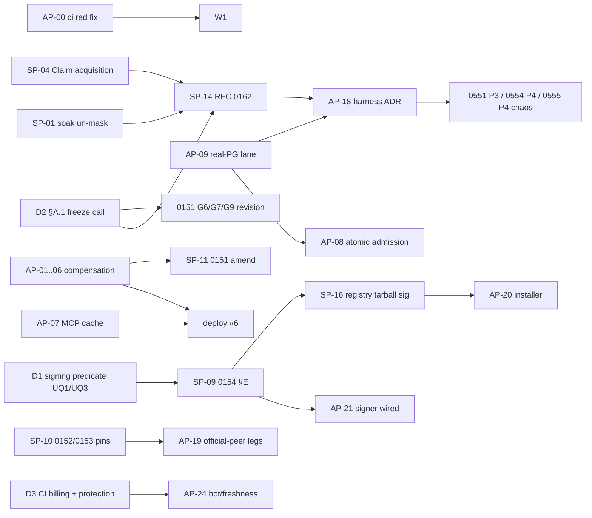

# OpenWOP A+ — Work Plan (openwop + openwop-app)

*Executable task cards derived from the pass-2 artifact dossiers
(`OPENWOP-A-PLUS-ROADMAP-ANALYSIS.md`, artifact af03cd31) and pass 1 (artifact edd70a35).
Prepared 2026-08-18 ~01:30Z against openwop-app `83c1385ca` (= origin/main = live deploy #5) and openwop `abb3c77c`
(1.136.4). Nothing here has been started; nothing here is committed. Numbers `AP-nn` (app) / `SP-nn` (spec) are plan
ids for the agrade orchestrator to lift into `H`/`S` numbers.*

| | |
|---|---|
| **Scope** | Every remaining item that the analysis found genuinely open, expressed as one PR-sized card each: what to change, where, the falsifiable acceptance test (what turns it red), size, evidence level reached, dependencies, and the artifact that owns it. Doc-only "prepare" — no code was changed. |
| **Not in scope** | Work the analysis marked DONE/STALE in the roadmap (do not rebuild it — see the analysis §2 for the list); human/vendor items (listed once in §5, not as cards). |
| **Sequencing rules** | (1) app P1 wire/security defects and corpus P1s first — none needs an RFC; (2) anything that adds optional wire waits for the RFC 0147 §A.1 freeze decision (§5 D2) or is argued essential in its own text; (3) evidence-level jumps that need no code (official-peer runs) run in parallel; (4) new artifacts are authored only where the analysis said AUTHOR (RFC 0162, narrowed 0581, narrowed 0584, execution-bounds ADR); everything else is an amendment to its owner. |
| **Machine rules** (from the program) | one full gate at a time on this box (`scripts/preflight-suite.sh --wait`); agents run gates detached (`nohup … & disown`, never a >10-min `run_in_background` Bash); worktrees off `origin/main` with a real `npm ci`; `OPENWOP_MOUNT_LOCAL_PACKS=false` for non-vitest boots; `npm run packs:prune` after removing a worktree; commit before sabotaging; break every new guard once and record the red. **As of 01:00Z `npm run ci` is RED on origin/main at `check-feature-deps` + `feature-deps-classifier.test.ts` (inherited from #3326, owned by the CRM session) — every card below rebases onto the fix or carries the regen as a separate labelled commit.** |
| **Evidence ladder** | `schema` → `server-free` → `test-seam` → `local-live` → `deployed-live` → `official-peer` → `independent-host` → `external-audit`. Each card names the level it reaches. |

---

## 1. Waves at a glance

| Wave | openwop-app | openwop (spec / conformance / examples / registry) | Gate to exit the wave |
|---|---|---|---|
| **W0 — unblock the gates** (hours) | AP-00 fix red `ci` inheritance (CRM session) | SP-01 un-mask the Conformance Soak; SP-02 PROTOCOL-STATUS dead table | `npm run ci` green on main; soak reaches the strict suite + `staleClaim` |
| **W1 — P1 defects, no RFC** (days) | AP-01…AP-06 (compensation), AP-07 (MCP cache), AP-08 (atomic admission), AP-09 (real-PG lane), AP-10 (CI/audit gates), AP-11 (dependency hour) → **deploy #6** | SP-03 (0150 §A), SP-04 (Claim acquisition), SP-05 (0148 witness), SP-06 (0149 lint/leg), SP-07 (0156 script), SP-11a (0151 healthy-run `none` leg + erratum) | every W1 card's sabotage recorded red→green; deployed-wire re-witness of RFC 0151/0153 rows |
| **W2 — evidence jumps + doc honesty** (days) | AP-12 (doc drift + derived roll-up), AP-13/14/15 (0555/0552/0556 smalls), AP-19 (A2A + MCP official-peer legs, app side) | SP-10 (0152/0153 amendments + pins + legs), SP-12 (0157 vectors), SP-13 (0147 ledger + generated view), SP-08 (0155 registry schema/vocab) | INTEROP-MATRIX rows at `official-peer` for A2A 1.0 (and MCP via Python); ADR 0548 roll-up derived |
| **W3 — new artifacts** (1–2 weeks) | AP-16 exec-bounds ADR; AP-17 ingestion-isolation ADR (+ impl); AP-18 qualification-harness ADR (+ two-process harness) → 0551 P3 | SP-14 RFC 0162 (after SP-04, SP-01); SP-15 RFC 0150 §D annex (absorbs 0159); SP-09 RFC 0154 §E amendment (absorbs 0160) | 0551 P3 green in `ci:full`; RFC 0162 Active with a seam; signing predicate decided |
| **W4 — decision-gated** | AP-20 (installer verifies tarball digest), AP-21 (signer wired), AP-24 (freshness window), AP-22 deploys | SP-16 (registry signing), SP-17 (audit engagement scope), 0151 G6/G7/G9 revision after freeze | see §5 |

Dependency graph (only the load-bearing edges):



---

## 2. openwop-app — task cards

Owner artifacts are existing ADRs unless the card says AUTHOR. Every card ends with a **provenance row** in its owner ADR (phase → commit → tests) and, where it closes or opens a residue, a row change in `docs/steward/AGRADE-WIRE-BLOCKED-RESIDUE.md` + `test/agrade-wire-blocked-residue.test.ts` (the register↔test agreement leg is what makes a stale row visible).

### AP-00 — Green the inherited `ci` red (owner: CRM session, #3327 lineage; NOT this program)
`check-feature-deps` + `test/feature-deps-classifier.test.ts` red on `83c1385ca` (ADR 0446 §F file-vs-symbol class: `resolveOne('email', {tenantId})` in `features/email/emailService.ts` flips six inbound email edges to hard-dep). Needs a per-edge review decision + `node scripts/gen-feature-deps.mjs` regen. Until it lands, every card below carries the deterministic regen as a **separate labelled commit** (the H54 PR #3328 pattern) so its own gate can run.

### AP-01 — Compensation triggers + terminal chokes (ADR 0554; analysis A3) — **P1, medium**
- **Change.** `src/executor/executor.ts`: pass `trigger` at every initiation; run-duration cap (`breachRunDuration` ~`:1637-1662`) and scheduler stall (`~:1860`) → resolve the definition (`resolveDefinitionForRun`) and call `unwindTerminatedRun({…, trigger:'cap-breach'})` before/with `emitTerminalFailure`; node-executions cap (`~:1668-1687`) → `trigger:'cap-breach'` (today it unwinds under `node-failure`); `finalizeRun` terminal guard (`~:1938-1946`, from #3325) must NOT return before the unwind when the recorded status is `cancelled` and committed compensable effects exist. `src/host/runCancel.ts` (RFC 0094): after the cascade, `unwindTerminatedRun({trigger:'run-cancel'})` honouring `compensation.onParentCancel`. `src/host/runDispatchSweeper.ts:142` (`dispatch_abandoned`) and `src/host/runDispatch.ts:128` (`dispatch_failed`): if the run has minted obligations, resolve + unwind under `cap-breach`/`node-failure` as appropriate rather than stranding.
- **Acceptance (each must go red when the new call is deleted).** For each trigger, register a policy naming **ONLY** that trigger (the fallback set already admits `node-failure`, so a mixed policy is vacuous): (a) run-cancel → `compensation.requested` + `completed` events, inverse invoked once; `onParentCancel:'skip'` child leaves no unwind; (b) cap-breach: run-duration cap fires → unwind under `cap-breach`; node-executions cap → `cap-breach` (and a policy `['node-failure']` does NOT unwind on a cap breach — the two-sided assertion); (c) sweeper/dispatch chokes on a run with one committed compensable node → rows leave `requested`; (d) #3325 regression: cancel mid-drain then last node fails → unwind still runs once, run stays `cancelled`.
- **Evidence.** test-seam; local strict `compensation-behavior` still 6/6; deployed-wire after AP-22.
- **Docs.** ADR 0554: new phase row "P3b triggers", provenance `:133` fixed, cross-reference note for #3325 amended; register `:94` + test row `phase:'P3'` re-labelled.

### AP-02 — Mint window fail-visible (ADR 0554; A4) — **P1, small**
- **Change.** `src/host/compensationRuntime.ts:243-249,316-322`: a failed `recordObligation` after a committed effect must be VISIBLE — emit `openwop.compensation.obligation{outcome:'mint_failed'}` and mark the run so `compensationStatusForRuns` cannot answer `completed`/`none` (a synthetic `manual_intervention_required` row keyed to the node, or a run-level `compensationMintFailed` flag folded as `manual`). Decide + record which in the ADR.
- **Acceptance.** Test makes `recordObligation` throw after a committed effect: run does not report `none`/`completed`; metric emitted; log key `compensation_obligation_record_failed` asserted. Sabotage: revert the catch to log-only → red.

### AP-03 — `compensationStatus` on healthy runs (ADR 0554; A1) — **P1, small–medium**
- **Change.** Distinguish mint-time `requested` from plan-frozen `requested`: add a plan marker (e.g. `planFrozenAt`/`compensation.requested` recorded per root run) and have `foldCompensationStatus` (`compensationLedger.ts:845-889`) return `none` when no plan exists — while still surfacing stranded rows on terminal-failed/cancelled runs (AP-01 removes most of them; the marker keeps the rest visible). Do NOT fold `none` for every non-failed run (that would hide stranded rows).
- **Acceptance.** (a) run a compensable node to `completed` → `GET /v1/runs/{id}` and the list projection show `compensationStatus:'none'` (red today); (b) a run whose plan froze but never started still reads `pending`; (c) `compensation-ledger.test.ts:224-226` rewritten to the spec semantic; (d) corpus leg proposed in SP-11a. Sabotage: drop the marker check → (a) red.
- **Docs.** ADR 0554 correction note ("the fold read row state; §D reads plan state").

### AP-04 — Invoke the inverse from the recorded row (ADR 0554; A2) — **P1, small**
- **Change.** `src/host/compensationRuntime.ts` `invokeInverseAction` (~`:715-745`) and `compensationUnwind.ts:464-467`: use the obligation row's `compensationNodeTypeId` / `compensationInput` (minted at `:274-290`); fall back to `collectDeclarations` only for pre-flip rows lacking them; keep `collectDeclarations` for policy/approval metadata.
- **Acceptance.** Mint under definition v1; redefine the workflow (different `nodeTypeId`/`inputMapping`) before the unwind; assert the invoked node type + inputs are v1's (red today — v2 would be invoked); the §21 seam report and the actual invocation agree (extend `compensation-unwind.test.ts:671-698` to assert what the fake node RECEIVED, not only the report). Sabotage: read from `declaration` again → red.

### AP-05 — Operator `start` gate (ADR 0554; A5) — **P1 safety, small**
- **Change.** `src/features/operations/routes.ts:637-760` + `src/host/compensationRecovery.ts:200-312`: `start` requires `isTerminalRunStatus(run.status)` (failed/cancelled/dead-lettered) AND (`policyAdmitsTrigger(policy,'operator-request')` OR an existing frozen plan); keep the `policyAdmitsTrigger` bypass for retry/skip/substitute/terminate on an existing plan only.
- **Acceptance.** `start` on a `running` run → 409; on a `completed` run with a `['node-failure']`-only policy → 403/409; on a failed run with `operator-request` in the policy → 202. Sabotage: drop the status check → red.

### AP-06 — `inputMapping` resolution + branch-fork pin (ADR 0554; A6, G4) — **P2, small**
- **Change.** Resolve `${nodes.<id>.output.<port>}` / `${inputs.<name>}` in `compensation.inputMapping` from RECORDED forward outputs at mint time (store the resolved `compensationInput`; never re-evaluate at unwind — composes with AP-04). Pin the host's branch-fork behaviour ("a branch fork unwinds its own", `compensationRuntime.ts:443`) with a test and record it as a G4 input for SP-11.
- **Acceptance.** RFC 0151 §B's own example (`0151:51`) round-trips: the compensator receives the reserved id, not the literal `${…}` string (red today). Branch-fork test: source and fork each unwind only their own rows.

### AP-07 — MCP client cache: authorization in the key + invalidator wired (ADR 0553; A12, A13) — **P1 security, small**
- **Change.** `src/host/mcpClient.ts:899`: `scopeFingerprint = sha256([tenantId, orgId, actingUserId, serverId, sha256(sortedScopesForRoles(principal.roles)), connectionId+rotation/credential provenance])`; call `invalidateMcpCacheForPrincipal` from `accessControlService.ts:617 updateMember`, `:657 deleteMember`, `connectionsService.ts:203 revokeConnection` (and re-auth); correct `mcpClientCache.ts:23-27,150-153` + `mcpClient.ts:160-165` docblocks. Record process-local cancellation (`runLifecycle.ts:76`) as a known limit (cross-instance signal → AP-18).
- **Acceptance (falsifying).** grant → `listTools` cached `private` → revoke via the REAL seam (`updateMember`) → next `listTools` MUST hit the wire (red today); Connection rotation for the same user → miss; `mcp-client-current.test.ts:378-386` must not call the invalidator directly (or is renamed as a unit test and a seam-driven test added). Sabotage: remove the `updateMember` call → red.
- **Docs.** ADR 0553 CORRECTION at `:290`/`:321-322`; provenance rows P3 (`9b2af4839`) + H47 + this card; RFC 0153 G4 host note → SP-10.

### AP-08 — Atomic run admission = ADR 0549 **P4** (A7, A8, A9) — **P1, medium**
- **Change.** `Storage.insertRun(run, { dispatchOutbox, idempotentResponse?: {tenantId, endpoint, key, claimToken, responseStatus, responseBody} })`: SQLite `insertRunWithOutboxTxn` (`storage/sqlite/index.ts:988-996`) and PG `BEGIN … COMMIT` (`storage/postgres/index.ts:470-490`) also run `UPDATE idempotent_response … WHERE claim_token=? AND state!='completed'`; 0 rows → ROLLBACK + typed error → route maps to `idempotency_in_flight` + `details.retryAfter` (canonical, `idempotency.md:62`); `routes/runs.ts` builds `CreateRunResponse` before insert; drop the raw-key echo (`runs.ts:401-405`, `types.ts:560`); same for `routes/userAgents.ts:109/185/212`; keep the `finally` release (no-op on a committed row); PG claim path `postgres/index.ts:1105-1113` retries the INSERT once when `rows` is empty (A8). Correct 0549 header "(Draft)" and the phantom witness names (`:213`); correction note at `:476-478` relieving 0551 P4.
- **Acceptance.** Storage-layer fault injection on SQLite AND real PG (testcontainers, needs AP-09): a `Storage` wrapper resolves `insertRun` then throws → ledger row `completed` inside the txn → retry REPLAYS 201; `SELECT count(*) FROM runs WHERE idempotency_key=?` = 1; stale claimant after reclaim → 0 rows/ROLLBACK, `dispatch_outbox` unchanged; concurrent PG claim + release → no TypeError; 409 body is `idempotency_in_flight` (also un-tolerate `errorCode undefined` in the app's mirror of `highConcurrency`). Sabotage: move `complete` back outside the txn → the crash test goes red. A route-level `vi.spyOn` throw is NOT acceptable evidence.
- **Register.** Until merged: add a `host-evidence` row "duplicate admission window" the tripwire demands (pins the residual).

### AP-09 — Real-Postgres parity into a lane that runs + workspace CAS legs (ADR 0549/0551/0550; A10, A11) — **P1, gate placement**
- **Change.** `scripts/ci.sh`: add `storage-adapter-parity-testcontainers.test.ts` to the `OPENWOP_CI_LIVE=1` block (`:689-693`) as a hard-require (fail, not skip, when Docker is absent under `ci:full`); add real-PG workspace legs (sequential If-Match 409 + `Promise.all` racing writers on one path → exactly one 200); PG no-If-Match write `postgres/index.ts:1023-1046` becomes one txn or `UPDATE … WHERE version=$returned`; correct `storage-postgres.test.ts:343-345` (false coverage comment) and ADR 0551 H44 P0 witness cell `:276` (→ `workspace-durability.test.ts`, `workspace.test.ts`).
- **Acceptance.** `npm run ci:full` executes the file (log shows its `it()` names); drop `AND etag = $10` → race leg red; the etag-mis-stamp race reproduces before the fix and not after.

### AP-10 — Delivery-gate honesty: ADR 0550 correction + `ci.yml` order + audit-gate fixes (A17, A18) — **P1 doc / small**
- **Change.** ADR 0550: correction note recording the 2026-07-21 disable (#2359), unprotected main, 0 checks on #3321–#3325, and the decision "local `ci.sh` + opt-in pre-push hook is the CURRENT merge gate; hosted enforcement is a human item (§5 D3)"; Lane 1 restated. `.github/workflows/ci.yml:120-129`: `npm ci` before `typecheck`; `test/ci-gate-coverage.test.ts:65-80` asserts ORDER (mirror `:47-55`); `scripts/check-audit.mjs:93` matches by ADVISORY id only (package-name match → UNEXPECTED); `:41` missing `revisitAfter`/`owner` → schema failure; add `owner`/`mitigation`/`affectedPath` to `scripts/audit-exceptions.json` entries. Vitest caps: `backend/typescript/vitest.config.ts` + frontend: `poolOptions.forks.maxForks`/`maxWorkers` keyed to `os.cpus()`, `NODE_OPTIONS=--max-old-space-size` on the vitest step (or fold into AP-16 if authored first).
- **Acceptance.** Sabotage `ci.yml` back to typecheck-first → guard red; add a fake high advisory on `officeparser` with a new GHSA → gate red (green today); remove the cap → config test red.

### AP-11 — Dependency hour (proposed 0581 pre-work, no ADR; A16) — **P2, hours**
- **Change.** `npm update mermaid dompurify` (in-range) under `npx -y npm@10.9.8` (never local npm; diff lockfile added/removed = 0/0; re-run `test/kms-backend-preflight.test.ts`); `isEvalSupported:false` at both `getDocument` call sites the app controls (`kbService.ts:1338-1341` via unpdf's `getDocumentProxy(data, options)`; officeparser's own pdf.js cannot be configured — note it in the exception); amend the officeparser/pdfjs exception entries with the magic-byte + unpdf facts; add `test/vendored-pdfjs-tripwire.test.ts` reading `node_modules/unpdf/dist/pdfjs.mjs` `apiVersion` and asserting `>=6.2.108` OR an exception `package:"unpdf-vendored-pdfjs"` with `revisitAfter` (red today — that is the point). Never take `npm audit fix`'s offered downgrades.
- **Acceptance.** frontend `npm audit --omit=dev` moderate count 0 for mermaid/dompurify; tripwire test present and pinned via the exception; `check-css-tokens` etc. unaffected (`( cd frontend/react && npm run build )`).

### AP-12 — Doc drift sweep + derived program roll-up (ADR 0548 + all children; A20) — **P2, small**
- **Change.** `scripts/adr-rollup.mjs --check`: read each child ADR's `Status:` line + phase table, diff against ADR 0548's roll-up (`:96-155`), fail on drift; regenerate 0548 at `83c1385ca`; add `A+` target + the §A.1 freeze note + the rung-name correction at `:9-11`. Sweep: 0549 header + `:213` witnesses; 0553 provenance rows + `mcpClient.ts:160-165`; 0554 `:133`, register `:94`, tripwire label; 0555 status line P4 reason (`host-evidence: network`) + register `:95` + tripwire `why`; 0556 `:149`; `routes/discovery.ts:1424-1425` comment; INTEROP-MATRIX `:293` (spec-side, SP-10).
- **Acceptance.** Edit a child's Status line without regenerating → `adr-rollup --check` red; wire it into `ci.sh` beside `check-adr-refs`.

### AP-13 — ADR 0555 smalls — **P2, small**
- No-pool pin (`test/pack-isolation-*`: assert no worker pool/reuse exists — red if someone adds one); live-image guarantees probe: `DEPLOY-SMOKE.md` + `scripts/verify-deploy.sh` call a host-ext/readiness surface that reports `childAdapterGuarantees()` from the running image and assert the expected set (a Node minor renaming `--permission` flips five guarantees silently today); ADR CORRECTION 6 (P4 blocker = network invariant `SECURITY/invariants.yaml:1069`); narrow the P3 row to the host-call POLICY surface + sabotage; record the network-denial runtime decision once §5 D5 is taken.

### AP-14 — ADR 0552 smalls — **P2, small**
- `observability/metrics.ts:257-262`: add the served `profile` label (closed 2-set from `A2A_PROFILES`; shared with MCP) so P4 usage evidence exists; `scripts/verify-deploy.sh`: one curl+jq leg comparing the live Agent Card flags to `capabilities.a2a.*` on the deployed origin (today the certify lane boots locally). Add a Part V "Claim record" block. Do NOT set `OPENWOP_A2A_STREAMING=true` (false claim); durable push waits on §5 D7.

### AP-15 — ADR 0556 smalls (A15) — **P2, small**
- `parseSenderConstraints` (`workloadIdentity.ts:381-389`): refuse to boot / refuse to advertise a non-empty `senderConstraint` until a DPoP/mTLS verifier exists (today: advert + self-DoS); `openwop.authz.decision` counter (the ADR names it `:770-777`) + SLO row; fix provenance `:149`; record "DPoP before mTLS on Cloud Run" if §C is ever attempted; P4 = ADD a telemetry/SLO block to the EXISTING deployment attestation (`deploymentAttestation.ts`), never a second attestation.
- **Acceptance.** `OPENWOP_WORKLOAD_IDENTITY_SENDER_CONSTRAINTS=dpop` with no verifier → boot refuses with a typed reason (red today: it boots and refuses every credential).

### AP-16 — AUTHOR: execution-bounds ADR (the un-owned half of proposed 0580) — **P1, small ADR + small code**
- **Reserve** the number with `node scripts/check-adr-refs.mjs --reserve <slug>` at authoring time (0580 free as of now). Scope ONLY: vitest worker/heap caps (backend + frontend), hosted per-job timeouts (exist), heap-crash attribution to a test file, artifact upload without secrets, `preflight-suite` posture in `ci.sh` (`--wait` default, not hard-fail — the multi-session workflow), and the measured budgets (one fleet → 57 MB free; four → load 144). Do NOT re-decide 0550 Lane 1.
- **Acceptance.** Config test reading the resolved vitest config (red when the cap is absent); `ci-gate-coverage` asserts `NODE_OPTIONS`; `test-preflight-suite.sh` extended for the `--wait` default.

### AP-17 — AUTHOR: untrusted document-ingestion isolation ADR (proposed 0581, narrowed) — **P2 ADR, medium impl**
- Compose on the ADR 0555 child adapter: route `extractTextFromBytes` for OFFICE/PDF/DOCX (`kbService.ts:1318-1360`) through `childProcessAdapter` (`--disallow-code-generation-from-strings`, `--permission`, memory cap, SIGKILL wall clock); byte/page/object/decompression/CPU/time limits; malicious fixtures (PDF with JS/OpenAction, zip-bomb pptx, ICNS/JXL bomb, mermaid `%%{init}%%`); mind 2×96 MB on 512 Mi. SBOM + exception-field hardening → ADR 0550 (AP-10), not here.
- **Acceptance.** `test/kb-ingest-isolation.test.ts`: fixture attempting `globalThis.__pwned=1` → undefined in the API process (red if in-process); >1 GiB decompression refused within N s; ICNS bomb terminates within the wall clock (red today: infinite loop in-process).

### AP-18 — AUTHOR: shared multi-process qualification harness ADR (proposed 0584, narrowed) → delivers ADR 0551 P3 — **P1, medium**
- Extend `scripts/ci.sh`'s live lane with a `qualification` step: testcontainers Postgres; boot N=2 backend processes on it (`OPENWOP_MOUNT_LOCAL_PACKS=false`, bounded `maxForks`); scenario pack owned by 0551/0554/0555/0556; `sign-attestation.mjs` gains a REQUIRED `containerDigest` from `gcloud run revisions describe` and `verifyDeploymentAttestation` checks it; explicit CPU/RAM/worker budgets. Never a parallel qualification lane; not the scenario owner.
- **Acceptance.** kill process A between 201 and `executeRun` → B starts the run exactly once (drop the outbox lease predicate → red); two processes racing one workspace `If-Match` → exactly one 200; two processes racing one idempotency claim on real PG → one winner; attestation with a `containerDigest` ≠ live revision → verify FAILS (not checked today). Cross-instance: 0554 P4 stale-worker unwind, 0553 cross-instance cancel (A13).

### AP-19 — Official-peer legs, app side (ADR 0552/0553; after SP-10 pins) — **P1 evidence, small**
- A2A: pin `@a2a-js/sdk@1.0.1` as a devDependency; host-as-server driven by the SDK client (SendMessage/GetTask/CancelTask/SubscribeToTask incl. `A2A-Version`), host-as-client against the SDK's Express server; legs FAIL (not skip) when the peer is unreachable. MCP: Python `mcp==2.0.0` server/client fixture (a tiny script the suite spawns) for `server/discover`, `Mcp-Method`, `requestState`; TS SDK follows when it ships 2026-07-28. Record results in the corpus INTEROP-MATRIX row + bundle `peers[]` (SP-10).
- **Evidence.** `official-peer` for RFC 0152 §B–§E and RFC 0153 §B–§D.

### AP-20 — Pack installer verifies the full artifact digest (A14; after SP-16 / RFC 0154 §E) — **P1 supply-chain, small**
- `packs/registryInstaller.ts:128-162`: verify Ed25519 over the tarball bytes (or the file-digest map in `pack.json`), not `pack.json` alone; refuse packs whose signature does not cover the artifact once the registry ships it; until then, at minimum pin and assert per-file digests for the 208 steward packs.
- **Acceptance.** Swap one byte in `prompts/*.md` of a signed tarball → install refused (green today).

### AP-21 — Wire the deployment signer (ADR 0550 residue; after §5 D1) — **P2, small**
- `scripts/deploy.sh` produces `build-meta/attestation.json` via `sign-attestation.mjs` after `--certify` (predicate per SP-09; `sign-attestation.mjs:139` stops reading the deprecated `capabilities` mirror); readiness/Operations verifies it; a deploy without it refuses to ship (like the certify stamp at `deploy.sh:229-236`); bake `contractProvenance.corpusCommit` into the image stamp so it survives `npm ci --omit=dev` (AP-24 overlap).

### AP-22 — Deploy #6 (after AP-07 at minimum; ideally AP-01…AP-11) — **P1**
- `scripts/deploy.sh` from a clean `origin/main` worktree with `npm ci` in both halves; `gcloud builds list --limit 3`; `scripts/verify-deploy.sh`; re-witness RFC 0151/0153 rows on the deployed origin (INTEROP-MATRIX via openwop-1). Note the compensation `pending` fix and the MCP cache fix are both wire-visible — the row notes should say so.

### AP-23 — App `SECURITY.md` + "remediated finding ⇒ regression test" invariant (0585 residue) — **P3, small**
- `SECURITY.md` at the app root naming the corpus SLA (`../openwop/SECURITY/response-sla.json`) and disclosure path; invariant in ADR 0548/0550; test that the file exists and names the SLA (red today).

### AP-24 — Freshness + vendoring policy (0583 → ADR 0550 amendment; after §5 D3 for bots) — **P2, small**
- Section in ADR 0550: pin within the current minor, 14-day window on a new minor; `check-suite-freshness.mjs` comparing the pin to the registry's latest minor (self-test stubs the registry to prove it can go red); `check-vendored-packs.mjs` mirroring H48; `corpusCommit` in the image stamp; bump-PR delta checklist. Bot PRs only after branch protection.

### AP-25 — Deprecation-date lint (0552 P4 / 0553 P4) — **P3, tiny**
- A test that fails when `A2A_LEGACY_PROFILE_SUNSET` (2027-03-12) / `MCP_LEGACY_PROFILE_SUNSET` (2027-08-12) is within N days and the legacy profile is still advertised; the corpus twin lives in SP-10.

---

## 3. openwop — task cards (spec, schemas, conformance, examples, registry)

Repo conventions: RFC amendments carry dated correction notes (never rewrite rationale); a wire/schema change is a suite minor + reissue; every new leg records `executed-pass`/`blocked` (no soft-skip that reads as pass); `openwop:check` green; CHANGELOG `[Unreleased]`.

### SP-01 — Un-mask the Conformance Soak (RFC 0157 box 5 + examples repo; C1) — **P1, small** — repos: `openwop-examples` + `openwop`
- Port `WHOLE_VALUE_PATTERN` (whole-value raw-typed rule, `conformance/src/lib/workflow-chain-expansion.ts:10-37`, from #819) AND `carryCompensation` into `examples/hosts/in-memory/src/workflow-chain-expansion.ts`; move `check-workflow-chain-expansion-sync.mjs` into its OWN job in `.github/workflows/conformance-soak.yml` (today step 4 masks the strict suite `:113` and `staleClaim`/`restart-during-run` `:213-232`).
- **Acceptance.** Next soak run: drift guard green; strict suite and the multi-process durability scenarios EXECUTE (log shows their `it()` names); reintroduce the drift → only the guard job reds.

### SP-02 — `PROTOCOL-STATUS.md` dead section (RFC 0147 §A.9 / 0149 §D; C2) — **P1, tiny**
- `scripts/generate-protocol-status.mjs:165`: match the padded header (`/^\|\s*Host\s*\|\s*Passed\s*\|/`); add a non-vacuity leg (reference-host rows > 0, else fail); regenerate.
- **Acceptance.** Pad the header again → generator fails (green today).

### SP-03 — RFC 0150 §A into `idempotency.md` v1.5 + invariants + mismatch code (C3) — **P1, small editorial**
- `spec/v1/idempotency.md`: Layer-1 record shape `(authenticatedTenantId, canonicalEndpointId, callerIdempotencyKey)`, `requestDigest`, `pending|completed|retryable-failure|terminal-failure`, lease owner/expiry, atomic reclaim MAY, host-generated keys MUST NOT share the keyspace (RFC 0150 `:28-34`); DEFINE the canonical mismatch error. **CORRECTED 2026-08-18: this card recommended `idempotency_key_replay_mismatch` (the app's spelling); the corpus chose `idempotency_key_mismatch` on stronger evidence — it is the only spelling in two shipped artifacts including the published SDK 1.7.0 `HTTP_ERROR_CODES`, and `idempotency_key_conflict` is retired. Landed as openwop#1070, suite 1.136.6, with both legacy spellings tolerated until the first minor after 2026-11-10.** The app's one-string move is a separate item, not part of ADR 0549 P4; align `grpc-transport.md:126` and the SQLite reference host `server.ts:2285-2291` with the canonical spelling; register `idempotency-key-tenant-endpoint-scoped`, `idempotency-store-no-host-generated-keys`, `replay-semantic-digest-complete` in `SECURITY/invariants.yaml`; correct RFC 0150 box 6 count; add §E stamp fields to `run-snapshot`/run schema or downgrade §E to SHOULD with a note; map the RFC's 7 scenario names to real files.
- **Acceptance.** `rfc-conformance-coverage.mjs` shows the three invariants registered; a new `idempotency-pending-lease-recovery` leg (or renamed existing) exercises reclaim against the sample host and records `executed-pass`; `check-doc-tallies` green.

### SP-04 — `storage-adapters.md §"Claim acquisition"` (RFC 0162 prerequisite; C4) — **P1, small editorial**
- Write the section the citations assume: claim, heartbeat, TTL, stale reclaim, resume-on-startup, event-log invariants — the contract `examples/hosts/sqlite/src/server.ts` and the app already implement; make `production-profile.md:34`, RFC 0009:149-150, `staleClaim.test.ts:1-3`, `restart-during-run.test.ts:1-3` resolve.
- **Acceptance.** A dangling-anchor leg (extend `rfc-lifecycle-coherence` or the link checker) that fails on a cited section that does not exist — red today for this one.

### SP-05 — RFC 0148 witness integrity (C5) — **P1, small–medium**
- Decide UQ1: `witnessSha256` = sha256 over the ordered per-requirement `(id, disposition, assertionCount)` tuples + `scenarioManifestSha256` + `targetConfigurationSha256` — emit in `conformance/src/cli.ts:415-421`, verify in `certification-bundle-verify.ts` (re-derive `scenarioManifestSha256` from `results` too); OR strike the field. Register `certification-no-vacuous-pass` (`certification-bundle-non-vacuous.test.ts`); fix `cli.ts:384-390` comment; correction note at RFC §C:87 (`openwop-replay-fork` conditional floor landed `2a19cea1`; G7 CLOSED); add a "one unrelated assertion cannot certify a behavioural file" leg — which requires leg-level requirement ids (`requirement-registry.ts:26-33`) — scope that as the follow-on (bundle-v2 revision = suite minor + reissue).
- **Acceptance.** Flip a byte in `results.totals` under a valid `witnessSha256` → REJECT; the app's `conformance/certify.ts` consumes the new field.

### SP-06 — RFC 0149 lint predicate + lifecycle leg + tallies (C6) — **P2, small**
- `capability-example-root-layout.test.ts:81-82`: scan ALL root keys for a `capabilities` wrapper (keep the ```diff carve-out); fix `grpc-transport.md:172-183` example and `:201` "in flight"; new `rfc-lifecycle-coherence` leg: for each `spec/v1/*.md` whose line 3 names `RFC NNNN \`Status\``, the status equals the RFC's cell → red today on `self-hosted-runner.md:3` (0122 Accepted) and `frontend-plugin-packs.md:3` (0117 Accepted); derive README `:68-69` tallies/versions in `generate-protocol-status.mjs` (49/60 Stable; suite from `conformance/package.json`); RFC 0149 UQ4 correction note ("no hits" was wrong; two hits); note SDK-parity leg is `blocked` in hosted CI (no `OPENWOP_SDKS_DIR`) — add the sibling checkout to `openwop-spec.yml` or record.
- **Acceptance.** Re-add a first-key wrapper elsewhere → lint red; sabotage a spec `:3` status → leg red.

### SP-07 — RFC 0156 claims gate + ledgers (C7) — **P2, small**
- `scripts/generate-assurance-status.mjs`: tokens for `current-A2A compatible` / `current-MCP compatible` (`:142-143`); derive `permitted` from evidence (INTEROP-MATRIX official-peer rows / bundle `peers[]` from SP-10) instead of constants; `crossOrg` threshold → 3 orgs (align with `GOVERNANCE.md:97` / RFC 0038) or a recorded reason for 2; tighten `EXEMPT_CONTEXT` (`:223`); delete or generate the `MAINTAINERS.md:116-143` hand ledger (26 vs derived 41); count `internal-pre-audit-findings.json` (4 open Medium) with owner/target fields; correction notes at RFC 0156 `:110`, `:117`; amend Conformance section to name the script (6/6 files absent).
- **Acceptance.** README with "current A2A compatible" while `permitted:false` → `--check` red (cannot fire today).

### SP-08 — RFC 0155 registry schema + one claim vocabulary (C8) — **P3, small** (+ governance UQ1)
- `schemas/extensions-registry.schema.json` (closed records) + validation leg; one generator for claim vocabulary (feeds SP-07 tokens and `profiles.md` §"Claim vocabulary"); UQ1 re-derive the budget from the measured cohort (73 draft / 41 high) — governance decision, then a budget leg.

### SP-09 — RFC 0154 §E amendment (absorbs proposed 0160) + legs (C9, A14) — **P1 decisions, medium**
- After §5 D1: §E names DSSE + SLSA provenance v1 as the envelope; bundle-v2 wrapper; `evidenceLevel` REQUIRED enum (`schema|server-free|test-seam|local-live|deployed-live|official-peer|independent-host|external-audit`) on bundle v2 (0148 schema minor); expiry/supersession/revocation; key policy ("a signer may only sign what it can verify"); **MUST: a pack/bundle signature covers the FULL artifact digest** (registry today signs `pack.json` only — SP-16); strike UQ2; refresh `:134`, `auth.md:203`, self-audit `:224,241`; register the four named invariants or record why not; add legs: unknown-issuer refusal, tenant neutralization, sender-downgrade, and record that `cryptographically-bound`/`proof-bound` are host-witnessed only through a credential-bearing harness (or add one).
- **Acceptance.** `artifact-provenance-verification` leg: tampered bundle under valid signature → REJECT; bundle without `evidenceLevel` fails schema; `expiresAt < now` → `expired` and the assurance manifest demotes the claim.

### SP-10 — RFC 0152 / 0153 amendment pass + official-peer pins + legs (absorbs proposed 0163; C10, C11) — **P1**
- Strike `:10/:97` (0152) and `:10/:99` (0153) "no seam wired" clauses (correction notes); map Conformance names → real files; 0152 `:74` "official fixtures": vendor upstream fixtures or strike; resolve UQ2 in each: `@a2a-js/sdk@1.0.x` pinned (server + client) and Python `mcp==2.0.0` pinned (TS SDK follows when it ships 2026-07-28); official-peer JOBS that FAIL (not soft-skip) when the peer is unreachable; new legs — A2A host-as-server artifacts, CancelTask, cross-tenant, `a2a-1.0-stream-push` behavioural (SSE content-type + ≥1 event; fixes G-C1's same-source compare); MCP MRTR timeout/cancel/replay + scope-change staleness (needs a seam or second-credential re-auth); harden `mcp-cache-tenant-scope.test.ts:48-71` (`softSkip('blocked')` when the secondary key is unset; `expect(200)`; assert `private` or require differing callers); bundle-v2 `peers[]` `{protocol, package, version, role, result}` (0148 schema minor); date-aware sunset lint (2027-03-12 / 2027-08-12); adopter inventory naming 2025-11-25; fix `a2a-integration.md:362,504`, `mcp-integration.md:300,301,308`, INTEROP-MATRIX `:293`.
- **Acceptance.** Official-peer job present in `openwop-spec.yml`/soak, recorded `executed-pass` with the pinned version in the bundle; a bundle claiming `a2a-1.0` with empty `peers[]` is not `certified` for a "current-A2A" claim (SP-07 consumes).

### SP-11 — RFC 0151 amendment (C12; absorbs the non-frozen part of proposed 0158) — **P1 (11a) / P2 (11b)**
- **11a (now):** `compensation.md:3` banner; RFC box 3 + G1 (0150 §C landed `730ff3de`); box 6 (app storage-level ADVERSARY 1 witness = test-seam); a NEW behaviour leg: a run that completes a compensator-declaring node WITHOUT a trigger reads `compensationStatus:'none'` on the snapshot (this is what would have caught A1 — needs only a policy with a compensable node and no failure); erratum: "a host MUST refuse at registration a policy naming a trigger it does not fire" (`validation_error`) — argue safety-fix under §A.1 (same principle as `capability_required`); test registers a policy naming ONLY the unimplemented trigger; add an `inputMapping` value grammar (`compensation.md:53-60`) — what `${nodes.<id>.output.<port>}` means and that it MUST be resolved from recorded facts at plan time; crash-resume-mid-unwind + approval-before-inverse legs.
- **11b (text, unfrozen):** decide G4 (branch-fork rollup — take the app's pinned behaviour as input) and G5 (retention minimums).
- **After §5 D2:** the 0151 revision landing G6 (hold reason codes), G7 (canonical recovery endpoint family — the app's host-ext shape is the candidate), G9 (plan projection), and `compensation.supportedTriggers` (default ABSENT = unspecified; the app's honest value `['node-failure']` until AP-01 lands, then all four).

### SP-12 — RFC 0157 measurement + expansion vectors — **P2, small**
- Measure box 4 now that the app pins ≥1.133 (`workflow-chain-host-expansion` legs on the app, record in INTEROP `:281`); an expansion VECTOR file (`conformance/vectors/workflow-chain-expansion.json`: chain → expected definition, incl. compensation carry + nested) consumed by the conformance core, the in-memory host, and the app's third core — the drift fix that does not need a byte-diff; a nested×compensation leg.

### SP-13 — RFC 0147 ledger + generated per-child acceptance view (absorbs proposed 0164 with an RFC 0149 §D amendment) — **P2, medium**
- Re-sweep RFC 0147 criteria 4/5/6, registers R9/R12/G22, `docs/RFC-0147-SELF-AUDIT.md` (header + §A.3/§A.4/§A.5/§A.8; "42 absent" → 29); RFC 0149 §D amendment: acceptance-item vocabulary `complete|carried: <why>|externally gated: <evidence>` + retro policy (annotated-vs-bare boundary, ~200 bare pre-0147 items) + the spec-status leg (SP-06); extend `generate-protocol-status.mjs` with a per-child acceptance view for 0147's children; gate `rfc-conformance-coverage.mjs` in `openwop-check.sh` with a ratchet (absent count may not grow; alias table entries must resolve to files — it currently over-reports 0154).
- **Acceptance.** Tick a criterion whose evidence row is `blocked` → generator red; the coverage ratchet reds if a named scenario has no file.

### SP-14 — AUTHOR RFC 0162 — Durable Execution and Disaster-Recovery Qualification (after SP-01, SP-04) — **P1 spec, /prd five-architect pass**
- Allocate the number at authoring (`RFCS/` tops at 0157 → 0158 unless a peer reserved higher). Content: the claim/lease/heartbeat/reclaim contract by reference to SP-04; admission durability (kill after 201 before dispatch; the app's run+outbox txn is the reference); queue/outbox ownership, duplicate delivery, leases, redrive, poison — composed from RFC 0017 queue-bus, RFC 0053 dead-letter (rejected auto-redrive — respect it), RFC 0083 trigger bridge; multi-region by reference to RFC 0036 + 0150 §D (absorb 0159's qualification LEVELS: durable single-instance / durable multi-instance / multi-region-qualified); RPO/RTO/backup-restore/region-evacuation/version-skew/in-flight-migration as DECLARATIONS + runbook/evidence items (deployed-live/external-audit), not black-box scenarios; recovery audit events only if RFC 0154 §D lacks them (new event kinds are wire); a §host-sample seam so the `durable multi-instance` profile can go red under strict; §A.1 rationale in the text (`production-profile §Durability` is an existing MUST with no definition and no executing witness → essential). Conformance: kill-after-201-before-dispatch → run still starts; duplicate outbox delivery → one execution; process-kill during checkpoint → resume without duplicate node effect (needs AP-18's harness); poison → dead-lettered not looped; advertiser under strict MUST execute the multi-process legs (else `blocked`).
- **Acceptance.** Five-architect review passes; the seam exists in the sample host; the app can adopt via AP-18 with `blocked` → `executed-pass`.

### SP-15 — RFC 0150 §D annex (absorbs proposed 0159) — **P2, small text + a seam**
- `idempotency.md` §"Fenced effects — qualification": adapter classes (provider-enforced / host-ledger-enforced / compensatable / at-least-once-risk / irreversible), the per-adapter evidence obligation, and the counting-effect-sink extension of `simulate-partition` (`multi-region-idempotency-behavior.test.ts`) + an adversarial provider fixture that ignores idempotency. No new profile name (the value `fenced-effects` exists). Levels → SP-14.
- **Acceptance.** A `fenced-effects` advertiser MUST show ONE effect at the sink under a forced partition where a `reconciled-records` host shows two; adversarial-provider leg reds if a duplicate suppressed only by the provider is counted as fenced.

### SP-16 — Registry: signatures cover the artifact (A14; `openwop-registry` repo) — **P1 supply-chain, small–medium**
- `signing.method: "ed25519"` over the tarball bytes (or a per-file digest map in `pack.json` that the signature covers) for the 158/160 `manual` versions; `registry/scripts/verify-signatures.mjs:149-168` verifies accordingly; the version manifest's `integrity` is then covered by the signature chain; then AP-20.
- **Acceptance.** Swap one byte in a signed tarball's `prompts/*.md` → `verify-signatures.mjs` red (green today).

### SP-17 — External-audit engagement scope + intake (0585 residue) — **P3 doc / P0 human**
- `SECURITY/external-audit-engagement.md §2.1`: add openwop-app (`app.openwop.dev`, the Cloud Run image, isolation adapter, MCP/A2A mounts, KB ingestion, compensation runtime); §8 tracker keeps the honest "outreach sent: null" until it isn't; findings → regression-test intake rule (mirrors AP-23).

### SP-18 — Deferred to v2 / after §5 D2 (do NOT start now)
- Protocol-v2 discovery closure + v1↔v2 negotiation (proposed 0161, citing RFC 0073 / 0043 / 0144 / 0149); 0151 G6/G7/G9 revision + `supportedTriggers`; RFC 0155 budget leg after UQ1.

---

## 4. What NOT to build (the roadmap lists it; the analysis found it landed)

Do not re-implement: RunCompensationPanel/RBAC/SoD/audit chain (0554 P3 #3322); reverse-completion + nested ordering; retry/approval/waiver/substitution/termination/DLQ flows; SLO projection + runbooks (0556 P2 #3318); host-call broker, per-dispatch tokens, interrupt preservation, replay-through-boundary, confused-deputy tests (0555 P1/P2); MRTR restart-safety (HMAC `requestState`); MCP downgrade floor/audience/audit (0553 P3 #3325); durable A2A task store + peer-authority probe; workspace/outbox record correction (H44); readiness fail-closed for memory storage; RFC 0149 typo lint; RFC 0155 Tier-3-before-Stable; RFC 0154 SPIFFE/sender-constraint prose; RFC 0151 reverse-completion/irreversible rollup/reason codes; the "no multi-region advert" (already compliant); "restart-safe A2A push" (above RFC 0100 §4 — amendment first); "implement RFC 0159 fencing" (no such RFC; from-scratch linearizable owner); "advertise only the trigger implemented" (no advert surface — use SP-11a's refusal erratum).

---

## 5. Decisions only David can make (nothing else moves these)

| # | Decision | Blocks |
|---|---|---|
| D1 | RFC 0154 UQ1 (proof format) + UQ3 (attestation predicate — recommend DSSE + SLSA provenance v1, already what npm OIDC emits for suite/SDK) | SP-09, SP-16, AP-20, AP-21, everything "signed" |
| D2 | Whether SP-14 (RFC 0162), the 0151 G6/G7/G9 revision + `supportedTriggers`, and 0150 §D annex clear RFC 0147 §A.1 as essential/safety, or wait for R3/R9/R14 | SP-14, SP-18, Phase 2 of the roadmap |
| D3 | Re-enable hosted CI (org billing) + protect `main` — or record "local `ci.sh` is the deliberate merge gate" (AP-10) and stop calling it a blocker | AP-24 (bots), roadmap Phase 0 |
| D4 | Maintainer recruitment (2 unaffiliated per RFC 0156 §A vs 3 organizations per GOVERNANCE.md:97/RFC 0038 — pick one and record it); audit vendor outreach (idle since 05-11; add openwop-app — SP-17); Tier-3 outreach | roadmap Phase 6; the §A.1 freeze (R14) |
| D5 | Runtime for pack network denial: Deno/WASM worker vs brokered-only egress sidecar vs "not on Node/Cloud Run" | ADR 0555 P4 / roadmap Phase 4 network gate (AP-13 records it) |
| D6 | An OTLP collector + a second region on the live service | 0556 numbers; 0551 P4 |
| D7 | Whether RFC 0100 gains a durable-push MUST (then ADR 0552 P3 rides the 0551 outbox) | ADR 0552 P3 |
| D8 | Which of the 13 proposals to author — recommendation: only RFC 0162, narrowed 0581, narrowed 0584, a small execution-bounds ADR; amend the rest | W3 |

---

## 6. Roadmap document — proposed correction patch (`docs/OPENWOP-A-PLUS-ROADMAP.md`, branch `codex/a-plus-roadmap`)

Not applied — your branch. Each line is a targeted replacement.

1. Header: `App audit baseline` → `83c1385ca` (deploy #5, includes #3322–#3326); add `Analysis: docs/OPENWOP-A-PLUS-ROADMAP-ANALYSIS.md (pass 2) · Work plan: docs/OPENWOP-A-PLUS-WORK-PLAN.md`.
2. Under "How agents must use this document", add rule 11: *"Before proposing an RFC that adds optional wire, cite RFC 0147 §A.1 and state whether R3/R9/R14 are Closed; if not, argue essential/safety in the RFC text or sequence after RFC 0147's exit."*
3. Part I: add a "Freeze" paragraph (RFC 0147 §A.1; R3/R9 "Open — unwitnessed", R14 "Open, Critical, externally gated"; `compensation.md:439-442` parks G6/G7/G9).
4. RFC 0147: replace "Track every child RFC…" bullets with SP-13; note the ledger/self-audit/registers lag by hours and the dead PROTOCOL-STATUS table (SP-02).
5. RFC 0148: keep residue; add "witnessSha256 is dead wire; requirement identity is per file" (SP-05); route "compose with 0160" → "RFC 0154 §E".
6. RFC 0149: drop "typo detection" (done); replace "validate all examples incl. fragments" with "YAML + RFCS/ extraction (fragments stay prose per §D unless amended)"; add SP-06's two falsified docs.
7. RFC 0150: replace the first two bullets with "land §A in `idempotency.md` + register 3 invariants + define the mismatch code" (SP-03); note §B vectors do not exist; "compose with 0159" → "§D annex (SP-15)".
8. RFC 0151: drop reverse-completion/irreversible-rollup/reason-codes (done); add SP-11a's healthy-run `none` leg + refusal erratum + `inputMapping` grammar; rephrase the exit "every advertised trigger executes" → "every trigger the policy schema names executes, or the host refuses the policy".
9. RFC 0152/0153: drop card/runtime, stateless, header/body, extension proofs (deployed-wire); replace "official or pinned peer" with the concrete pins (`@a2a-js/sdk@1.0.x`; Python `mcp==2.0.0`; TS SDK when it ships 2026-07-28); replace "specify restart-safe" with "test restart-safe (RFC 0100 owns the spec)"; name the absent legs.
10. RFC 0154: drop SPIFFE/sender-constraint/audit-binding as spec asks; add "resolve UQ1/UQ3; §E MUST cover the full artifact digest (registry signs `pack.json` only)"; rephrase Phase 4's "sender constrained" gate.
11. RFC 0155: "approve the budget" → "re-derive from the measured registry (73 draft / 41 high) then add a budget leg"; drop Tier-3-before-Stable and shadow (done); "SDK helpers" flagged as a new ask.
12. RFC 0156: add the 2-vs-3-org threshold, the two empty token rows / constant `permitted`, the MAINTAINERS ledger, the undated Medium findings.
13. RFC 0157: "SQLite/reference-host drift" → "in-memory examples host: WCP2 whole-value rule (#819) never mirrored; soak red 100+ runs; drift guard masks the durability witness"; exit evidence level = local-live/test-seam; add "expansion vector file".
14. New RFCs section: keep 0162 (+ prerequisite SP-04, freeze rationale, absorb 0159 levels); re-file 0158 → 0151 revision, 0159 → 0150 §D annex, 0160 → 0154 §E, 0163 → 0152/0153 UQ2 + 0148 `peers[]` + 0156 §F, 0164 → 0149 §D + generators; mark 0161 v2/off-path.
15. ADR 0548: add "derived roll-up script (AP-12)"; note six merges stale.
16. ADR 0549: replace "resolve via 0582" with "P4 atomic admission (AP-08)"; add "real-PG parity in a lane that runs (AP-09)".
17. ADR 0550: add the correction-note item + "`ci.yml` typecheck-before-`npm ci` was introduced by 0550 P0"; "signed attestations under RFC 0160" → "under RFC 0154 §E after UQ1/UQ3".
18. ADR 0551: replace "Correct the implementation record" with "P0 witness cell + false coverage comment + concurrent/PG workspace CAS legs (AP-09)"; "Implement RFC 0159" → "fencing per RFC 0150 §D is a from-scratch build; not before AP-18"; add "the two-process harness (AP-18) is the P3 asset".
19. ADR 0552: drop "persist correlation" and "peer authority" (done); "restart-safe push" → "after an RFC 0100 amendment (D7)"; add served-profile label + verify-deploy probe.
20. ADR 0553: replace "harden cache invalidation" with the defect statement (key has no authz material; invalidator unwired; ADR `:290` false; DEPLOYED with H53) → AP-07; note P3 merged + deployed; drop "persist MRTR" (mostly done).
21. ADR 0554: rewrite from the "did NOT ship" list: AP-01…AP-06 (triggers, mint window, healthy-run `pending`, live-definition unwind, `start` gate, `inputMapping`), P4 chaos via AP-18; drop unwind/nested, flows, UI+RBAC+SoD, replay (done); "RFC 0158 surface" → "§21 + host-ext until G7 unfreezes".
22. ADR 0555: drop 7 done bullets; keep network (as a runtime decision, D5) + no-pool pin + live-image probe; fix "blocked on RFC 0035 adoption" → "blocked on the network invariant".
23. ADR 0556: drop instrument/SLOs/alerts/projection/deputy tests (done); keep authz counter, P4 telemetry block, drill, sender constraint (D-gated; boot refusal AP-15).
24. New ADRs section: 0580 → split (AP-16 bounds ADR + 0550 amendment); 0581 → narrowed (AP-17); 0582 → 0549 P4; 0583 → 0550 amendment (AP-24); 0584 → harness only (AP-18); 0585 → don't (AP-23 + SP-17).
25. Part III matrix: apply the row corrections in the analysis §5c (CI row app-only; SLO row no RFC; multi-instance/region → 0551 once; pack provenance → registry + installer; external assurance → engagement doc §8; typo/ghost → 0149; certification evidence → 0148 + 0154 §E).
26. Part IV gates: rephrase Phase 0/1/2/4/6 per the analysis §5d; add W0 "un-mask the soak; green the inherited `ci` red".
27. Part VI: add "fix the registry signature coverage" and "decide the pack network runtime".

---

## Appendix — how to lift these into the agrade queue

- App cards → `H` numbers in `/tmp/crosstalk-agrade.board.md` (next free after H54); spec cards → `S` numbers to `openwop-1` (next after S43); registry/examples cards need a worker with those repos checked out (`../openwop-examples`, `../openwop-registry`).
- One gate at a time; each card's PR body carries its sabotage record (red→green) and its provenance row; each PR rebases onto the AP-00 fix.
- Suggested first batch (parallel, disjoint files): AP-07 (mcpClient/mcpClientCache/accessControlService), AP-08+AP-09 (storage/routes/ci.sh), AP-01+AP-02+AP-03+AP-04+AP-05 (one agent — same files, executor/compensation*), AP-10+AP-11 (ci.yml/check-audit/deps), SP-01 (examples), SP-02+SP-03+SP-04 (spec editorial), SP-11a (0151 leg + erratum), SP-10 (pins + legs). Then AP-22 deploy #6.
