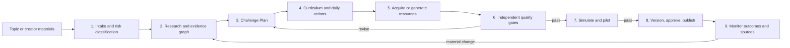
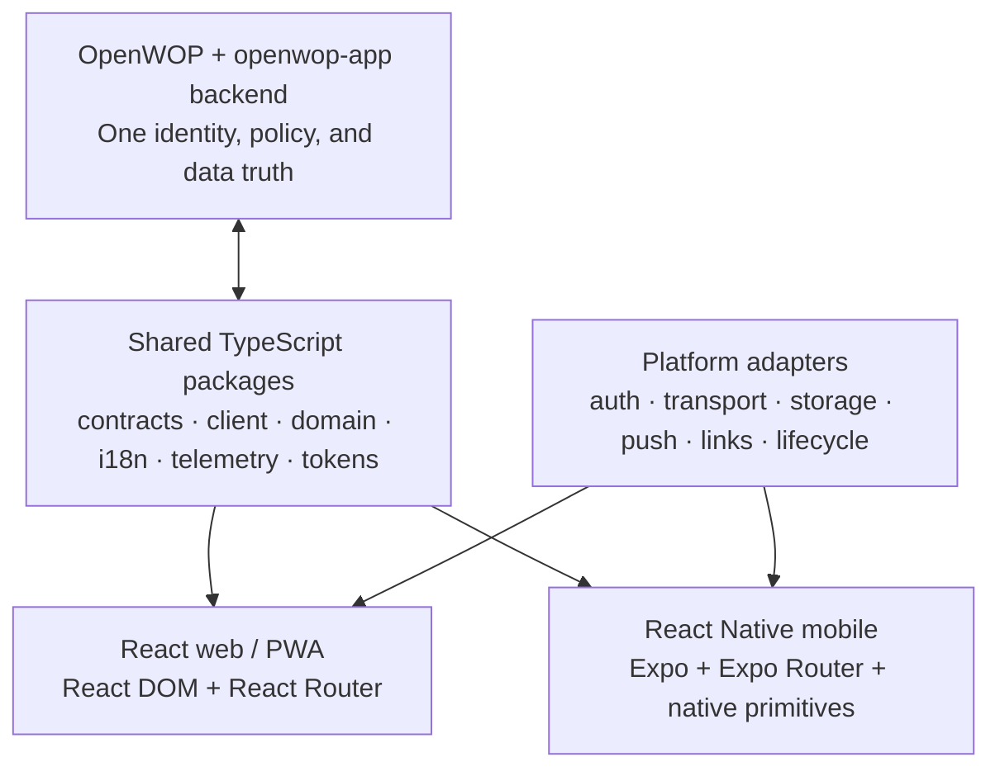

# PRD — KickTodo: goals that become guided, accountable action

| Field | Value |
|---|---|
| **Status** | Draft — architecture-reviewed 2026-07-18, two passes (grade **A−**); all findings from both passes folded in (see §18) |
| **Owner** | David Tufts |
| **Product** | KickTodo, with KickBot as the primary AI guide |
| **Tagline** | **Turn Dreams Into Plans** |
| **Target** | A branded openwop-app distribution and a set of self-contained feature packages, built on the existing OpenWOP workflow and multi-agent runtime |
| **Primary audience** | Adults balancing personal growth, health and wellness, family, career, finance, leadership, and other long-horizon goals |
| **Initial delivery surface** | Responsive React web/PWA plus a React Native participant app for iOS and Android; desktop web where useful for coaches, creators, and operators. |
| **Wire dependency** | **No new OpenWOP RFC for the initial product.** The MVP composes accepted goal, scheduling, verifier, approval, conversation, dispatch, pack, artifact, identity, and authorization contracts. |
| **Architecture posture** | Host-extension product surfaces under `/v1/host/openwop-app/kicktodo/*`; protocol behavior remains owned by the existing OpenWOP surfaces. |

> **Source synthesis.** This PRD incorporates the supplied KickTodo architectural description, business plan, Project Kickbot deck, and 2024 logo/web proposal. The historical dates, prices, competitor list, and implementation choices in those files are treated as inputs rather than current commitments. The durable intent is consistent: expert-authored challenges, daily achievable actions, flexible schedules, a supportive AI coach, fit-to-need accountability, visible progress, human coaching, and an eventual creator economy.

---

## 1. Executive summary

KickTodo should become a **guided achievement network**, not another to-do list. A user starts with a meaningful outcome, selects or creates a structured **Challenge**, adapts it to real-life constraints, and receives a small set of achievable actions at the right time. Their persistent named **KickBot agent** coordinates the plan, explains the next step, notices when the plan is no longer working, and helps the user recover without shame. KickBot is provisioned on the same standing-agent architecture as the app's other named agents, with its own governed workflows, schedules, knowledge, memory, Kanban workspace, conversations, connections, and activity history. The default name is “KickBot,” but the user may choose another name without creating a new agent or losing continuity. Friends, accountability partners, cohorts, and professional coaches can participate at the level the user explicitly chooses.

The best implementation path is to build KickTodo **on openwop-app**, as a white-label distribution plus a small suite of KickTodo-owned feature packages, and extend its React/TypeScript client architecture with a first-class **React Native app**. Web and native use the same OpenWOP host, identity and authorization model, schemas, domain rules, API client contracts, workflow execution, schedules, notifications, payments, replay, and observability. They do not duplicate backend truth, and they do not force React DOM components into a native renderer. The existing React PWA, workflow engine, feature registry, and branded distribution system give KickTodo a shorter and safer path to a polished iOS and Android product.

OpenWOP supplies the product's execution spine:

- An enrollment becomes an **RFC 0097 standing goal** with a declared completion judge and hard cost/time/iteration bounds.
- A published challenge is delivered as a **versioned challenge definition** executed by pinned host-built-in workflows and signed node/agent packs; workflow-chain and artifact-type packs are added only where validated portability is valuable.
- The existing scheduler starts the right workflow at the right local time; it is the only *time-of-day* cadence engine. (The heartbeat pull-loop is a separate autonomous cadence mechanism that also starts workflows; KickBot keeps it disabled by default—see §6.8.)
- Daily actions are human work items on the existing subject-owned board, with KickTodo metadata layered on top; KickTodo does not create a second generic task system.
- KickBot is one persistent named-agent instance on the existing roster/profile architecture. It uses the shared conversation system and convenes bounded specialist roles for planning, coaching, accountability, safety, and verification.
- Human approvals, coach review, and plan changes use the existing interrupt and approval primitives.
- Progress is a projection over completed actions, check-ins, goal evaluations, and runs—not a percentage that another store can contradict.
- Notifications, billing, commerce, and Stripe Connect are composed from their current owners rather than reimplemented.

KickTodo also needs a **Challenge Factory**: a reusable family of OpenWOP workflows that performs reproducible deep research, turns evidence into a structured Challenge Plan, decomposes that plan into daily action units, acquires or generates the required media, and refuses publication until the result passes evidence, instructional-design, behavior-design, safety, rights, accessibility, and simulated-user gates. The first catalog will be authored by AI through this factory; the same pipeline later accepts a creator's PDFs, links, video, audio, images, and original materials. “AI-authored” describes how the content is produced—not an exemption from source provenance, deterministic quality checks, or accountable release approval.

The product should launch in four cumulative waves: a solo guided-challenge MVP; accountability circles and coached cohorts; paid challenges and a governed creator marketplace; then selected calendar, wearable, messaging, and enterprise integrations. The entire vision remains in scope, but each wave lands at a real trust, data, or marketplace gate.

The one prerequisite that should not be hidden: the current openwop-app `goals` feature is primarily the RFC 0097 reference-host seam. Before KickTodo depends on it for real users, it must be productionized into the single goal controller that invokes the verifier, attaches contributing runs, enforces bounds, emits goal lifecycle events, and arms/disarms continuation. KickTodo must extend and consume that owner—not create `kicktodo-goals` beside it.

### Product promise

> Tell KickTodo what matters. Get a plan you can live with, the right support when you need it, and proof that you are moving forward.

### North-star outcome

**Meaningful weekly progress:** the share of active enrollments in which the user completes at least three planned actions or reaches a challenge-defined equivalent milestone without violating a safety or notification guardrail.

---

## 2. The new KickTodo vision

### 2.1 Category

KickTodo sits between a habit tracker, a learning program, a life coach, and an accountability community. Its differentiation is not the checklist. It is the **closed loop from aspiration to verified progress**:

1. Clarify the outcome.
2. Choose a proven challenge or create a personal plan.
3. Fit the plan to time, energy, preferences, and constraints.
4. Take one useful action now.
5. Capture a lightweight check-in or evidence.
6. Adapt the next action from actual progress.
7. Add the right level of human or AI accountability.
8. Stop when the declared success condition is met—or escalate safely when it is not.

### 2.2 Brand and voice

The product name remains **KickTodo**. **KickBot** is the default name of the user's in-product agent, not the product itself; a user-selected agent name replaces “KickBot” in conversational UI while product, safety, and provenance disclosures remain KickTodo-branded. The minimalist **“do” mark with the green check** is the primary compact icon; the full KickTodo lockup is used where brand recognition matters. Blue communicates trust and structure; green communicates progress and completion. The tone is encouraging, specific, and non-judgmental.

Copy principles:

- Prefer “What is one useful next step?” over “You are behind.”
- Treat snoozing, rescheduling, and reducing scope as valid planning actions.
- Celebrate evidence of progress, not compulsive app engagement.
- Never imply that KickBot—or a user-renamed instance—is a licensed medical, mental-health, financial, legal, or spiritual authority.
- Explain what AI changed and preserve the user's ability to approve, reject, or undo it.

### 2.3 Who it serves first

Initial focus: adults, especially busy professionals and caregivers, who have meaningful goals but struggle to translate them into sustainable daily behavior. The first release is 18+ and English-first, while every new UI surface follows the app's four-locale/i18n contract so localization does not become a retrofit.

Key segments:

- **Self-directed achiever:** wants a proven plan and private progress tracking.
- **Accountability seeker:** succeeds when a friend or small group can see selected progress.
- **Guided learner:** wants expert-authored lessons plus practical actions.
- **Coached participant:** pays for a bounded cohort with a real human coach.
- **Challenge creator:** turns expertise into a structured, governed, sellable program.
- **Organization sponsor:** later offers branded challenges to employees, members, or customers.

---

## 3. Product principles

1. **Action over administration.** The default home answers “What should I do today?”
2. **Plans adapt to lives.** Timezone, availability, accessibility, energy, and snooze choices are part of the plan—not exceptions to it.
3. **Accountability is consensual and graduated.** Private, partner, circle, cohort, and coach modes expose only what the user approves.
4. **AI proposes; policy and people govern.** Side effects, material plan changes, paid actions, and sensitive escalations are gated.
5. **Progress has one truth.** Action state belongs to the board; orchestration state belongs to runs; standing-goal state belongs to RFC 0097; KickTodo computes projections.
6. **Completion is earned, not clicked.** A user can mark an action done, but challenge completion follows the declared judge and criteria.
7. **Recovery is a feature.** Snooze, reduce, substitute, and restart are first-class branches with no guilt language.
8. **Content carries provenance.** Published challenge versions identify their author, review state, sources, risks, and change history.
9. **Replay must be safe.** Replaying a run never sends a duplicate nudge, charges a card, changes a check-in, or republishes content.
10. **OpenWOP remains honest.** Host-private KickTodo behavior is not advertised as portable protocol behavior until a separate RFC is accepted and conformance exists.

---

## 4. Core user journeys

### 4.1 Discover and enroll

1. The user browses curated challenges by desired outcome, category, time commitment, duration, difficulty, accountability mode, author, safety classification, price, and accessibility.
2. A challenge detail page shows the outcome, daily rhythm, example actions, evidence expectations, author, reviews, refund terms, and what the user's KickBot agent or a coach can see.
3. A short intake captures goals, schedule, timezone, constraints, accessibility needs, notification preferences, and optional accountability choices.
4. The plan-personalization workflow invokes the task-scoped Plan Builder skill, deterministic validators, and independent safety review within the publisher's allowed adaptation policy.
5. The user reviews the plan as an approval card: schedule, intensity, substitutions, privacy, AI use, bounds, and price.
6. Approval creates the enrollment, pins the challenge version, creates the standing goal, attaches the workflow, and arms the schedule idempotently.

**Success condition:** the user can reach a clear first action in under five minutes without understanding workflows or agents.

### 4.2 Today: do the next useful thing

The default KickTodo screen is **Today**, not a dashboard of configuration. It shows:

- A short focus statement from the challenge.
- Due actions grouped by morning, afternoon, evening, or “any time.”
- Estimated time and required materials.
- Start, Done, Journal, Ask KickBot, Substitute, and Snooze actions. When the user renames their agent, the rendered label uses that chosen name.
- A compact view of active challenges to prevent overload.
- An explanation for why a changed action was recommended.

Marking an action done updates the board card and creates a check-in. Evidence may be a note, rating, photo/media reference, measured value, or no evidence when the challenge allows simple attestation.

### 4.3 Recover from a missed day

When an action is missed, KickTodo offers policy-safe choices:

- Do it later today.
- Move it to the next available slot.
- Substitute an equivalent lighter action.
- Reduce the week's target.
- Snooze the challenge for a declared duration.
- Ask KickBot to re-plan.
- Ask a partner or coach for help.

No missed-day branch silently doubles tomorrow's workload. A plan change that alters the completion contract or materially increases risk requires explicit approval.

### 4.4 Ask KickBot

The user's named KickBot agent is available from Today, challenge detail, progress, and circle surfaces through the **same shared conversation system**. These are entry points into the same persistent agent identity and relevant durable conversation—not separate KickBot copies or mini-chat implementations. Context determines the active challenge, memory scope, and permitted tools.

KickBot can:

- Explain today's action and its source.
- Offer allowed substitutions.
- Summarize progress and patterns.
- Help journal or reflect.
- Propose a schedule or intensity change.
- Prepare a concise update for an accountability partner or coach.
- Escalate uncertainty, safety concerns, or repeated non-progress.

KickBot cannot silently complete actions, change evidence, expose private journal content, purchase a challenge, publish creator content, or grant a coach access. A custom name never changes these boundaries or obscures that the agent is AI.

### 4.5 Add accountability

The user chooses one of five levels:

1. **Personal:** private reminders and self-review.
2. **Partner:** one person sees a user-selected summary and may nudge or comment.
3. **Circle:** a small, resource-scoped group shares selected progress and a challenge room.
4. **Cohort:** a time-bounded group follows one published challenge version together.
5. **Coach:** a professional receives only the explicitly granted progress, check-in, and messaging scopes.

Invitations state exactly what the invitee will see. Access can be revoked immediately. Private journal text and sensitive metrics are never included by default.

### 4.6 Complete and reflect

After each contributing run or declared checkpoint, the verifier evaluates the challenge's completion criteria. When satisfied, the enrollment closes and KickTodo produces:

- A progress summary.
- A completion certificate when the challenge supports one.
- A private reflection prompt.
- Optional sharing copy that reveals no sensitive data unless the user adds it.
- A next-challenge recommendation that is advisory, not an automatic enrollment.

---

## 5. Product surfaces

| Surface | Purpose | Existing openwop-app composition |
|---|---|---|
| **Today** | Due actions, start/done/check-in/snooze, active-challenge focus | Subject-owned kanban board + schedule projection + notification preferences |
| **Discover** | Browse published challenges and categories | KickTodo catalog; CMS for public editorial pages; Analytics for consented measurement |
| **Challenge detail** | Outcome, curriculum, author, safety, price, reviews | Published immutable challenge snapshot + Media + Commerce projection |
| **Enrollment** | Intake, personalized plan, consent, approval | Forms/run-input forms + workflow run + HITL approval |
| **KickBot agent** | Persistent named guide, contextual coaching, delegated work, and plan changes | Existing standing-agent roster/profile/workspace + chat + KickTodo workflows and specialist-skill pack |
| **Progress** | Adherence, milestones, trends, evidence, completion | Projection over board cards, check-ins, goal events, and run artifacts |
| **Circle / Cohort** | Scoped group progress, messages, coach presence | KickTodo resource ACL + existing conversation/notification infrastructure |
| **Creator Studio** | Author, preview, version, review, publish | Documents/KB/Media inputs + KickTodo structured definition + approval queue |
| **Coach Console** | Caseload, consented progress, flags, sessions | Accountability grants + notifications + challenge rooms |
| **Marketplace / Checkout** | Buy a challenge or coached cohort | Commerce and Billing; later Commerce Connect for creator payouts |
| **Settings** | Schedule, timezone, notifications, privacy, AI, data export | Existing settings, consent, notification prefs, connections, portability |

The configurable-navigation overlay should make the KickTodo distribution feel purpose-built: Today, Discover, Progress, the user's chosen agent name, and Circle dominate. Authoring, commerce, and operations surfaces appear only to eligible roles. Generic OpenWOP administration remains available to operators but is not the consumer information architecture.

---

## 6. Domain model and single sources of truth

### 6.1 `ChallengeDefinition`

A versioned, publishable executable curriculum owned by `kicktodo-core`:

```text
ChallengeDefinition
  id, version, status: draft|in-review|published|retired
  owner: { tenant, workspace?, principal? }, authorSubject
  title, summary, categoryIds[]
  outcome, audience, prerequisites[], contraindications[]
  duration, difficulty, estimatedMinutesPerDay
  activities[]
    stableActivityId, day/phase, title, instructions, contentRefs[]
    actionType, evidencePolicy, substitutions[], safetyTags[]
  completionPolicy
    verifierRef, successCriteria, minimumActions, allowedMisses?
  adaptationPolicy
    scheduleFlexible, intensityRange, allowedSubstitutions[]
  accountabilityModes[]
  executionProfile
    builtinWorkflowId, workflowDefinitionHash, packRefs[]
    portableWorkflowChainPackRef?
  artifactTypeRefs[]
  productRef?, coachOfferingRefs[]
  contentHash, provenance, reviewRecord, createdAt, publishedAt
```

Published versions are immutable and content-addressed. An author change creates a new version; active enrollments remain pinned unless the user explicitly accepts a safe migration. The initial app executes a small set of host-built-in, versioned KickTodo workflows parameterized by the definition; it does **not** generate one workflow or pack per challenge. An optional workflow-chain pack is an export/portability layer only after a challenge truly needs portable executable structure. Draft prose and source research can live in Documents/KB/Media, but the executable challenge structure has one owner: `kicktodo-core`.

### 6.2 `ChallengeEnrollment`

The user's pinned contract with a challenge:

```text
ChallengeEnrollment
  id, owner: { tenant, workspace?, principal }, ownerSubject
  challengeId, challengeVersion, challengeContentHash
  state: pending-approval|active|snoozed|completed|abandoned|escalated
  goalId                         -> existing RFC 0097 goals owner
  builtinWorkflowId + workflowDefinitionHash + resolved pack versions
  schedulePolicy, timezone
  accountabilityPolicyRef?
  conversationId
  boardId
  approvedPlanArtifactRef
  productOrderRef?
  createdAt, activatedAt, closedAt?
```

The enrollment does **not** own a second completion state machine. Its state is a product projection coordinated with the authoritative RFC 0097 goal lifecycle. The goal's wire-visible `objective` is a short SR-1 redaction-safe statement; the private plan and sensitive context remain in access-controlled KickTodo artifacts. Any enrollment/goal mismatch is an error surfaced to operations, not silently reconciled.

### 6.3 Daily actions

A daily action is a **human action card on one deterministic KickTodo board owned by the existing subject-aware Kanban service**, not a generic KickTodo task row and not one board per enrollment. The board is created without trigger columns so placing a user action in “To Do” cannot accidentally start a workflow. `kicktodo-core` owns a small occurrence record keyed by the deterministic card id:

```text
KickTodoActionOccurrence
  cardId
  enrollmentId
  challengeVersion
  stableActivityId
  occurrenceDateLocal
  evidencePolicy
  substitutionOf?
```

Occurrence/card ids are deterministic from `(enrollmentId, localDate, stableActivityId, planRevision)`, and the materialization saga relies on the Kanban `createCard({ cardId })` path treating same-board re-creation as idempotent while failing closed on a cross-board collision. **(Review note: an independent audit confirmed the `cardId` model and terminal-column completion exist on `kanbanService.ts`, but did not confirm this exact idempotent-create / cross-board-collision semantic — the Wave-0 `kicktodo-core` ADR must verify or establish it before the saga depends on it; see §18.)** The occurrence owns challenge meaning, due window, and evidence policy; the board card owns human work state; the check-in owns submitted evidence. A materialization saga can therefore repair a missing card or occurrence without inventing a second completion truth. Today reads the occurrence index and point-loads known card ids—never scans all cards across tenants.

Because the deterministic id includes `planRevision`, idempotency holds only **within** one revision. An approved re-plan therefore runs an explicit **plan-revision transition step**: atomically supersede/cancel the prior revision's not-yet-terminal occurrences and cards *before* materializing the new revision, so a re-plan—even one landing mid-day after materialization has already run—yields exactly one live card per `(enrollment, localDate, stableActivityId)` across the revision boundary. Terminal (completed) cards keep their history and evidence. **(Second-pass review finding, 2026-07-18; see §18 and ADR 0414.)**

### 6.4 `CheckIn`

A check-in records the user's response to an action: attestation, note, rating, mood (opt-in), measured value, or Media refs. It is user-owned and private by default. Only an explicit `AccountabilityGrant` may project selected fields to another person. AI retrieval of journal text is a separately visible consent, not implied by enrolling.

### 6.5 Progress

Progress is computed from:

- Board-card action state.
- Check-ins and accepted evidence.
- Goal `progress`, `goal.evaluated`, and `goal.closed` data.
- Contributing workflow runs and typed artifacts.
- Approved plan changes, snoozes, and substitutions.

The progress service may cache a projection for performance, but the cache is rebuildable and never an independent money/completion truth.

### 6.6 Accountability resources

`AccountabilityCircle` and `AccountabilityGrant` are product resources, not workspace membership aliases:

```text
AccountabilityCircle
  id, enrollmentId|cohortId, ownerSubject
  type: partner|circle|cohort|coach
  members[]: { subjectRef, roleLabel, status }
  conversationId

AccountabilityGrant
  id, enrollmentId, grantorSubject, granteeSubject
  scopes: progress-summary|action-status|check-in-note|message|coach-plan-proposal
  expiresAt?, revokedAt?
```

Subjects are stable opaque `{kind,id}` references, never email addresses or auth-provider identities. This is necessary because consumer participants may belong to different workspaces. Adding a friend to an organization would grant a much broader relationship and is therefore the wrong abstraction. Every circle read is resource-scoped, fail-closed, and uniform-404 for non-members.

The current generic chat routes resolve storage from the caller's active tenant, so they do **not yet** make a cross-workspace circle work by themselves. `kicktodo-accountability` needs a reviewed resource-conversation binding seam: resolve the circle's owning tenant by opaque resource id, prove the caller's live grant, then call the existing conversation store/service under that tenant. KickTodo owns no transcript store and the generic chat API must not be weakened to accept arbitrary tenant ids. This remains host-private unless OpenWOP later standardizes cross-host membership semantics.

### 6.7 Catalog and money boundaries

- The existing **pack Marketplace** remains the marketplace for signed OpenWOP feature/node/agent packs. It is not renamed or overloaded as the consumer challenge catalog.
- The KickTodo catalog owns discovery of published challenge versions.
- **Commerce** owns products, prices, carts, orders, refunds, and inventory-like availability.
- **Billing** owns KickTodo subscription tiers and KickBot entitlements.
- **Commerce Connect** is extended only when third-party creator payouts are introduced. The MVP can sell curated first-party challenges through ordinary Commerce.
- Stripe webhook, client, secret, routing, fulfilment, idempotency, and money-truth invariants remain exactly where ADR 0176/0385 put them.
- **Wave-3 marketplace prerequisites (review finding H2).** The Connect seller marketplace (onboarding, approval-gated dual paid lanes, destination charges, refunds/disputes ledger) is production-shaped, but two pieces are genuinely unbuilt and must be named as Wave-3 blockers, not assumed: (1) **a "challenge" listing/product type does not exist today** — Commerce's product types are the closed set `physical|digital|service` and the Connect paid-listing is pack-keyed, so a sellable challenge is a new concept either lane; and (2) **per-buyer challenge entitlement is a named ADR 0385 deferral** — `resolveEntitlements` does not model marketplace purchases and Connect pack install is host-wide superadmin, so scoped per-buyer unlock of a challenge/workflow-family is net-new work. Selling a challenge as a plain `digital` Commerce product sidesteps pack-install but is *not* the governed creator marketplace (no Connect seller onboarding or fee split).

### 6.8 KickBot named-agent identity and workspace

KickBot is **not merely a prompt, avatar, chat tab, agent pack, or stateless assistant**. Each user receives one persistent named standing-agent instance in their personal workspace, provisioned through the same roster, agent-profile, workflow, scheduler, knowledge, memory, Kanban, conversation, connection, approval, and activity owners used by the app's other named agents. The KickTodo distribution supplies a branded named-agent template that provisions the roster entry and profile; `feature.kicktodo.agents` supplies only the task-scoped specialist skills that KickBot may invoke. This preserves openwop-app's existing taxonomy: named agents are roster/profile instances, while handoff-based agent manifests are composable skills.

KickTodo must not add a parallel `KickBotAgent` table, private scheduler, memory store, vector store, board implementation, or transcript store. The named instance is a composed projection over existing owners:

| Agent capability | Existing owner | KickBot use |
|---|---|---|
| Stable identity and visible persona | Standing-agent roster (`rosterId`, `agentRef`, `roleKey`, `persona`, `label`) | One tenant-scoped instance with stable semantic role `kicktodo-guide` |
| Governance and tools | Agent profile | Capabilities, tool allowlists, required connections, autonomy bounds, approvals, and HITL policy |
| Workflow portfolio | Roster workflow bindings + built-in workflows | Enrollment, daily coaching, recovery, progress review, research assistance, and approved follow-up workflows |
| Schedules | Existing scheduler and scheduled-agent-chat behavior | Timezone-aware check-ins and reviews created only with user consent; no hidden cadence engine |
| Knowledge base | Existing KB/notebook/document bindings and cited retrieval | Challenge sources, user-approved materials, product guidance, and scoped enrollment context |
| Memory | Existing per-agent memory namespace | Durable preferences and useful facts that policy permits the agent to retain |
| Agent work | Roster-bound Kanban board | Delegated research, follow-ups, monitoring, and proposals owned by the agent |
| Conversation | Existing durable conversation owner | Continuous user relationship across product surfaces, with resource-scoped threads where required |
| History and observability | Existing run, activity, artifact, and metrics owners | Traceable decisions, specialist delegation, approvals, errors, and outcomes |

Provisioning is an idempotent, forward-repairable saga. It first ensures the default stable roster identity (for example `host:kickbot`) and `roleKey: kicktodo-guide`, then ensures its agent profile, Kanban board, workflow portfolio, knowledge and memory bindings, welcome conversation, and required workflow/skill-pack dependencies. A run may resolve a controlled pack channel for an invoked skill, but it stamps the concrete named-agent, specialist, workflow, node, and model versions used. Because an absent roster heartbeat inherits the host default, a new KickBot instance is explicitly created with heartbeat **off** and review-level autonomy. Schedules and autonomous heartbeat work remain disabled until the user approves timezone, cadence, quiet hours, notification policy, tool/connection access, and the relevant autonomy scope.

**Naming and continuity contract:**

- The default visible name is **KickBot**. Onboarding offers a user-chosen name, and the name remains editable later from the agent profile.
- A rename changes only mutable presentation fields such as `persona`, `label`, avatar, and a collision-checked display/mention alias. It never changes `rosterId`, `agentRef`, `roleKey`, owner subject, memory namespace, KB bindings, board ownership, workflow/schedule bindings, conversation ids, grants, run attribution, or historical records.
- Authorization, storage keys, joins, schedules, and tool grants never depend on the visible name. Historical runs retain the stable agent id and may also snapshot the display name used at execution time.
- Renaming does not create a new agent and does not reset memory, progress, schedules, workflows, or conversations. Resetting or replacing an agent is a separate, explicit, policy-governed operation.
- The UI continues to disclose that the renamed guide is an AI agent provided by KickTodo; custom naming cannot imitate a verified human coach or remove safety disclosures.

KickBot's Kanban board and the participant's daily-action board are intentionally different projections. The **participant board** contains human actions and is the completion truth for a challenge. The **agent board** contains work delegated to KickBot—research, reminders, follow-ups, monitoring, and proposals. Agent cards may reference an enrollment, challenge, or participant action, but they never duplicate or overwrite human completion state.

Disabling or deleting the instance first writes the explicit heartbeat-off state, pauses schedules and autonomous work, revokes or detaches tools and connections according to policy, and preserves or erases history according to the product's retention contract. No operation may leave orphaned scheduled work running under a retired identity.

---

## 7. Challenge Factory: creating the first catalog

### 7.1 Product intent and two reusable lanes

The first KickTodo challenges must feel intentionally researched, authored, paced, and tested—not like a long prompt split into 30 pieces. The Challenge Factory is therefore a **family of versioned OpenWOP workflows**, not one monolithic “generate course” workflow. Its output is an immutable, evidence-backed `ChallengeDefinition` plus the research, rights, evaluation, and provenance records needed to defend and improve it.

It supports two intake lanes:

1. **AI-first catalog lane.** KickTodo supplies a topic, audience, desired transformation, duration, daily time budget, commercial constraints, and risk tier. The factory researches and creates the full challenge.
2. **Creator-assisted lane.** An author supplies any combination of a brief, links, articles, PDFs, slides, documents, images, audio, video, transcripts, or a syllabus. The factory treats them as candidate evidence and creative direction, identifies gaps, researches what is missing, and returns an editable plan with source-by-source usage decisions.

Both lanes converge on the same canonical artifacts, gates, versioning, and publishing workflow. There is no lower-quality “creator import” path. Retrieved and uploaded content is always untrusted data, never workflow instructions.

### 7.2 Competitive and standards synthesis

| Pattern | What the research shows | KickTodo implication |
|---|---|---|
| Small actions that accumulate | Fabulous describes behavior-science-backed routines and turning small daily tasks into lasting change. | Start tiny, ramp deliberately, support habit stacking, and make recovery a designed branch. |
| Guided daily learning | Noom describes daily expert-developed lessons with read/listen options and optional enrichment. | Cap daily load and connect every lesson to an immediate real-world action. |
| Sequenced, adaptive, multimodal practice | Duolingo uses bite-sized units, progressive difficulty, personalized review, active recall, spaced repetition, and multiple modalities. | Build a competency graph; interleave learn, recall, practice, apply, and reflect; schedule review from evidence. |
| Modular AI authoring with editorial control | Current authoring products generate outcomes, modules, objectives, assessments, media, and typed blocks while keeping them editable. | Support targeted regeneration at claim, resource, day, and phase level instead of regenerating the whole challenge. |
| Reproducible evidence synthesis | PRISMA 2020 and PRISMA-S emphasize reporting search methods, selection, exclusions, and evidence flow. | Preserve query, screening, exclusion, deduplication, and source-flow records. Use “PRISMA-inspired”; never claim a systematic review unless one was performed. |
| Explicit evidence confidence | GRADE considers bias, inconsistency, indirectness, imprecision, and publication bias. | Give consequential claims a transparent, fit-for-product confidence assessment, with stricter thresholds in sensitive domains. Do not claim GRADE certification. |
| Outcome/activity/assessment alignment | Quality Matters treats alignment among objectives, assessments, materials, activities, technology, support, and accessibility as central. | Trace every daily action to an achievement and outcome, and give every outcome adequate action and evidence. |
| Inclusive alternatives by design | CAST's UDL framework addresses inclusive goals, methods, materials, assessments, and environments. | Require equivalent sensory/action routes, accessible media, and flexible ways to demonstrate progress. |
| AI lifecycle governance | NIST's Generative AI Profile organizes governance around mapping, measuring, and managing risks. | Version models, prompts, policies, evaluations, incidents, and monitoring across the factory lifecycle. |

KickTodo's differentiation is the final mile. Course tools largely stop at lessons and assessments; habit products largely stop at routines. KickTodo turns grounded knowledge into a **daily real-world action contract** with evidence, adaptation, accountability, coaching, recovery, and an OpenWOP execution trail.

Research basis: [Fabulous](https://www.thefabulous.co/), [Noom daily lessons](https://www.noom.com/support/faqs/using-the-app/daily-features/2025/10/how-to-find-and-revisit-your-noom-lessons/), [Duolingo learning path](https://blog.duolingo.com/duolingo-101-how-to-learn-a-language-on-duolingo/), [Duolingo spaced repetition](https://blog.duolingo.com/spaced-repetition-for-learning/), [PRISMA 2020](https://www.prisma-statement.org/prisma-2020-statement), [PRISMA-S](https://www.prisma-statement.org/prisma-search), [GRADE](https://www.gradeworkinggroup.org/), [Quality Matters](https://www.qualitymatters.org/qa-resources/rubric-standards/higher-ed-rubric), [CAST UDL](https://udlguidelines.cast.org/), and [NIST AI 600-1](https://nvlpubs.nist.gov/nistpubs/ai/NIST.AI.600-1.pdf). Examples of modular authoring include [Articulate Rise](https://www.articulate.com/360/rise/) and [Mini Course Generator](https://minicoursegenerator.com/). These sources inform the design; inclusion is neither endorsement nor permission to reuse their content.

### 7.3 Factory workflow family



Each stage is a separately versioned built-in workflow or sub-workflow. Its concrete definition hash and pack inputs are pinned into the run/enrollment record. A stage may later be exported as a workflow-chain pack when another host must execute it. This enables bounded parallel research, retries, replay-safe evaluation, independent provider/model selection, targeted regeneration, and resumability from accepted artifacts without making the MVP depend on a production-absent dynamic chain-expansion seam.

#### Workflow 1 — intake, framing, and portfolio selection

Inputs include topic, transformation, audience, exclusions, tone, duration, daily time budget, locale, accountability modes, and optional creator materials with declared ownership/license. The workflow outputs:

- A normalized author brief and jobs-to-be-done statement.
- Research questions covering outcomes, audience needs, prerequisites, effective actions, failure modes, contraindications, accessibility, culture/localization, competitors, and candidate resources.
- A risk class: `general`, `sensitive`, `regulated-adjacent`, or `prohibited`.
- Inclusion/exclusion criteria, freshness and evidence thresholds, rights policy, cost ceiling, and reviewer requirements.
- A go/no-go/needs-expert decision before expensive generation.

For the seed catalog, a portfolio run scores candidate topics on user value, actionability, evidence quality, differentiation, safety, source durability, time-to-value, seasonality, and overlap. It optimizes for a coherent catalog, not 24 unrelated high-volume keywords.

#### Workflow 2 — deep research and evidence graph

1. Generate query families for foundations, current evidence, opposing evidence, lived-experience barriers, safety, accessibility, cultural context, competitive products, and candidate media.
2. Search in parallel across approved providers. Prefer primary research, government/professional guidance, original creator sources, first-party product documentation, and rights-clear libraries.
3. Fetch and normalize allowed sources. Load files/URLs, extract PDFs, ingest permitted YouTube captions, transcribe creator-owned media, and OCR images only when rights allow.
4. Deduplicate canonical URLs and near-duplicate content. Record redirects, date, author/publisher, type, language, hash, access date, and freshness.
5. Screen sources against declared criteria and log every exclusion reason.
6. Extract claims, recommended actions, measures, prerequisites, risks, contraindications, and exact locators such as page, section, paragraph, or timecode.
7. Cluster supporting and conflicting claims into an evidence graph. Rate source quality and claim confidence; repetition is not evidence strength.
8. Run a deliberate contradiction/adversarial search on consequential recommendations.
9. Produce a research dossier, evidence table, contradiction register, content-opportunity map, and unresolved-question list.

Every factual statement in a plan or daily action must be traceable to an entailing source, labeled as opinion/creative framing, or removed. A citation about the same topic is not sufficient.

#### Workflow 3 — Challenge Plan generation

The `kicktodo.challenge-plan` artifact is the PRD and cross-workflow contract for one challenge:

```text
ChallengePlan
  identity: title, promise, category, locale, authorMode
  audience
    personas, jobsToBeDone, motivations, barriers
    prerequisites[], exclusions[], accessibilityNeeds[]
  transformation
    currentState, targetState, scopeBoundary, nonPromises[]
  outcomes[]
    measurableOutcome, baseline, target, method, timeHorizon
    evidenceClaimRefs[], confidence
  achievements[]
    stableId, observableEvidence, outcomeRefs[]
    prerequisiteAchievementRefs[], masteryRule
  behaviorDesign
    minimumViableAction, progressionModel, habitAnchors[]
    frictionPlan, recoveryPlan, motivationWithoutManipulation
  curriculum
    phases[], durationRange, cadence, timeBudgetPerDay
    learnActionReflectionMix, spacedReviewPolicy
  activityBlueprints[]
    purpose, achievementRefs[], actionType, evidenceType
    difficulty, duration, resourceNeeds[], substitutions[]
  accountability
    modes[], sharingDefaults, coachEscalations[]
  adaptation
    personalizationInputs[], safeVariationBounds, lockedElements[]
  safety
    tier, contraindications[], stopRules[], escalationCopy
    expertReviewRequirements[]
  contentAndRights
    sourceRefs[], permittedUses[], originalContentNeeds[]
    mediaGenerationNeeds[], attributionRequirements[]
  evaluation
    successMetrics[], qualityRubric, pilotPlan, retirementTriggers[]
  operations
    workflowRefs[], modelPolicy, budget, freshnessPolicy
  provenance
    researchRunId, sourceSnapshot, policyVersions
    unresolvedQuestions[], approvals[]
```

The generator produces at least two materially different architectures and a scored recommendation. A deterministic validator rejects vague promises, unmeasurable outcomes, orphan achievements, unsupported claims, unsafe scope, implausible loads, and resource needs without a rights-safe path.

#### Workflow 4 — curriculum and daily-action decomposition

The decomposer applies backward design: outcome → observable achievements → prerequisites → phases/milestones → evidence-producing daily actions → necessary resources. It inserts retrieval, reflection, application, consolidation, transfer, and recovery days rather than filling every day with new content.

```text
DailyActionUnit
  stableActivityId, dayWindow, phase, title
  userFacingWhy, actionInstruction, doneDefinition
  outcomeRefs[], achievementRefs[], prerequisiteRefs[]
  estimatedMinutes, difficulty, energyProfile, materials[]
  contentBlocks[]
    type: article|video|audio|podcast|pdf|image|prompt|exercise|quiz
    sourceRef?, generatedAssetRef?, locator?, requiredOrOptional
  retrievalOrReflectionPrompt?
  evidencePolicy
    attestation|note|quiz|artifact|photo|measurement|coachReview
  substitutions[]
    equivalentOutcome, lowerEnergy, lowerCost, accessibleAlternative
  recoveryBranch, skipConsequence, nextReviewAt?
  safetyNotes[], stopRules[], escalationRoute?
  accessibility
    transcriptRef?, captionsRef?, altText?, readingLevel
    nonVisualAlternative?, nonAudioAlternative?, nonPhysicalAlternative?
  coachPrompts[], accountabilityShareTemplate?
  claimRefs[], attribution[], rightsDecisionRefs[]
  qualityScores, generationProvenance
```

Daily design rules:

- Default required load is 5–20 minutes. Longer actions are disclosed before enrollment and offer a valid smaller version when the outcome permits it.
- One clear primary action per day; enrichment is visibly optional.
- Watching or reading alone is rarely progress evidence; pair it with recall, choice, practice, creation, observation, or application.
- Difficulty ramps within declared bounds. Day one creates a useful early win without a false promise.
- Every seven-day span includes review/consolidation and a recovery path.
- Required actions trace to achievements; achievements trace to outcomes.
- Substitutions preserve the outcome rather than merely resembling the original activity.
- Cumulative time, cognitive, emotional, financial, physical, and equipment loads stay within plan limits.

#### Workflow 5 — resource acquisition and original media

For each need, the resource planner chooses a recorded disposition:

1. **Link/embed** through a publisher-supported player/page when commercial use, privacy, accessibility, and durability are acceptable.
2. **Quote/excerpt** only within documented rights and with attribution/locator.
3. **License/import** creator-owned, licensed, public-domain, or compatible Creative Commons material.
4. **Generate original** text, worksheet, diagram, image, narration, podcast segment, or video when no strong rights-safe resource exists.

Image, audio, and video generation is used only when the medium improves the action. Assets receive disclosure, prompt/model provenance, accessibility metadata, moderation, and technical QA. Factual scripts are restricted to the evidence graph and independently citation-checked before synthesis.

Rights decisions distinguish `link-only`, `embeddable`, `licensed-hosting`, `adaptation-allowed`, `commercial-use-allowed`, `AI-processing-allowed`, and `unknown/blocked`. Unknown fails closed. Every external dependency gets availability/freshness checks and a fallback.

This is a hard product constraint:

- YouTube supports embedding subject to its API/developer policies. Use privacy-enhanced mode where appropriate; do not assume captions/downloads can be republished; provide a fallback.
- [TED's usage policy](https://www.ted.com/about/our-organization/our-policies-terms/ted-talks-usage-policy) says structured commercial/course use may require a license, and [TED's terms](https://www.ted.com/about/our-organization/our-policies-terms/ted-com-terms-of-use) prohibit putting TED content into AI workflows without written permission. The factory never scrapes or AI-summarizes TED content by default; a TED item is `link-only/blocked-for-AI` unless licensed.
- [Creative Commons licenses](https://creativecommons.org/share-your-work/use-remix/cc-licenses/) differ: `NC` can conflict with paid challenges and `ND` prohibits adaptation. Attribution alone is not enough.

#### Workflow 6 — independent evaluation and red-team gates

Generation and evaluation run separately. High-impact checks use different provider/model configurations where possible. Evaluators are tasked to find defects, not polish copy.

| Gate | Hard requirement |
|---|---|
| Schema/graph | Schemas valid; ids/references resolve; no prerequisite cycles. |
| Evidence/factuality | Consequential claims have entailing citations; conflicts resolved or disclosed; confidence meets risk tier. |
| Alignment | Outcomes map to achievements/evidence; required actions map to achievements; no unsupported transformation promise. |
| Behavior design | Small start, progression, friction/recovery plan; no shame, coercive streak loss, or engagement dark patterns. |
| Daily usability | One primary action, clear done definition, realistic time, available prerequisites, no workload stacking. |
| Safety | Contraindications, stop rules, uncertainty, escalation; prohibited diagnosis/treatment-like behavior blocked. |
| Rights/durability | Every source/asset has a permitted disposition, attribution, health check, and fallback. Unknown rights fail. |
| Accessibility/inclusion | Captions, transcripts, alt text, equivalent routes, reading level, contrast, language, and assumptions pass. |
| Privacy | No unnecessary data request, unsafe evidence, hidden sharing, or sensitive inference. |
| Originality | No suspicious phrase overlap or unlicensed derivative output; provenance stamped. |
| Media | Integrity, intelligibility, moderation, factual script alignment, length, and mobile delivery pass. |
| Product simulation | Enroll, schedule, complete, miss, substitute, snooze, resume, and close without a dead end. |

The rubric totals 100 points across evidence, outcome design, daily quality, behavior design, accessibility, safety, rights, delight, and operational integrity. Publication requires **90/100 overall**, no category below **80%**, every hard gate passed, zero severity-1 defects, zero unresolved severity-2 trust defects, and replay/fork/idempotency checks on side effects. Delight—usefulness per minute, voice, variety, emotional arc, media fit, and milestone salience—is measured but cannot compensate for a trust failure.

#### Workflow 7 — simulation, pilot, approval, and publication

Synthetic preflight personas include the intended beginner, a time/energy-constrained user, relevant accessibility routes, a prerequisite-gap user, a claim-checking skeptic, a returning missed-week user, and an adversary attempting unsafe advice, evidence fraud, source prompt injection, or privacy leakage. Simulation yields traces, confusion points, time estimates, unsafe branches, and revisions; it is not evidence of real-world effectiveness.

Release stages:

1. **Dogfood:** complete every action and validate every dependency on mobile and desktop.
2. **Closed alpha:** 10–25 representative people per challenge; measure time accuracy, completion clarity, usefulness, burden, accessibility, trust, and early outcome signal.
3. **Canary:** limited eligible audience with incident monitoring and rollback.
4. **Catalog release:** immutable version plus signed evidence/evaluation bundle.

The first catalog can be 100% AI-authored while remaining accountable. Initially, an authorized KickTodo editor approves the bundle; regulated-adjacent or sensitive subjects also require a qualified domain reviewer. This is governance, not co-authorship. Fully autonomous publication is a later evidence-gated capability and remains prohibited for sensitive tiers.

#### Workflow 8 — post-publication monitoring

Monitor broken/redirected/paywalled/removed/geoblocked resources; embed status; source freshness and retractions; license/terms changes; material contradictions; time accuracy; abandon points; substitution and recovery rates; accessibility reports; incidents; refunds; and outcome evidence. Minor metadata fixes preserve a version only if the user contract is unchanged. Any material action, claim, outcome, resource, safety, or completion-policy change creates a new immutable version. A kill switch unlists a challenge and blocks new enrollments while preserving audit evidence.

### 7.4 Reusing existing node and agent packs

| Need | Existing OpenWOP capability |
|---|---|
| Research | `core.openwop.web-search`, `core.openwop.http`, deep-research/research-crew agents |
| Parallelism/resilience | Flow router, iterator, aggregate, batch, sub-workflow, wait, and error nodes |
| Ingestion | RAG URL/file/GitHub/S3 loaders; Files PDF extraction and MIME/image utilities |
| Video/audio sources | Notebook YouTube-caption and transcription nodes; AI audio transcription |
| Retrieval | RAG splitters/retrievers, KB semantic search and citation-aware RAG, embeddings/rerank |
| Typed content | AI structured output, extract, classify, guardrail, transform; structured-extractor/long-doc agents |
| Claim grounding | Campaign grounded-kernel, verified evidence, proof-linked angles, per-claim verification patterns |
| Documents/slides | Template, assemble, render/export, outline, draft, notes, and deterministic audit nodes |
| Images/audio/video | AI image/audio/video nodes; Podcasts outline/transcript/TTS/mix; Creative Video jobs |
| Accessibility | Accessibility content-check and alt-text nodes plus media/document render checks |
| Approval | HITL form, approval, and ask-user nodes |
| Deterministic validation | JSON Schema validation plus KickTodo validators |

These are reusable primitives, not automatic proof of production readiness. In particular, `core.web.search` intentionally returns a deterministic `stub: true` fixture when `host.webSearch` is unavailable. A Challenge Factory publication run **must fail closed** on stub search results and require a real advertised/configured search adapter. The same rule applies to model and media nodes: placeholder, demo, or unresolved provider output can exercise a workflow but can never enter a release bundle.

The Factory uses the existing agent taxonomy instead of treating every role alike:

- **Persistent factory coworkers**—for example a Research Lead, Challenge Architect, Producer, and Release Coordinator—may be named roster/profile agents in the operator or creator workspace. They retain a work portfolio, project memberships, schedules, approved knowledge, memory, board, conversations, and activity across many challenge candidates.
- **Task-scoped specialists**—for example evidence critic, behavior-design critic, rights checker, accessibility reviewer, safety reviewer, and rubric evaluator—are handoff-based skills carried in the signed `feature.kicktodo.agents` pack. They receive bounded task inputs and scratchpad, return typed artifacts, and do not acquire standing memory, schedules, or publication authority. The `.agents` namespace remains the registry name even when the host presents these handoff workers as “Skills.”
- **Deterministic policy and state transitions** remain `feature.kicktodo.nodes` or host services. Schema validation, rights-policy application, score aggregation, approval state, and publication cannot be delegated to a persona.

The `kicktodo-creator` feature registers the canonical factory workflows as `builtinWorkflows`; node and specialist packs remain present and version-pinned even when creator access is toggled off, preserving replay/fork. No generator receives publication authority, and an evaluating skill never inherits the generator's private memory or scratchpad.

**Signing gap (review finding M1).** The host's Ed25519 `verifyPinned` machinery (host-held keyring + revocation, ADR 0367) is the real trust boundary for node/agent/plugin packs, but **workflow-chain pack signature verification is a registry-fetch path that is not yet wired on the in-tree loader** (`workflowChainPackLoader.ts`). The MVP factory ships built-in workflows and pinned node/agent packs (which are covered), so this is not a Wave-1 blocker; but if published or third-party-creator challenges must be verified against a pinned *publisher* key (§13, Wave 3), that chain-pack signing leg is net-new work to build on the existing `packSignature.ts` primitives.

### 7.5 New KickTodo-specific nodes

Generic nodes perform the mechanics. New nodes are limited to canonical artifacts and durable policy:

| Node | Responsibility |
|---|---|
| `feature.kicktodo.nodes.research-frame` | Turn brief/risk tier into question families, inclusion rules, freshness, and evidence thresholds. |
| `feature.kicktodo.nodes.source-normalize` | Canonical source, hash, locator, creator declaration, and permitted-processing record. |
| `feature.kicktodo.nodes.evidence-graph` | Validate claim/source entailment, conflicts, confidence, and gaps. |
| `feature.kicktodo.nodes.plan-generate` | Emit typed `ChallengePlan` alternatives from evidence and constraints. |
| `feature.kicktodo.nodes.plan-validate` | Validate completeness, measurable outcomes, traceability, tier rules, rights path, and loads. |
| `feature.kicktodo.nodes.decompose` | Produce achievements, prerequisite graph, phases, and daily candidates. |
| `feature.kicktodo.nodes.day-validate` | Enforce daily schema, clarity, time/load, substitutions, accessibility, safety, and traceability. |
| `feature.kicktodo.nodes.rights-decide` | Apply an operator-approved rights policy and fail closed; output a decision artifact, not legal advice. |
| `feature.kicktodo.nodes.alignment-audit` | Compute outcome→achievement→activity→evidence coverage and gaps. |
| `feature.kicktodo.nodes.release-evaluate` | Aggregate independent rubrics and hard gates without self-grading. |
| `feature.kicktodo.nodes.publish-version` | Pin artifacts/packs/sources, sign the bundle, and atomically publish an immutable version. |
| `feature.kicktodo.nodes.monitor` | Check links, freshness, policy changes, incidents, and guardrails; trigger review without editing. |

The pack is named `feature.kicktodo.nodes`, so type ids stay inside that namespace, matching the app's node-pack convention and avoiding loader/registry collisions. Rights rules are versioned policy artifacts because terms change independently of code. An LLM's copyright guess is never executable truth.

### 7.6 Creator Studio

Creators interact with an opinionated studio, not a raw canvas:

1. Start from a topic, guided brief, existing challenge, or imported materials.
2. Upload/link content and declare ownership/license; see ingestion, transcription, safety, accessibility, and rights status.
3. Review the research map, source coverage, conflicts, gaps, and blocked sources.
4. Edit/approve the Challenge Plan before costly media work.
5. Edit typed day/phase cards, compare revisions, and regenerate one block at a time.
6. Review link/license/generate decisions, citations, attributions, transcripts, alt text, and fallbacks.
7. Resolve transparent quality defects—never an opaque “AI quality” badge.
8. Preview personas, schedules, accessibility modes, missed days, and mobile layouts.
9. Sign declarations, submit for approval, price, and publish an immutable version.
10. Monitor outcomes, incidents, freshness, versions, and revenue within granted data scope.

Uploads remain quarantined until MIME/malware, prompt-injection, privacy/PII, ownership declaration, and content-safety checks pass. Creator edits are provenance-stamped; an edit that invalidates evidence, alignment, safety, or rights automatically reopens those gates.

### 7.7 First-batch production plan

Seed the catalog with **24 exceptional challenges**, released as four cohorts of six. This creates meaningful discovery without sacrificing review depth.

- Use six lower-risk, high-actionability territories with four archetypes each: `start`, `build`, `reset`, and `deepen`. Candidate territories are focus, personal organization, learning skills, creativity, relationships/community, and everyday wellbeing.
- Mix 7-day quick wins, 14-day foundations, and 21/30-day builds; every first day is useful in under ten minutes.
- Defer medical/mental-health treatment, investing or credit repair, legal outcomes, extreme fitness/diet, minors, and other high-consequence topics until separate expert, policy, and liability gates exist.
- Design at least one challenge per territory accessibility-first to stress-test equivalent routes; all challenges still meet accessibility requirements.

Cadence: approve the 24-item portfolio; create one linked Factory project per candidate; add the reusable named factory coworkers and assign the pinned workflow portfolio; research six plans in parallel with isolated budgets and shared source deduplication; hold the plan gate; decompose and produce media; independently evaluate; dogfood and alpha; publish only passing challenges; feed defects/outcomes into factory policy before the next cohort. The KickTodo candidate record—not a new Projects facet—stores `projectId`, so Projects remains generic and does not depend upward on `kicktodo-creator`.

The target is not “24 generated.” It is **24 published with signed evidence and evaluation bundles**. Failed candidates are revised, replaced, or withheld.

Initial service targets:

- 100% of factual claims linked to claim/evidence records.
- 100% of external resources with rights disposition, accessible route, availability check, and fallback.
- 100% of required actions traceable to an achievement and outcome.
- Median required daily time within ±20% of the estimate in alpha.
- At least 90% of alpha users say they knew exactly what to do that day.
- At least 80% rate content useful for time invested; zero material safety, rights, privacy, or factuality incidents at release.
- A predeclared outcome signal for every challenge; engagement alone never proves effectiveness.

### 7.8 Execution and governance requirements

- Parent runs own strict cost/time/iteration budgets and versioned sub-workflows; accepted artifacts can resume without repeating research or media jobs.
- The factory is an ordinary bounded parent run with child runs, not a standing goal. RFC 0097 is reserved for a participant's durable outcome; content production terminates at its run bounds or approval state.
- Parallel research uses RFC 0118 bounded fan-out (`maxFanOut` currently 16) and deterministic join order. Batches above the host ceiling are chunked; if a target host does not advertise parallel fan-out/per-item input, the workflow uses an explicit sequential variant rather than silently changing semantics.
- Search, fetch, generation, and evaluation record provider/model, parameters, policy/prompt version, time, and cost. BYOK secrets never enter artifacts/logs.
- Publication, licensing spend, expensive media generation, and external side effects are idempotent and approval-gated by policy.
- Source text cannot select tools, alter policy, reveal secrets, or approve itself. Tool calls are schema-constrained.
- Forks may explore different plans but never inherit publication approval. Replay cannot republish, duplicate assets, or charge again.
- Outputs are tenant-scoped, resource-authorized, retention-aware, exportable, and deletable through their owning feature.
- Factory telemetry is separate from participant outcome data. Neither creator materials nor participant data silently trains a provider model.

### 7.9 Definition of factory MVP

An authorized editor can enter a topic, optionally upload mixed media, and receive a reproducible research dossier/evidence graph; validated editable Challenge Plan; complete challenge with daily units, citations, rights-safe media, accessible alternatives, and recovery branches; independent scorecards and simulations; a signed release bundle; approval-gated Discover publication; and broken-link/freshness monitoring.

It is not complete if quality depends on hidden prompt craft, manual copying, an evaluator trusting the generator, or an editor remembering a rights/safety checklist outside the system.

---

## 8. OpenWOP orchestration design

### 8.1 Accepted protocol building blocks

| Product need | OpenWOP primitive | KickTodo use |
|---|---|---|
| Durable outcome | RFC 0097 standing goals | One bounded goal per enrollment; judge-owned completion |
| Completion evaluation | RFC 0090 verifier/convergence | Evaluate declared success criteria after checkpoints |
| Time-based work | RFC 0052 scheduling | Daily planning, reminders, cohort sessions, recovery checks |
| Safe autonomy | RFC 0058 bounds + budget policy | Cap loop count, wall time, and spend per enrollment/run |
| Human control | RFC 0051 approvals + RFC 0104 routing | Plan approval, material replan, content publish, coach proposal |
| Packaged programs | Feature `builtinWorkflows`; optional RFC 0013 chain packs | Built-ins execute the app; chain packs are an optional portable/export representation |
| Multi-agent work | RFC 0118 bounded fan-out/join + ordinary sub-workflows | Research/evaluation branches collaborate with recorded merge order |
| Conversation | RFC 0005 + existing app chat | Durable conversations reached through the same named KickBot identity; enrollment/circle context is resource-scoped |
| Authorization | RFC 0049 + host resource ACL | Workspace operations plus product-specific grant scopes |
| Typed outputs | Host artifact registry; optional RFC 0071/0075 artifact-type packs | Host-native KickTodo schemas first; portable packs only when cross-host reuse is real |
| Integrations | RFC 0095 connection packs | Calendar/wearables/messaging when deliberately added |

### 8.2 Concrete openwop-app composition profile

KickTodo must distinguish **protocol primitives**, **host-native product seams**, and **portable packs**. Conflating them would either overstate interoperability or make the app harder to operate.

| Concern | Primary implementation in openwop-app | Grounding rule |
|---|---|---|
| Challenge/enrollment/check-in/catalog records | New `src/features/kicktodo-*` services and deterministic tenant/subject keys | Host-private domain data; never advertised in `/.well-known/openwop` |
| Primary guide identity | Existing standing-agent roster + agent profile | One stable named KickBot instance per personal workspace; display name is mutable, identity and resource bindings are not |
| Participant outcome | Existing `src/features/goals/` RFC 0097 owner after §9.5 productionization | One goal per enrollment; no KickTodo goal store or client-set completion |
| Cadence | Existing `host/schedulingService.ts` and scheduler daemon/routes | Explicit deterministic job ids per enrollment/slot; scheduler is the only clock |
| Human work | Existing subject-owned Kanban service/cards | One deterministic KickTodo board per user; terminal column is action completion; no task table |
| Agent work | Existing roster-bound Kanban board | KickBot's delegated work and monitoring; references but never replaces participant action truth |
| Participant/factory orchestration | KickTodo `builtinWorkflows` registered by feature manifests | Small stable workflow set parameterized by immutable challenge/plan revisions |
| Domain workflow nodes | `feature.kicktodo.nodes` calling `ctx.features.kicktodo-*` surfaces | Packs are thin adapters; authorization, validation, CAS, and storage remain in host services |
| Specialist skills | Handoff-based manifests in `feature.kicktodo.agents`, with tool allowlists, typed task/return contracts, scratchpad-only memory, and capability requirements | Named agents and workflows invoke bounded workers; specialists propose or evaluate and domain writes still pass through governed nodes/surfaces |
| Shared multi-agent work | Existing Projects feature and `project` Subject | Factory candidates and cohorts may own a shared board, workflow portfolio, schedules, KB, memory, conversation, and descriptive people/agent roster; projects never become cognitive or authoritative principals |
| Knowledge and memory | Existing KB/document bindings + per-agent RFC 0004 memory namespace | Cited product/challenge knowledge is distinct from private, policy-controlled remembered facts; neither is copied into KickTodo storage |
| Typed run outputs | Host-registered `kicktodo.*` artifact schemas | Artifacts validate run output; they are not the authoritative product database |
| Research sources | Notebooks/KB/Documents/Media owners plus refs from KickTodo | KickTodo stores provenance and references, not duplicate file/document/vector stores |
| Conversation | Existing conversation transcript/store and RFC 0005/0101 behavior | One transcript owner; cross-workspace access requires the resource-binding seam in §6.6 |
| Notifications | Existing notification emitter/preferences | KickTodo emits typed requests; notification policy/delivery remains centralized |
| Commerce | `kicktodo-commerce` adapter over Commerce/Billing/Commerce Connect | Adapter registers fulfilment behavior; `kicktodo-core` never imports Stripe or money ledgers |
| Portability | Optional workflow-chain/artifact-type packs after validation | Persist chain pack name/version, expansion id, concrete workflow hash, and node-pack versions |

This profile follows the app's existing campaign/notebook pattern: feature services own domain policy, `ctx.features.<id>` is the runtime boundary, node packs call that boundary, and built-in workflows compose the nodes. It also avoids relying on the production-absent workflow-chain expansion test seam.

#### Capability and readiness gate

The KickTodo distribution exposes a host-private operator route such as `GET /v1/host/openwop-app/kicktodo/readiness`; it is **not** a new OpenWOP capability. The route derives status from the included feature registry, actual provider readiness, and the same capability sources used by discovery.

Wave 1 activation requires:

- `agents.goals` honestly advertised with `judge: verifier`, `schedule` and `manual` continuation, and required bounds after §9.5 lands. **(Second-pass review note: `discovery.ts` already emits this advertisement—including a `commitment` continuation claim with no wiring plan—whenever `OPENWOP_GOALS_ENABLED=true`, ahead of the behavior. The flag must remain off, guard-tested per ADR 0412 P0, until ADR 0412 P5 wires the behavior and reconciles the advertised set.)**
- Scheduler daemon persistence and timezone behavior operational; a route existing is not enough.
- Artifact registry and required `feature.kicktodo.*` node/agent packs loaded at their pinned versions.
- A working AI provider for the models selected by each role, with BYOK/managed policy and budget enforcement.
- For Challenge Factory publication, a real `host.webSearch` adapter and non-stub retrieval, plus real configured image/audio/video providers for any required generated assets.
- `OPENWOP_REQUIRE_BEHAVIOR=true` green for the exact KickTodo distribution before release.

Parallel dispatch and per-item input are accelerators, not semantic dependencies. When advertised, the factory uses them within the host's limit; when absent, a separately tested sequential workflow variant preserves output ordering and quality. Group-conversation behavior is a Wave 2 prerequisite, not a Wave 1 claim.

### 8.3 Enrollment workflow

```text
select published challenge
  -> collect intake and consent
  -> planning agent personalizes within adaptation policy
  -> safety/policy reviewer checks the proposed plan
  -> human approval gate: schedule + privacy + intensity + price
  -> create/pin enrollment
  -> create RFC 0097 standing goal with verifier + bounds
  -> create enrollment conversation
  -> create deterministic scheduler jobs per approved cadence slot
  -> materialize the first due action cards idempotently
  -> welcome turn from the user's named KickBot instance
```

Creation is a saga with deterministic keys for enrollment, shared KickTodo board, goal, conversation, scheduler slots, and first occurrences. The scheduler job id includes the enrollment and slot—not merely workflow+cron—so two challenges at the same cadence cannot collapse into one job. A failure after payment but before activation is recoverable from the order/enrollment idempotency key; fulfilment never depends on the browser redirect. Activation reaches `active` only after every required reference is present; compensating cleanup disables schedules before removing incomplete projections.

### 8.4 Daily loop

```text
scheduled trigger
  -> idempotently materialize deterministic occurrences + cards
user opens Today
  -> bounded aggregate read (no write-on-GET)
  -> context check (time, snooze, completed work, user preferences)
  -> coaching decision
       deterministic reminder when no AI is needed
       named KickBot turn when explanation/adaptation is useful
  -> user acts and checks in
  -> persist board transition + append check-in through a repairable saga
  -> build immutable progress-evidence snapshot when policy requires evaluation
  -> verifier run judges that snapshot and records the contributing run id
  -> continue | propose adjustment | escalate | close satisfied
  -> notification/accountability projection filtered by grants
```

The deterministic path handles ordinary reminders and card creation. Today never performs a cross-tenant card scan: it reads the user's bounded occurrence index and point-loads known cards. The verifier never judges mutable live collections directly; `kicktodo.progress-evidence` freezes the relevant card/check-in/plan refs and hashes for replay. AI is reserved for personalization, explanation, reflection, adaptation, and judgment that benefits from it. This controls cost and prevents a daily multi-agent fan-out from becoming the default hot path.

### 8.5 KickBot and its specialist team

The user interacts with **one persistent named agent**: KickBot, or the name the user chose for that instance. KickBot owns continuity across conversations, schedules, workflows, approved knowledge, memory, Kanban work, and activity. Other roles extend that capability through the app's existing composition layers rather than becoming persistent agents by default.

#### 8.5.1 Existing composition layers

| Layer | Existing openwop-app owner | Use in KickTodo | Boundary |
|---|---|---|---|
| **Named agent** | Roster entry + agent profile + agent workspace | A durable coworker with identity, persona, workflows, board, schedules, KB, memory, integrations, conversations, autonomy, and activity | Create only when the role needs an independent long-lived relationship or work queue |
| **Skill / worker** | Handoff-based agent manifest in an agent pack | A bounded specialist that receives typed task input, uses allowlisted tools, and returns a typed result | Scratchpad only; no standing schedule, KB, long-term memory, authority, or private-context inheritance |
| **Workflow** | Feature-registered `builtinWorkflows`, sub-workflows, and ordinary runs | The reproducible control plane: collect inputs, invoke nodes/skills, route branches, wait for approval, join results, and commit through domain services | Pins definitions and inputs; never hides authoritative state inside prompts |
| **Project** | Existing `project` Subject and Projects feature | A shared work container with charter, members, board, workflows, schedules, knowledge, memory, and group conversation | A project has no cognition and grants no write authority; membership is descriptive/read-scoped |
| **Deterministic node/service** | `feature.kicktodo.nodes` + `ctx.features.kicktodo-*` | Validation, authorization, policy, CAS/idempotency, evidence freezing, state transitions, and publication | Remains authoritative where correctness cannot depend on model judgment |
| **Goal judge** | Existing standing-goal/verifier owner | Final evaluation of declared participant success criteria | Completion truth never belongs to a named agent's confidence or memory |

**Promotion rule:** start a capability as a deterministic node or task-scoped skill inside a workflow. Promote it to a named agent only when it demonstrably needs its own durable identity, recurring schedule, direct human relationship, cross-project portfolio, board/inbox, governed memory, or independently managed integrations. A role that merely transforms one typed artifact into another is not a named agent.

The MVP does not depend on a new normative `role: skill` manifest field. KickTodo authors its own handoff manifests to the constrained skill profile, validates scratchpad-only memory and typed task/return contracts at pack load, and may present them as Skills in the host UI. Cross-host standardization of that label/profile remains an OpenWOP RFC concern; the existing `.agents` registry namespace and manifest wire shape are unchanged.

#### 8.5.2 Role-by-role architecture

| Role | Default realization | Optional named-agent extension | Why |
|---|---|---|---|
| **KickBot Guide** | Persistent named roster/profile agent | Always named; the user may rename the instance | It owns the continuous relationship and composes every other layer |
| **Plan Builder** | `personalize-plan` workflow invoking a Plan Builder skill, deterministic plan validator, Safety Reviewer, and user approval | A creator/operator may hire a persistent **Challenge Architect** named agent that works across authoring projects and composes the same skill/workflows | Participant personalization is a bounded transformation; ongoing catalog/creator work benefits from a durable portfolio and project membership |
| **Daily Coach** | A KickBot workflow/mode triggered by the shared scheduler or conversation; deterministic policy handles routine reminders and substitutions before any model call | A separately named personal coach is a future explicit user choice, with its own identity and narrowly granted context—not an automatic duplicate | Making it a second default agent would split the user's memory, schedule, and relationship across two principals |
| **Accountability Steward** | Privacy-filter workflow/skill invoked by KickBot under live `AccountabilityGrant` checks | A cohort may add one persistent **Cohort Steward** agent to its project for scheduled summaries, group facilitation, and follow-up work | Personal sharing is task-scoped; cohort operations can justify a recurring project member, but the agent never owns or expands grants |
| **Safety Reviewer** | Independent handoff skill plus deterministic policy gate and HITL escalation | An operator may maintain a named **Safety Operations** agent that owns the review queue and incident projects, while each decision still runs the independent gate | Review must be isolated from the generator; a named operations agent is useful for queue continuity but cannot self-approve or replace qualified review |
| **Progress Verifier** | Frozen `kicktodo.progress-evidence` → deterministic checks → verifier skill where rubric judgment is required → existing goal judge | A named **Quality Analyst** may audit samples and manage escalations, but never closes participant goals | Verification should be replay-clean and independent of conversational memory; the goal owner remains completion truth |
| **Research Lead** | Factory research workflow coordinating search, ingestion, research-crew skills, and evidence graph nodes | Persistent named agent for the first-batch Factory or a creator workspace | Repeated research supervision across many candidates benefits from a board, project portfolio, schedules, and curated KB |
| **Instructional Architect / Behavior Designer** | Plan/decomposition skills inside Factory workflows | Persistent named **Challenge Architect** when creators want an ongoing collaborator | Generation steps are task-scoped; cross-version curriculum stewardship is durable work |
| **Media Producer** | Resource/media sub-workflows invoking image, audio, video, document, and accessibility nodes | Persistent named producer for a high-volume creator/operator workspace | Asset jobs, retries, rights dependencies, budgets, and approvals create a real recurring queue |
| **Evidence, rights, accessibility, and release critics** | Independent skills and deterministic gates | Optional named operations agents only for triage and queue ownership | Independence and typed evidence matter more than persona continuity; publication authority remains human/policy owned |

#### 8.5.3 Project topology

Projects are the existing shared orchestration workspace, not a replacement for KickTodo domain records:

1. **Challenge Factory candidate project.** For the first catalog, create one project per challenge candidate. Its charter summarizes the authoring objective; its shared board tracks factory stages and defects; its workflow portfolio contains the applicable Factory workflows; its KB binds the candidate source corpus; project memory holds non-authoritative working notes; schedules drive approved monitoring; its group conversation convenes selected named factory coworkers. The authoritative `ChallengePlan`, evidence graph, rights decisions, release bundle, and publication state remain in `kicktodo-creator` records/artifacts, referenced by `projectId`.
2. **Cohort operations project.** Create one internal project per coached cohort when the operator/coach team needs a shared board, schedule, knowledge base, group conversation, or named Cohort Steward. Cross-workspace participants are not automatically project members: the existing Projects feature only admits people from the project's organization, while KickTodo cohorts use resource-scoped grants. Participants therefore interact through the cohort/circle resource and its authorized conversation unless they are genuine members of the same organization. Participant-private journals, memories, evidence, and personal Connections never enter project memory or project chat.
3. **Solo enrollment.** Do **not** create a project by default. A solo user already has KickBot, a participant-owned action board, enrollment records, a standing goal, schedules, and conversations. Creating one project per enrollment would add UI clutter, consume the existing project cap, and turn project listing/scans into a consumer hot path without adding an owner that is missing.
4. **Advanced challenge workspace.** A user may explicitly promote a complex solo challenge into a project later, linking rather than migrating the enrollment. The enrollment and goal remain canonical; the project adds a collaborative workspace.

An agent listed as a project member does not automatically execute project work. Existing semantics are preserved:

- A **project board** card entering a trigger column starts a project-attributed workflow; it does not become an agent turn merely because agents are project members.
- A **project workflow** explicitly dispatches a task-scoped skill or named agent and records the project/enrollment/challenge refs in run metadata. The authorized initiating workflow resolves project context and passes bounded refs; agent membership itself does not authorize reads or tools.
- A project card that starts work remains the canonical card and retains the resulting run id. The dispatched named agent receives run attribution/activity without creating a second mutable completion truth. Recurring cross-project work may instead originate on the named agent's roster-bound board; project views derive its status from stamped project refs and runs. If a future UI shows both, one is a read-only projection—never two independently movable cards.
- A **project group conversation** may explicitly convene a bounded subset of named agent members using the existing cadence mechanism. It never fans out on every message.
- Project membership confers no write authority. Route authorization, tool allowlists, Connections, approvals, and KickTodo resource grants remain live, server-side gates.

#### 8.5.4 Context, memory, and replay contract

- KickBot's long-term memory belongs to KickBot's stable agent subject. A named specialist has a separate memory namespace; it does not silently share KickBot's.
- Project memory and knowledge are shared project context, suitable for charters, research, decisions, and non-private working notes. They are not a dumping ground for participant journals or hidden profile facts.
- Task-scoped skills receive an immutable context envelope containing only authorized artifact/source refs, policy version, task, budget, and return schema. Their scratchpad is ephemeral.
- Delegation records the parent named-agent/project subject, specialist definition and version, workflow/node versions, supplied context refs, allowed tools, budget, output, and merge decision.
- Safety, rights, evidence, accessibility, and verification reviewers remain independent of the generator. A review workflow cannot read the generator's private scratchpad or reuse its approval.
- For simple challenges, a specialist role may collapse to deterministic nodes. For complex challenges, workflows may use bounded fan-out/join, but all writes still pass through governed feature surfaces and approval rules.

This model gives the user one coherent primary agent while allowing a creator, operator, or cohort to assemble a visible team of genuine named coworkers where persistent ownership adds value.

### 8.6 Artifact types

Initial registered types:

- `kicktodo.challenge-plan`
- `kicktodo.check-in-summary`
- `kicktodo.progress-report`
- `kicktodo.plan-change-proposal`
- `kicktodo.completion-certificate`
- `kicktodo.safety-review`
- `kicktodo.progress-evidence`
- `kicktodo.challenge-release-bundle`

These schemas register with the one host artifact registry using collision-resistant `kicktodo.*` ids. They are host-native in the MVP; an artifact-type pack is added only if another host needs the types. Artifacts are immutable run outputs and validation/provenance envelopes, not authoritative challenge/enrollment/check-in rows. AI-produced types use open validation where model drift is expected, with required decision fields validated before acceptance. Sensitive raw journals are not promoted to broadly visible run artifacts.

### 8.7 Replay, fork, and side-effect rules

At activation, stamp the enrollment's decision-bearing inputs into run metadata or durable artifacts: challenge version/content hash, plan revision, activity ids, concrete built-in workflow definition hash (or chain expansion id), node/agent pack versions, model/provider policy, variant assignment, timezone, schedule policy, accountability policy version, verifier, and bounds.

- Replay reads recorded plan, check-in, verifier, and artifact results; it does not rerun paid or side-effecting nodes.
- Fork preserves the original pinned challenge version and prior evidence refs unless the user explicitly starts a new enrollment branch.
- A replay/fork never emits a notification, invites a participant, changes a grant, posts socially, charges a customer, pays a creator, or creates a second action card.
- Live user state that must honor immediate revocation—especially accountability access—is checked live rather than frozen into a run.
- All external writes use deterministic idempotency keys and compare-and-swap transitions.
- A fork may change configurable inputs only within the pinned workflow/challenge contract. Exploring a new challenge version or completion policy creates a new enrollment branch and new goal; it never rewrites historical causation.

---

## 9. Application architecture

### 9.1 Recommended shape

Build KickTodo as a **named white-label distribution** of openwop-app:

- Rebrand web through the existing `VITE_BRAND_*`, runtime Appearance, assets, and CSS-token seams; generate the React Native app identity, icons, splash assets, universal-link domains, bundle/application ids, and native design-token inputs from the same KickTodo distribution source.
- Add a `kicktodo` bundle to the distribution catalog and a reviewed `distributions/kicktodo.json` include-mode manifest.
- Refine the bundle catalog before claiming a truly slim build: today many features remain classified as “core,” so an include-mode manifest alone will not yet tree-shake every enterprise surface.
- Use configurable navigation immediately to present a consumer product while the distribution taxonomy is refined.
- Keep the backend and frontend as the existing two independently deployed surfaces.

### 9.2 Proposed feature packages

| Package | Responsibility | Toggle/default | Dependencies |
|---|---|---|---|
| **`kicktodo-core`** | Challenge definitions/versions, enrollments, action occurrences, check-ins, Today, progress projection, KickBot named-agent provisioning/profile/workflows, and specialist-skill dependencies | No runtime toggle when compiled into the KickTodo distribution; consumer product core | standing-agent roster/profile, goals, scheduler, Kanban, chat, knowledge/memory, notifications, media |
| **`kicktodo-accountability`** | Partner/circle/cohort/coach resources, grants, privacy-filtered summaries, coach console | OFF until Wave 2; tenant bucket | kicktodo-core, conversations, notifications, consent |
| **`kicktodo-creator`** | Challenge Factory, creator intake/studio, evidence and rights records, evaluation, review, publish, versions, moderation | ON for the operator tenant in Wave 0; editor/publisher authorization still fail-closed; external onboarding starts Wave 3 | kicktodo-core, documents, notebooks/KB, media, web search, RAG, approvals |
| **`kicktodo-commerce`** | Challenge/product projection, entitlements, subscription gates, cohort capacity; later creator payouts | OFF; tenant bucket | kicktodo-core, commerce, billing; later commerce-connect |
| **`kicktodo-integrations`** | Calendar, wearable, and messaging connections with explicit consent | OFF; tenant bucket | kicktodo-core, connections |

Feature dependencies use the existing `dependsOn` disable-lock for registered feature ids; scheduler and Kanban remain core route/services rather than fake feature dependencies. Cross-feature imports are inverted through small registration seams. Specifically, `kicktodo-commerce` is the adapter that imports the public service contracts of both KickTodo and Commerce and registers fulfilment; neither base Commerce nor `kicktodo-core` imports the other, and `kicktodo-core` never imports Stripe.

### 9.3 Distribution, registry, and workflow wiring

ADR 0366 is already implemented, so the KickTodo distribution must use its real composition path:

1. Append each backend feature to `BACKEND_FEATURES` and each user-facing half to `FRONTEND_FEATURES`; do not edit the core route or navigation derivation.
2. Add a `kicktodo` entry to `distributions/bundles.json` and a `distributions/kicktodo.json` **include-mode** manifest. The generator's classification and dependency-closure gates must pass.
3. Classify every newly registered KickTodo feature immediately. An unclassified feature becomes “core” by construction and would silently ship in every white-label distribution.
4. Declare exact `requiredPacks` on the owning feature, including pinned `feature.kicktodo.nodes` and `feature.kicktodo.agents` versions. Pack installation is independent of runtime toggles so historical runs still replay.
5. Register participant/factory definitions through `builtinWorkflows` and domain calls through `surface: { id, build }`. Thin pack nodes use `ctx.features.kicktodo-*`; they do not import backend services.
6. Run `npm run ci:distribution` and a KickTodo boot-smoke under `OPENWOP_REQUIRE_BEHAVIOR=true`. Backend and frontend remain separate deploys, backend first.

The first manifest will still include many currently unbundled “core” features. The distribution may refine the bundle catalog, but it must not claim artifact-level exclusion until sourcemap/boot-smoke evidence proves the excluded code is absent. A named distribution is a build identity, not a run-time tenant toggle.

### 9.4 Route namespace

All product routes live under one collision-resistant owner:

```text
/v1/host/openwop-app/kicktodo/challenges/*
/v1/host/openwop-app/kicktodo/enrollments/*
/v1/host/openwop-app/kicktodo/today/*
/v1/host/openwop-app/kicktodo/check-ins/*
/v1/host/openwop-app/kicktodo/circles/*
/v1/host/openwop-app/kicktodo/creator/*
/v1/host/openwop-app/kicktodo/coach/*
```

Do not register a second `/goals`, `/scheduler`, `/notifications`, `/commerce`, `/billing`, `/marketplace`, or `/chat` owner. KickTodo calls those services through established seams.

The current route audit finds no existing `/v1/host/openwop-app/kicktodo` registrant. Feature routes mount after the core `ROUTE_MODULES`, so this prefix remains collision-free only if all KickTodo packages coordinate beneath one owner. A route-registration test must enumerate the complete prefix and fail if two KickTodo packages claim the same method/path.

### 9.5 Productionize the existing goals owner

Before Wave 1 activation, extend `features/goals/` in place so it actually owns the full RFC 0097 lifecycle:

- Bind contributing run ids to a goal.
- Invoke the configured verifier/host judge after declared checkpoints.
- Persist `lastVerdict` and increment iterations atomically.
- Enforce iteration, wall-clock, and accumulated-cost bounds.
- Emit content-free `goal.evaluated` and `goal.closed` events.
- Arm/disarm the existing scheduler/commitment continuation reference.
- Support principal/workspace ownership and resource authorization, not tenant-only sample rows.
- Store only a redaction-safe objective/verdict on the protocol object; private challenge context stays behind KickTodo authorization.
- Consume immutable `kicktodo.progress-evidence` snapshots so judge replay does not reread mutable card/check-in state.
- Add route-level and daemon integration tests for convergence, escalation, exact bound termination, replay, and cross-tenant denial.
- Keep `OPENWOP_GOALS_ENABLED` advertise/enforce parity honest throughout the work. The advertisement already exists **ahead of behavior** in `discovery.ts` (judge + `schedule`/`commitment`/`manual` under the flag, all currently unhonored and vacuously green under conformance): ADR 0412 P0 adds a flag-off guard test first, and the `commitment` claim is wired or dropped at the P5 honesty flip.

This is protocol-owner hardening, not a KickTodo fork. **(Review note: an independent audit confirmed the current state — `features/goals/` is CRUD over one `DurableCollection` with create-time bounds/judge-only guards; the judge-write path `putGoal` exists but is orphaned, `progress.contributingRunIds` is never appended, no verifier is invoked, no `goal.evaluated`/`goal.closed` emitter exists, and `continuation.armRef` is stored but never read. The six items above are therefore all genuinely absent, and extending in place is consistent with the ADR 0039 design. This is the true critical-path prerequisite for the whole participant loop.)**

### 9.6 Mobile strategy: extend the React architecture with React Native

KickTodo should ship a real React Native participant application for both iOS and Android. Mobile is another presentation client of the same openwop-app host—not a separate Firebase application, a permanent WebView wrapper, or a second product backend. The existing SwiftUI/`WKWebView` client remains a useful transition and host-compatibility harness, but it is retired from the KickTodo distribution after React Native reaches release parity and existing installs have a tested migration path.

> **This decision supersedes ADR 0181 for the KickTodo distribution and must be recorded as such (review finding H1).** ADR 0181 (`native-desktop-mobile-shell`, *implemented*) established the current native strategy — thin SwiftUI/`WKWebView` (iOS) and Electron (desktop) shells that load the *server-served React SPA*, deliberately shipping **zero** native UI so there is "one SPA everywhere / no second UI that drifts." A first-class React Native participant client is a **deliberate reversal** of that doctrine: it re-authors the participant view layer natively and therefore accepts a second, drifting UI surface for that slice. This is a legitimate product trade (native UX, offline, push, store presence for a consumer app), but it must be owned honestly. Two things follow:
>
> 1. **Write a superseding ADR** ("native-rendered participant client supersedes ADR 0181") before RN implementation, capturing the two-UI-surface trade, the drift-control gates (shared contracts/domain/client packages as the single source of behavior; a canonical route-intent vocabulary; parity tests), and the retirement path for the WebView shell. This is host work, not an OpenWOP RFC.
> 2. **"Reuse" means contracts, not screens.** An independent audit confirmed the reusable layer genuinely exists and is React-free — the published `@openwop/openwop` SDK (`OpenwopClient`, `streamEvents`) plus ~40 React-free `src/client/*Client.ts` modules funnelling through one `requestJson.ts`/`config.ts` chokepoint, and an auth layer that already prefers a `Bearer` ID token over cookies. But **every participant *screen* is net-new**: the web `ui/`, xyflow, TipTap, Mermaid, and `react-router` surfaces do not render under React Native. §9.6.1's reuse policy is therefore the load-bearing contract, and the effort estimate must reflect a full native view layer, not a port.

React Native's current guidance recommends using a framework such as Expo for new applications, and Expo is the recommended community framework. KickTodo should therefore create an Expo development-build application under `clients/mobile/`, use Expo Router for typed native navigation and automatic deep-link handling, and target React Native's New Architecture from its first production build. Expo is a toolchain choice, not a hosting lock-in: native builds can run through EAS or local/owned CI, push can use Expo or direct APNs/FCM, and updates can be self-hosted if operator requirements demand it. Sources: [React Native framework guidance](https://reactnative.dev/), [Expo Router](https://docs.expo.dev/router/introduction/), [React Native New Architecture](https://reactnative.dev/architecture/landing-page), and [EAS Build](https://docs.expo.dev/build/introduction/).

#### 9.6.1 One product architecture, two renderers



“Shared React architecture” means sharing contracts and behavior at stable boundaries—not maximizing identical JSX. React DOM and React Native have different layout, accessibility, navigation, input, background-execution, media, and lifecycle semantics. The reuse policy is:

| Layer | Reuse rule |
|---|---|
| OpenWOP and KickTodo schemas | Share exactly: generated/validated wire and host-extension types, artifact schemas, error vocabulary, capability checks, route constants, and idempotency-key builders |
| Domain behavior | Share exactly: challenge/enrollment projections, plan validation, progress calculations, permission predicates, recovery rules, formatting, experiment assignment interpretation, and reducers/state machines |
| API client | Share request/response parsing and error classification behind injected auth, fetch/stream, locale, telemetry, and connectivity adapters; remove direct `window`, DOM, cookie, and Vite dependencies from shared code |
| Design system | Share semantic tokens, typography scale, spacing, motion intent, icon names, content patterns, and accessibility rules; implement separate React DOM and React Native components with platform-appropriate behavior |
| Navigation | Maintain one canonical route-intent vocabulary (`today`, `challenge`, `enrollment`, `check-in`, `conversation`, `approval`) with a web React Router mapper and an Expo Router mapper |
| Screens | Share hooks/view-models where they stay platform-neutral. Build participant screens from React Native primitives; do not port DOM-heavy editor, canvas, TipTap, Mermaid, or XYFlow surfaces to mobile merely for parity |
| Creator/operator work | Keep the full Challenge Factory, complex authoring, pack administration, and dense diagnostics web-first; mobile may expose review/approval slices designed specifically for touch |

The target package boundaries are `kicktodo-contracts` (no React dependency), `kicktodo-client` (transport/auth ports), `kicktodo-domain` (pure state and policy), `kicktodo-design-tokens` (generated semantic values), and thin platform packages for web and native components. Metro and Vite consume the same versioned packages, while their output bundles remain independent. Platform-specific implementation uses `.native.ts`, `.ios.ts`, `.android.ts`, or narrow adapters—the supported React Native pattern for sharing code with React web—not runtime conditionals scattered through domain modules. See [React Native platform-specific code](https://reactnative.dev/docs/platform-specific-code.html).

#### 9.6.2 Native client foundations

| Concern | Required architecture |
|---|---|
| Framework and renderer | Expo development builds, Expo Router, React Native New Architecture, Hermes, and only libraries verified compatible with the pinned Expo SDK/New Architecture matrix |
| Identity | Use the existing verified OIDC bearer path. The native identity adapter obtains and refreshes an ID token through the configured identity SDK/system-browser flow and sends `Authorization: Bearer`; native must not depend on browser cookies or embed a reusable API key |
| Secret storage | Store only refresh/session credential material in OS-protected storage through an identity library or SecureStore. Never put bearer tokens, journals, evidence, or provider secrets in generic AsyncStorage, logs, analytics, crash reports, or the offline outbox. SecureStore is encrypted local key-value storage, but it is not an irreplaceable-data source of truth: [Expo SecureStore](https://docs.expo.dev/versions/latest/sdk/securestore/) |
| REST and live updates | Reuse the typed request/error layer with a React Native transport adapter. Prefer authenticated fetch streaming only after device tests prove compatibility; otherwise use the host's existing run-event long-poll endpoint with cursor/`Last-Event-ID` semantics. Push and app foreground refresh are hints, never state truth |
| Navigation and links | Expo Router maps universal/app links and notification intents into canonical route intents. The app re-authorizes and loads the resource by opaque id after every link; a deep link is never proof of access. Web links continue to resolve in the PWA when the app is absent |
| Notifications | Extend the existing Notifications owner with native-device registrations; do not create `kicktodo-push`. Store the deliverable token as protected secret-bearing data, retain only a hash as its lookup/deduplication fingerprint, and bind the registration to user, tenant, platform, environment, token kind, last-seen, and revocation state. Never return or log the raw token. Process Expo receipts, prune `DeviceNotRegistered`, respect quiet hours/preferences, and deduplicate by notification id. The repo already contains the Expo provider seam; client registration and durable receipt processing are the missing production pieces. See [Expo push setup](https://docs.expo.dev/push-notifications/push-notifications-setup/) and [receipt handling](https://docs.expo.dev/push-notifications/sending-notifications/) |
| Media and uploads | Use native image/document pickers and resumable, bounded uploads to the existing Media/Documents owners. Persist only upload operation ids locally; strip EXIF/location unless explicitly required and consented; never copy media into a KickTodo-specific blob store |
| Accessibility | Treat VoiceOver/TalkBack focus order, dynamic type/font scaling, reduced motion, touch targets, screen-reader labels/actions, contrast, captions/transcripts, switch control, and keyboard support as native release gates—not assumptions inherited from web WCAG checks |
| Observability | Emit the same product event vocabulary with platform/app/build/runtime versions, route intent, network type, and anonymous installation id. Redact tokens, journal text, evidence bodies, source content, and notification payloads; correlate API requests through existing trace headers where supported |

#### 9.6.3 Deliberate offline model

Offline is a bounded client capability, not a second authoritative database. The mobile app may cache the current Today projection, downloaded challenge resources explicitly marked offline-safe, redacted progress summaries, and a durable outbox of user-initiated mutations. SQLite is appropriate for this bounded cache/outbox; if sensitive offline content is later approved, use SQLCipher with a database key held in OS-protected storage and define backup, logout, account-deletion, biometric-change, and key-loss behavior first. Expo documents SQLCipher support for its SQLite module: [Expo SQLite](https://docs.expo.dev/versions/latest/sdk/sqlite/).

Every queued mutation contains an operation id, subject/workspace binding, resource id, base revision, client timestamp/timezone, payload schema version, and expiry. The server remains authoritative:

1. Queue only explicitly supported operations such as action completion, snooze, substitution choice, and a bounded check-in draft.
2. Re-authenticate and re-authorize before upload; never replay an outbox entry under a different subject or workspace.
3. Send the stable operation id as the idempotency key and the base revision for CAS/conflict detection.
4. On conflict, preserve the local draft, fetch server truth, and show a comprehensible resolve/retry choice. Never silently overwrite a newer server check-in or plan.
5. Do not declare goal completion, change accountability grants, buy/publish content, upload sensitive evidence, or execute AI/provider work while offline.
6. On logout, grant revocation, account deletion, or tenant switch, cancel in-flight work and cryptographically erase or delete the applicable cache/outbox before another identity can open it.

#### 9.6.4 Releases, compatibility, and migration

- Pin Expo SDK, React Native, React, native modules, and build tooling as one tested mobile runtime. The web app may advance React independently; shared packages must declare compatible peer ranges and cannot assume renderer internals.
- Maintain a host/mobile compatibility handshake using the existing app version and OpenWOP discovery data plus a host-private minimum-supported-mobile-build response. Unsupported combinations show an upgrade-required state before mutations, not random screen failures. This host-private build gate is not an OpenWOP capability.
- Deploy backend-compatible changes before mobile clients that consume them. New mobile behavior must tolerate the oldest supported host during rollout; destructive contract removal waits until supported app adoption crosses the declared threshold.
- OTA updates are optional and limited to JavaScript/assets compatible with the installed native runtime. Pin `runtimeVersion`, stage/canary updates, retain rollback, and require a new binary for native code, permissions, Expo SDK, or native dependency changes. Expo's runtime-version policy is specifically designed to prevent incompatible native updates: [EAS Update compatibility](https://docs.expo.dev/eas-update/introduction/).
- Generate KickTodo app name, schemes/domains, icons, splash, colors, bundle/application ids, privacy declarations, and environment endpoints from the reviewed distribution configuration. Secrets and signing material stay in the build system, never in the manifest or JavaScript bundle.
- Release gates include iOS and Android unit/component tests, real-device auth/push/deep-link/offline tests, Maestro or equivalent end-to-end journeys, accessibility automation plus human screen-reader passes, cold/warm launch and Today interaction budgets, crash-free-session thresholds, and store privacy/permission review.
- Run the current Swift shell and React Native app in parallel only during migration. Freeze new KickTodo feature work in the shell after native beta; deep links, notification routes, and signed-in identity migrate to React Native; retire the shell only after account/session continuity, rollback, and store-update behavior are proven.

#### 9.6.5 Mobile delivery sequence

1. **Foundation:** create `clients/mobile`, shared contract/client/domain packages, KickTodo distribution-generated native config, OIDC bearer spike, API smoke, and Today read-only screen on both platforms.
2. **Closed alpha:** enrollment, Today actions, check-in, progress, named KickBot conversation and profile, universal links, foreground/background refresh, native push registration/receipts, and crash/trace instrumentation.
3. **Offline/recovery:** bounded cache/outbox, conflict UI, media upload recovery, timezone/DST tests, accessibility passes, and low-connectivity simulations.
4. **Store launch:** commerce entitlement/checkout handoff, production signing, privacy manifests, staged rollout, support diagnostics, upgrade/rollback gates, and iOS-shell migration.
5. **Native advantage:** widgets, haptics, camera/evidence capture, calendar/wearable integrations, and background work only when each capability has explicit consent, data ownership, battery, safety, and replay rules.

### 9.7 Persistence and ownership ledger

| Data | Single owner | Storage/read rule |
|---|---|---|
| Challenge draft/version/catalog projection | `kicktodo-core` | Composite tenant/challenge/version keys; published content hash immutable; public projection contains no draft/private fields |
| Enrollment/action occurrence/check-in | `kicktodo-core` | Subject-partitioned prefixes and point keys; no request-path `DurableCollection.list()`; append check-ins and CAS lifecycle changes |
| Research corpus/vector chunks | Notebooks/KB | KickTodo stores source/chunk/citation refs and hashes only |
| Factory collaboration workspace | Projects | `kicktodo-creator` candidate stores `projectId`; project owns shared charter/board/workflows/schedules/KB/memory/chat/membership, while KickTodo owns candidate artifacts, gates, versions, and publication |
| Long-form plans/worksheets | Documents | Versioned document refs; KickTodo artifacts may validate outputs but do not duplicate document bodies |
| Uploaded/generated assets | Media | Media refs, moderation/accessibility/provenance metadata; no KickTodo blob store |
| Human action state | Kanban | Deterministic card id and terminal-column state; KickTodo occurrence stores domain meaning, not another done flag |
| Durable outcome/verdict | Goals | Goal id, judge verdict, contributing runs, bounds; enrollment projects it |
| Cadence/fire history | Scheduler | Explicit deterministic job ids; enrollment stores refs, never a next-fire clock |
| Messages | Conversation store | Circle/enrollment stores conversation id only |
| Notification preferences/delivery | Notifications | KickTodo emits notification requests and stores no delivery ledger |
| Orders/entitlements/payouts | Commerce/Billing/Commerce Connect | KickTodo stores refs and a product access projection, never money truth |

If dedicated KickTodo tables are required for indexed catalog/Today queries, migrations join the app's one forward-only SQLite/Postgres migration sequence; the feature does not invent a private schema version. Multi-owner activation and check-in flows are explicit sagas because Kanban, Goals, Scheduler, Conversation, and KickTodo do not share one transaction. Every step has a deterministic key, a durable phase marker, and a reconciler that converges forward; compensation disables future side effects before removing projections.

---

## 10. Authorization, privacy, and safety

### 10.1 Authorization

- Every enrollment is bound to an RFC 0048 owner triple and the app's stable opaque subject; no authorization key uses email or OAuth-provider identity.
- Creator mutations require workspace write and resource ownership; publish requires an eligible reviewer distinct from the author for risk-classified content.
- Accountability access is resource-grant based. A friend is not made a workspace member merely to see one challenge.
- Coach scopes are explicit and narrower than participant ownership.
- Public challenge reads return only a published immutable projection; draft ids and author-private fields do not leak.
- By-id denial is uniform 404 where existence would reveal private participation.
- Mutations use route-level authorization tests; service tests alone are insufficient.
- A cross-workspace circle route resolves its owning tenant from the opaque circle id, then proves a live `AccountabilityGrant`; it never accepts `tenantId` from the client. Generic chat routes remain tenant-scoped.
- Product roles (`participant`, `creator`, `reviewer`, `coach`) are host-private resource roles mapped through existing RFC 0049 authorization decisions. They are not added to OpenWOP's normative scope vocabulary for the MVP.

### 10.2 Privacy

- Journal notes, mood, health values, and photos are private by default.
- Sharing progress does not imply sharing journal content.
- AI access to private journals is opt-in and visible in Settings and the enrollment plan.
- Accountability summaries are generated from a field allowlist, not by asking a model to “remove sensitive information.”
- Consent and grant revocation take effect immediately on reads and future notifications.
- Data export and deletion include KickTodo resources, grants, check-ins, and media references while preserving legally required money/audit records under their existing owners.

### 10.3 Safety

- Initial service is 18+.
- Challenges declare safety tags, prerequisites, contraindications, evidence policy, and escalation text.
- Health, mental-health, finance, legal, spiritual-direction, eating/weight, and high-intensity fitness content receives category-specific review.
- AI may support reflection and planning but must not diagnose, prescribe, guarantee outcomes, or impersonate a licensed professional.
- High-risk advice cannot auto-publish. The Safety Reviewer can block or escalate but does not replace a qualified human reviewer.
- Crisis/self-harm signals route to an immediate safety response and human-help resources; they are not treated as an engagement opportunity.
- Streaks never punish necessary rest. Snooze and recovery are first-class, and leaderboards are opt-in within a circle.

---

## 11. Business model

The historical business model remains directionally sound, with simpler sequencing:

### Wave 1 revenue

- Free curated challenges.
- KickBot Plus subscription for higher AI limits, deeper personalization, and premium progress insights.
- First-party paid challenges sold through Commerce.

### Wave 2 revenue

- Paid coached cohorts with limited capacity.
- One-to-one or small-group coaching offerings, with explicit cancellation/refund terms.

### Wave 3 revenue

- Approved expert creators sell challenges.
- Platform fee and creator payout through the existing Stripe/Commerce Connect owner.
- Optional additive products or services linked to a challenge, clearly separated from health claims.

### Wave 4 revenue

- Branded organizational programs and portals.
- Seat or participant pricing plus managed content/services.

Advertisements are not in the initial plan. They conflict with trust, privacy, and the Today screen's focus; revisit only with evidence and a consent-safe model.

---

## 12. Requirements by release wave

### Wave 0 — foundation and architectural gates

- KickTodo brand configuration, icon/lockup, semantic design tokens, PWA manifest, React Native app identity/configuration, universal-link domains, legal/privacy content, and signing/secret ownership.
- `kicktodo` bundle plus include-mode distribution manifest, registry classification, dependency closure, distribution CI, and behavior-honesty boot smoke.
- Production-grade goals controller as described in §9.5.
- `kicktodo-core` ADR: data ownership, routes, RBAC, replay, migration, and event plan.
- React Native client ADR **that explicitly supersedes ADR 0181** (review finding H1): the two-UI-surface trade, shared-package boundaries as the drift-control seam, identity/token-first auth, transport fallbacks, native-device registration, offline outbox/conflicts, deep links, distribution-generated app config, compatibility, release skew, and Swift-shell migration/retirement.
- Challenge Factory ADR: workflow boundaries, artifact schemas, model/provider separation, source security, rights policy, quality thresholds, and publication authority.
- Register the first `ctx.features.kicktodo-*` surfaces, `feature.kicktodo.nodes`/`.agents` packs, host-native artifact schemas, and built-in participant/factory workflows.
- Implement idempotent named-agent provisioning for the default KickBot roster identity, profile, agent-work board, workflow portfolio, knowledge/memory bindings, and welcome conversation; prove rename continuity and safe disable/delete behavior. Provision explicit heartbeat-off/review mode, and do not activate schedules or autonomous heartbeat work before explicit cadence, timezone, quiet-hours, notification, tool/connection, and autonomy consent.
- Implement the named-agent/skill/workflow/project taxonomy in the KickTodo ADR: one primary named KickBot, handoff workers with scratchpad-only memory, explicit promotion criteria for optional named specialists, and project templates for Factory candidates and cohorts without treating membership as assignment or authority.
- Implement the research, evidence graph, Challenge Plan, daily decomposition, deterministic validation, evaluation, and approval-gated publishing spine.
- Seed one transparent demo challenge and one factory-produced production candidate; retain its complete evidence/evaluation bundle.
- Threat model for journals, accountability grants, public catalog, and AI safety.

**Exit gate:** KickTodo readiness is green with real non-stub research/AI providers; the factory can produce and safely replay one challenge candidate end to end; and one enrollment can run through plan approval, scheduled action, check-in, frozen evidence snapshot, verifier evaluation, and safe replay in a persistent authenticated deployment.

### Wave 1 — solo guided-challenge MVP

- Discover curated free/paid first-party challenges.
- Challenge detail and intake.
- Plan approval and enrollment activation.
- Today screen with Done, Journal, Substitute, Snooze, and Ask KickBot (rendered with the user's chosen agent name).
- Flexible timezone-aware scheduling.
- Personal progress, milestones, and completion.
- One persistent named KickBot Guide, with Plan Builder, Daily Coach, Safety Reviewer, and Progress Verifier realized through the declared bounded workflows, skills, deterministic gates, and goal judge.
- Notification preferences, quiet hours, push opt-in.
- First-party Commerce checkout and entitlement.
- Responsive React PWA plus React Native iOS and Android participant apps through the §9.6 closed-alpha scope.
- Four factory cohorts yielding up to 24 first-party AI-authored challenges; only candidates meeting §7.3 release thresholds enter Discover.
- Source/link/freshness monitoring and an operator kill switch for every published challenge.

**Exit gate:** a user can complete a multi-week challenge without operator intervention; retries, replay, and payment fulfilment are idempotent.

### Wave 2 — accountability and human coaching

- Partner invites and resource-scoped grants.
- Circles and coached cohorts.
- Privacy-filtered progress feeds and group conversation.
- Coach console, caseload, participant flags, and plan-change proposals.
- Cohort capacity, start/end dates, and scheduled sessions.
- Optional opt-in leaderboard and achievements.
- Accountability effectiveness experiments using tenant-safe variant stamps.

**Exit gate:** a participant from another workspace can use the resource-bound circle/conversation route without gaining workspace access or weakening generic chat tenancy; revocation is immediate and route-tested.

### Wave 3 — creator economy

- Creator Studio with structured authoring, preview, sources, safety declarations, and versioning.
- Review queue, separation of duties, moderation, retirement/recall.
- Creator profiles and challenge reviews.
- Commerce product linkage, refunds, tax/region policy, creator onboarding, payouts, disputes, and entitlement revocation.
- Creator analytics that do not expose participant private data.
- Signed workflow/node/artifact packs when a challenge includes executable extensions, including the not-yet-wired **workflow-chain-pack registry-fetch signature verification** (review finding M1) if third-party challenges must be publisher-key-verified.
- **Prerequisites before the marketplace opens (review finding H2):** a first-class **challenge listing/product type** (none exists today) and **per-buyer challenge entitlement** in `resolveEntitlements` (an ADR 0385 Phase-4 named deferral — Connect purchases are not modelled and pack install is host-wide superadmin). Scoped per-buyer unlock is net-new; do not assume the existing paid-listing lane delivers it.

**Exit gate:** a paid third-party challenge can be reviewed, sold, fulfilled, refunded, and paid out exactly once with full auditability, and entitlement unlocks scoped per-buyer access rather than a host-wide install.

### Wave 4 — integrations and organizations

- Calendar projection and controlled calendar write.
- Evidence imports from selected wearable/health providers with narrow scopes.
- Messaging-channel reminders (for example WhatsApp) with consent and quiet hours.
- Organizational challenge libraries, cohorts, branding, and aggregate privacy-preserving reports.
- Portuguese and Spanish content expansion based on market evidence.
- Native mobile calendar/wearable integrations only where consent, platform policy, battery cost, and outcome evidence justify them.

**Exit gate:** every integration is a Connection with host-side credentials, explicit consent, SSRF/egress controls, and replay-safe writes.

---

## 13. Functional requirements

### Catalog and publishing

- Published challenge versions are immutable and addressable.
- Every published version includes a signed source snapshot, rights decisions, quality scorecards, evaluator provenance, approvals, and monitoring policy.
- Publication fails closed when any hard evidence, alignment, safety, rights, accessibility, privacy, or operational gate is unresolved.
- Search and filters operate on server-indexed fields; no cross-tenant full scans on hot paths.
- Retirement prevents new enrollments but does not break active or historical enrollments.
- Material safety changes may offer a reviewed migration; they never silently rewrite an active plan.

### Challenge creation

- Each first-batch challenge candidate has a linked Factory project for shared charter, board, workflows, schedules, source knowledge, working memory, conversation, and named-agent membership. `kicktodo-creator` remains the sole owner of challenge artifacts, gates, versions, and publication state.
- Topic-only and creator-material intake both produce the same canonical `ChallengePlan`, `DailyActionUnit`, evidence graph, rights records, and release bundle.
- Research records queries, providers, screening decisions, exclusions, deduplication, source hashes, dates, locators, contradictions, confidence, and freshness.
- Creator uploads remain quarantined until security, privacy, ownership declaration, rights, and content-safety checks pass.
- Editors can regenerate or revise one claim, resource, action, day, or phase without invalidating unrelated accepted work.
- Relevant edits automatically reopen dependent evidence, alignment, rights, accessibility, safety, media, and release gates.
- Original image, audio, and video generation records disclosure, prompt/model provenance, moderation, factual-script review, accessibility assets, cost, and technical QA.
- Generator and evaluator roles are separated. Only an authorized approval step can publish.
- Production publication rejects `stub: true`, placeholder, demo-fixture, unresolved-provider, and non-durable media outputs even when their node run technically succeeded.

### Enrollment and planning

- An enrollment pins all decision-bearing versions before activation.
- The plan preview shows schedule, expected effort, evidence, AI roles, sharing, price, cancellation, and bounds.
- The user may reject or edit allowed fields before approval.
- Activation is idempotent and compensates partial failure.

### Daily action and check-in

- Occurrences are deterministic and unique.
- “Done” is fast and available without opening chat.
- Check-in requirements come from the challenge's evidence policy.
- React Native offline-capable actions follow §9.6.3's bounded cache/outbox, idempotency, authorization, conflict, expiry, and erasure contract; PWA caching alone never implies offline mutation support.

### Scheduling and notification

- All schedules carry IANA timezone and handle daylight-saving transitions.
- One shared scheduler is used; no KickTodo poller or queue.
- Quiet hours and per-category preferences are enforced server-side before push delivery.
- Missed-window policy is explicit per challenge: skip, collapse to one recovery action, or ask the user.
- Scheduler ids are explicit and deterministic per `(enrollment, cadence slot)`; Today is a bounded read and never relies on write-on-GET materialization.

### Accountability

- Invitations disclose scopes before acceptance.
- Grantees cannot reshare or broaden access.
- Coach proposals remain inert until the participant approves them, except emergency safety actions explicitly defined by policy.
- Group progress defaults to qualitative status, not sensitive raw values.

### AI and orchestration

- Every personal workspace has at most one active `kicktodo-guide` roster instance unless the user explicitly creates or imports another agent; provisioning is idempotent and ownership is server-derived.
- The default visible name is KickBot. A user can choose or later change the name, avatar, and permitted persona fields without changing the stable roster identity, role, memory namespace, knowledge bindings, board, workflows, schedules, conversations, grants, or run history.
- KickBot uses the existing named-agent profile/workspace architecture for workflows, schedules, knowledge, memory, Kanban, conversations, integrations, permissions, approvals, and activity; KickTodo creates no parallel owner for any of them.
- KickBot's agent-work board is separate from the participant action board and cannot authoritatively mark human challenge actions complete.
- A handoff-based specialist is presented as a Skill, not provisioned as a named agent. It has typed task/return contracts, scratchpad-only memory, no schedules or KB ownership, and minimal scoped context and permissions.
- A role is promoted to an optional named agent only when it needs an independent durable identity, direct relationship, recurring schedule, cross-project portfolio, board/inbox, governed memory, or integrations.
- Delegation records parent named-agent and project subjects, specialist identity/version, workflow/node versions, context refs, tools, budget, output, and merge decision; specialists do not inherit private memory or personal Connections by default.
- Project membership is descriptive and may grant read visibility; it never assigns work or grants write/tool authority. Project workflows perform dispatch, one board card remains canonical, and run attribution plus stamped project refs drive agent/project activity projections without mirrored completion state.
- Every agent tool has an allowlist and safety tier.
- Side-effecting tools require the appropriate approval policy.
- User-visible AI recommendations include a concise rationale and source where applicable.
- Managed/BYOK model access follows current provider, budget, and secret-resolution seams.
- Automated runs without an acting user fail closed on personal Connections.
- Core participant/factory workflows are feature-registered `builtinWorkflows`; workflow-chain packs are optional portability artifacts rather than an MVP runtime dependency.
- Verifier input is an immutable typed progress-evidence snapshot with plan/card/check-in refs and hashes, not an unbounded live-store query.
- Capability requirements and sequential fallbacks are declared explicitly; a non-advertised optional capability is never assumed.

### Commerce

- Entitlement follows verified webhook fulfilment, never checkout return.
- Refund/dispute state revokes future access according to a documented policy without deleting completed-history records.
- Paid enrolment and creator payout use deterministic idempotency and minor-unit-first fee calculations at payment boundaries.

---

## 14. Non-functional requirements

- **Availability:** Today and action completion degrade gracefully when AI providers are unavailable. Deterministic actions and prior plan content remain usable.
- **Performance:** Today loads from one bounded aggregate endpoint; no per-enrollment N+1 fan-out. Target p95 under 1.5 seconds on a warm backend for a user with 10 active enrollments.
- **Scale:** deterministic point keys and tenant indexes; avoid `DurableCollection.list()` cross-tenant scans on request paths.
- **Project scale:** one Factory project per candidate is acceptable for the first 24-item catalog, but external creator scale requires indexed project listing, an archival/cap policy that does not count inert candidates forever, and bounded project-owned board/schedule reads before the creator marketplace opens.
- **Accessibility:** WCAG 2.2 AA target, keyboard complete, screen-reader labels, reduced motion, no color-only state, accessible charts with table alternatives.
- **Localization:** all new UI strings externalized into the app's supported locales; challenge content locale is versioned separately from UI locale.
- **Observability:** enrollment activation, schedule fire, action materialization, check-in, verifier decision, notification suppression, grant access, and commerce fulfilment are traceable without logging sensitive content.
- **Security:** authenticated production posture, authorization enforcement, uniform resource denial, rate limits, bounded inputs, media scanning, signed packs, BYOK refs only.
- **Data lifecycle:** retention is explicit by resource; account deletion cascades product data and media refs while preserving required financial/audit ledgers.
- **Testing:** service, route, daemon, replay/fork, concurrency, and end-to-end tests; manual test pages cover every feature even while toggled off.
- **Distribution integrity:** generator classification/closure checks, excluded-code sourcemap scan, backend/frontend distribution builds, boot smoke, and `OPENWOP_REQUIRE_BEHAVIOR=true` are release gates.
- **Reconciliation:** activation and action/check-in sagas expose durable phases, retry counters, terminal operator errors, and forward repair; no background loop retries forever without a bound.

---

## 15. Metrics and experiments

### Activation

- Signup to first approved plan.
- Median time to first completed action.
- Intake abandonment by step.

### Engagement and outcome

- Meaningful weekly progress (north star).
- D7 and D30 active-enrollment retention.
- Action completion rate by planned difficulty and time estimate.
- Challenge completion and abandonment rates.
- Recovery rate within seven days of a snooze or missed action.
- Verifier false-positive/false-negative rate from sampled human review.

### Challenge Factory quality

- Candidate-to-publish acceptance rate and revision cycles by failed gate.
- Claim citation coverage, sampled entailment precision, and material contradiction rate.
- Outcome→achievement→action→evidence alignment coverage.
- External-resource health, rights-policy freshness, and fallback success.
- Stated versus observed daily-time error and “I knew what to do” score.
- Accessibility-route completion parity and unresolved accessibility defect age.
- Factory cost, elapsed time, and human approval time per published challenge.
- Post-publication factual, rights, safety, privacy, and source-integrity incidents: target zero material incidents.

### Accountability

- Partner/circle/coach invitation acceptance.
- Completion uplift relative to matched personal-only enrollments.
- Coach response time and participant-rated helpfulness.
- Grant revocation and privacy-report rates.

### Business

- Free-to-paid conversion.
- Paid challenge completion, refund, and dispute rates.
- KickBot subscription retention and model cost per active enrollee.
- Creator earnings, concentration, and content-quality acceptance rate.

### Guardrails

- Notification opt-out and push-unsubscribe rate.
- User reports of guilt, pressure, harmful advice, or unwanted sharing.
- Safety escalation rate and reviewer response time.
- AI plan-change rejection rate.
- Privacy/security incidents: target zero.

Experiments use the existing feature-variant system. Any variant that affects a run is stamped into run metadata so replay/fork never re-buckets a historical enrollment.

---

## 16. Options evaluated

| Option | Near-term cost | Debt/risks | What it forecloses | Reversibility | Verdict |
|---|---|---|---|---|---|
| **A. Separate native product with its own Firebase/backend domain** | Highest: duplicated identity, storage, schedules, notifications, chat, payments, replay, privacy, and observability | Two goal/task/schedule truths and cross-system reconciliation become permanent | Direct reuse of the app's existing creator/coach/admin and OpenWOP host architecture | Low after customer data splits | **Reject** |
| **B. KickTodo white-label distribution + React web and React Native clients over one openwop-app host** | Moderate mobile presentation work; low domain/infrastructure duplication | Requires disciplined shared-package boundaries, native platform adapters, compatibility gates, and consumer-grade resource ACLs | Nothing material; preserves native UX and the full web workbench | High: feature packages, independent clients, and host-private APIs isolate change | **Recommend** |
| **C. Standardize every KickTodo concept in OpenWOP before building** | Slowest; RFC, schema, SDK, conformance, and multi-host witness work | Premature wire commitments around an unvalidated product model | Rapid iteration on challenges, circles, and coaching | Low once normative shapes lock | **Reject for MVP; revisit proven portable concepts** |

**Dominant force:** single source of truth. Option B is the only approach in which goals, schedules, runs, chat, approvals, notifications, and payments retain one owner while KickTodo adds only its real domain semantics.

Evidence that would change the recommendation: a mandatory native capability that React Native and its native-module escape hatches cannot meet at the required reliability/performance level, or a day-one requirement to run against third-party OpenWOP hosts whose product-extension APIs cannot support KickTodo. Neither is presently established; a measured native-module hotspot would justify one focused Swift/Kotlin module, not a second product architecture.

---

## 17. RFC verdict and future protocol triggers

### Initial verdict

**Host work only; no new OpenWOP RFC.** KickTodo routes are non-normative host extensions. Node and agent packs—and optional future workflow-chain, connection, or artifact-type packs—use existing accepted distribution contracts. Standing goals, scheduling, verifier decisions, approval gates, conversation, dispatch, authorization, and replay already have protocol owners.

The named KickBot instance is also host work: it composes the app's existing standing-agent roster, agent profile, scheduler, workflow bindings, KB, memory, Kanban, conversation, connection, and activity owners. Provisioning, the `kicktodo-guide` role, and rename behavior stay behind host-extension surfaces and do not introduce a portable agent-identity field or capability claim.

This verdict depends on disciplined layering: KickTodo records may appear in host-private APIs, domain tables, feature surfaces, run metadata, and `kicktodo.*` artifact payloads, but the MVP adds no normative field to a Run, Goal, Interrupt, Capability, or existing protocol event. KickTodo operational/audit events remain on the host-extension event bus; they are not presented as portable RunEvent kinds. Optional OpenWOP capabilities are checked and used according to their advertisements, with explicit fallbacks or readiness failure.

### A new RFC becomes mandatory if KickTodo proposes any of the following

- `kicktodo` or `challenges` capability advertisement in `/.well-known/openwop`.
- Normative `/v1/challenges`, `/v1/enrollments`, or circle/coaching endpoints.
- New `challenge.*`, `checkin.*`, or `accountability.*` run-event types.
- A normative agent-manifest role or cross-host requirement that other hosts classify handoff workers as Skills.
- A portable cross-host challenge/enrollment wire schema rather than a host-private artifact/pack.
- Cross-host accountability membership or coach authorization semantics.
- New requirements that another conforming OpenWOP host **MUST** implement.

At that point, author a separate RFC in `../openwop/RFCS/` and reach at least Accepted before advertising or depending on it in the host.

---

## 18. Architecture review summary

| Category | Status | Key decision |
|---|---|---|
| Boundaries & duplication | **Pass with prerequisite** | Extend the existing goals owner; compose KickBot from the existing named-agent owners; reuse scheduler/boards/chat/knowledge/memory/notifications/commerce; do not create parallel systems |
| Security & authorization | **Design required** | Resource-scoped accountability grants plus a resource-bound conversation authorization seam solve the cross-workspace collaboration gap without weakening generic chat |
| Data integrity & failure modes | **Design and proof required** | Immutable versions, deterministic IDs, frozen progress evidence, CAS transitions, and forward-repair sagas must be implemented and failure-injection tested |
| Coupling & cohesion | **Pass with prerequisite** | KickTodo packages compose existing owners through registries, surfaces, built-in workflows, and narrow service adapters; dependency-direction tests must keep the core independent of creator and commerce |
| Performance & scale | **Design required** | Today aggregate endpoint, tenant indexes, no request-path collection scans or N+1 reads |
| Error handling & resilience | **Design and proof required** | Provider readiness fails closed; participant actions degrade safely; factory publication never accepts stub research or placeholder media; repair workers expose actionable states |
| Pattern compliance | **Pass with prerequisite** | ADR 0001 packages, backend/frontend registry entries, `bundles.json`, the KickTodo include-mode distribution manifest, built-in workflows, exact pack dependencies, and host-extension routes |
| Testability | **Design required** | Route, daemon, concurrency, replay/fork, authz, and payment integration tests are release gates |
| Wire/capability/replay | **Host-private additive; pass with prerequisite** | No protocol wire change; productionize honest RFC 0097 behavior, pin execution inputs, and preserve accepted-capability fallbacks before launch |
| Content integrity | **Design required** | Factory separates research, generation, evaluation, approval, and monitoring; evidence and rights fail closed |
| Named-agent identity | **Pass with proof required** | One stable roster identity with a mutable user-facing name; profile, workflows, schedules, KB, memory, Kanban, conversations, grants, and history survive rename |
| Role taxonomy | **Pass with proof required** | Persistent identity is a roster/profile agent; handoff manifests are scratchpad-only skills; workflows orchestrate; projects share context; nodes/services and the goal judge retain authority |
| Project composition | **Pass for first batch; scale prerequisite for creator launch** | Factory candidates and cohorts reuse project-owned surfaces without making projects cognitive or canonical; solo enrollments avoid project proliferation |
| Mobile client architecture | **Pass with prerequisites** | Expo/React Native extends the React/TypeScript architecture through shared contracts/domain/client packages and native adapters; it does not add a backend owner or require a wire change, **but it reverses ADR 0181's "one SPA / no second UI" doctrine and must be recorded as a superseding ADR (H1)**; reuse is contracts+client+tokens, screens are net-new |
| Commerce marketplace | **Pass for MVP; Wave-3 prerequisites** | First-party challenges sell through ordinary Commerce today; the governed creator marketplace needs a new challenge listing/product type and per-buyer entitlement in `resolveEntitlements` (ADR 0385 Phase-4 deferral) before it opens (H2) |

### Top five implementation priorities

1. **Make standing goals real in the host**: verifier, continuation, bounds, events, ownership, and replay tests.
2. **Prove the distribution and Factory spine**: KickTodo manifest/registry closure plus research → evidence graph → plan → daily units → independent gates → signed publication bundle, with real-provider readiness.
3. **Land the smallest complete participant loop around the named agent**: provision/rename KickBot → published challenge → approved plan → deterministic schedule/action → Today → check-in → frozen evidence → goal evaluation → completion/recovery.
4. **Establish the React Native foundation before duplicating screens**: first **write the ADR that supersedes ADR 0181** (H1), then shared contracts/domain/client ports, native token-first auth, Today smoke on both platforms, native distribution config, and compatibility tests.
5. **Build accountability authorization before social UI**: resource grants, resource-bound conversations, privacy projections, invitation acceptance, and immediate revocation.

### External architecture review (2026-07-18) — grade A−

An independent `/architect` review verified the PRD's load-bearing claims against the live codebase via five parallel seam audits. **All five central claims held:** the `goals` reference-seam prerequisite (§9.5) is accurate; the per-user renamable named-agent model (§6.8) is accurate against the code (rename-continuity is already structural — `rosterId`/`roleKey` are decoupled from `persona`/`label` per ADR 0379 — and per-user provisioning rides the existing `ensurePersonalWorkspace` choke point, the ADR 0025 mirror); the subject-owned board, single-owner notifications/billing/commerce/Connect, and the N-gate publication-approval pattern (`approvalService` + `core.approvalGate` + `gatedFlow`) all exist as described; and David's law (`ARCHITECTURE.md:162-168`) is satisfied so long as coaching capabilities stay core-and-activated-via-`agentProfile`. The Track-B verdict was confirmed: **host-private / additive, no OpenWOP RFC required.**

The grade lost half a letter to three corrections, now folded into this PRD: **H1** — §9.6's React Native app reverses the *implemented* ADR 0181 ("one SPA everywhere") and must be recorded as a superseding ADR, with "reuse = contracts/client/tokens, not screens"; **H2** — the Wave-3 creator marketplace needs a new challenge listing/product type and per-buyer entitlement in `resolveEntitlements` (an ADR 0385 Phase-4 deferral), named above as blockers; **M1** — workflow-chain-pack registry-fetch signing is not yet wired, needed only if published challenges must be publisher-key-verified. Minor: the "only cadence engine" phrasing was narrowed (§1) because the heartbeat pull-loop is a second cadence mechanism, and two claims previously stated as existing behavior (Kanban `createCard` idempotency, rename mention-alias uniqueness) are reworded as invariants to verify in the Wave-0 ADR.

### Second-pass review (2026-07-18) — post-ADR consistency audit, grade A−

A follow-up `/architect` pass reviewed this PRD together with the landed Wave-0 ADRs 0412–0415 for cross-document consistency and residual gaps. The first review's fold-in held everywhere it was checked: ADR 0181 carries its partial-supersession note, FEATURES.md rows are in lockstep for all four ADRs, and the M3 verify-items are promoted to explicit work in ADR 0414. Two new findings, both now folded into this PRD and the ADRs:

1. **Goals advertisement ahead of behavior (HIGH).** `discovery.ts` already advertises `goals: { judge: 'verifier', continuation: ['schedule','commitment','manual'] }` whenever `OPENWOP_GOALS_ENABLED=true` — capabilities ADR 0412's own audit shows are unhonored, and vacuously green under conformance (only the `requiresBounds` 422 is probed non-vacuously). The original ADR 0412 sequencing put the "honesty flip" last (P5), leaving the over-advertisement armed throughout P1–P4. Fixed: ADR 0412 gains a **P0 flag-off guard test**, and the advertised `commitment` mode must be wired by P4 or dropped from the advertisement at P5.
2. **Plan-revision supersession (HIGH).** Deterministic occurrence/card ids include `planRevision`, so idempotency holds only within one revision; an approved re-plan would silently duplicate live cards across the revision boundary. Fixed: §6.3 and ADR 0414 P1 gain an explicit atomic supersession step, with a proof-matrix row below.

Also closed: ADR 0412's evidence-snapshot open question is **decided** (opaque immutable snapshot ref + content hash; the consumer owns the schema) because ADR 0414 P3 already depended on that answer — a cross-ADR interface must not stay open in the provider while committed in the consumer. Citation hygiene: the ambiguous "ADR 0079" reference is pinned to `0079-strategic-planning.md` (the repo's duplicate-0079 renumbering is tracked separately), and ADR 0414's mixed RFC/ADR numbers are labeled. ROADMAP.md now points here for the KickTodo (non-port) program.

### Pre-implementation proof matrix

| Proof | Minimum evidence before feature implementation is called launch-ready |
|---|---|
| Protocol honesty | `/.well-known/openwop` advertises only implemented accepted capabilities; RFC 0097 goal scenarios pass with `OPENWOP_REQUIRE_BEHAVIOR=true`; no KickTodo capability or normative event is introduced |
| Route isolation | Registration test proves the `/v1/host/openwop-app/kicktodo/*` prefix has no collision and every handler enforces tenant, subject, role, and resource checks |
| Distribution closure | KickTodo backend and frontend registries, bundle classification, include-mode manifest, exact required packs, assets, and built-in workflows pass distribution validation and boot smoke |
| Named-agent continuity | Repeated provisioning creates one `kicktodo-guide` with explicit heartbeat-off/review defaults; rename tests preserve stable identity, owner, profile, board, workflow/schedule bindings, KB/memory namespaces, conversations, grants, and run attribution; disable/delete tests stop heartbeat, autonomous, and scheduled work first |
| Role realization | Tests prove Plan Builder/Daily Coach/Safety Reviewer/Progress Verifier resolve through their declared named-agent, skill, workflow, node, project, and judge owners; no handoff skill receives long-term/conversation memory, schedules, KB ownership, or implicit Connections |
| Project semantics | A Factory project composes the shared board/workflows/schedules/KB/memory/chat and named-agent roster while authoritative challenge state remains in `kicktodo-creator`; membership alone never executes work or grants write/tool authority; solo enrollment creates no project by default |
| Provider integrity | Readiness and publication tests reject stub web search, placeholder model/media output, missing provenance, and unpinned model or pack policy |
| Goal truth | One goal per enrollment; only the goal owner changes outcome state; verifier consumes an immutable `kicktodo.progress-evidence` snapshot; replay/fork tests preserve decisions |
| Goals advertisement honesty | `OPENWOP_GOALS_ENABLED` is guard-tested off until ADR 0412 P5; at P5 the advertised judge/continuation set exactly matches wired behavior (`commitment` wired or dropped) and `OPENWOP_REQUIRE_BEHAVIOR=true` is green **non-vacuously** for every advertised claim |
| Schedule/action idempotency | Repeated enrollment, daemon delivery, retry, timezone/DST transition, and missed-day recovery produce one logical occurrence/card per deterministic ID |
| Plan-revision transition | An approved re-plan (including one landing mid-day after materialization) atomically supersedes prior-revision non-terminal occurrences/cards and yields exactly one live card per `(enrollment, localDate, stableActivityId)` across the revision boundary |
| Saga repair | Failure injection at every cross-owner step proves safe compensation or forward repair for enrollment, check-in, completion, grant revocation, publication, and purchase fulfilment |
| Accountability privacy | Cross-workspace tests prove opaque-subject grants, least-privilege projections, conversation binding, immediate revocation, and denial through generic chat routes |
| Factory quality | A seeded end-to-end build produces a signed release bundle whose claims, sources, rights policy, accessibility alternatives, safety classification, time budget, and outcome alignment meet §7.3 thresholds |
| Native identity and isolation | Real-device tests prove OIDC bearer refresh/revocation, tenant switching, logout/cache erasure, universal-link reauthorization, token redaction, and denial of cookie/API-key fallback |
| Native delivery | iOS and Android tests prove device-token rotation/revocation, receipt processing, notification-id deduplication, deep-link routing, quiet hours, and foreground/background/terminated behavior |
| Offline convergence | Network-loss, retry, expiry, duplicate delivery, subject switch, server-revision conflict, DST/timezone, and app-kill tests converge without duplicate actions, overwritten check-ins, or offline goal completion |
| Client compatibility | Supported mobile builds negotiate successfully with the oldest/newest supported host; unsupported builds fail before mutation; OTA updates never cross native `runtimeVersion` compatibility |
| App gates | Backend TypeScript and Vitest gates, canonical frontend build, React Native type/unit/component gates, iOS and Android builds, real-device smoke, distribution checks, and targeted security/replay tests are green on the implementation branch |

---

## 19. Open product decisions

1. Which six transformation territories should form the proposed 24-challenge seed slate, and who owns editorial approval for each territory?
2. Is KickBot Plus a standalone subscription, bundled challenge entitlement, or both?
3. What evidence policies are acceptable for launch challenges: self-attestation, note, photo, measurement, or coach verification?
4. Which data may an accountability partner see by default? Recommendation: action-status summary only; everything else opt-in.
5. Will Wave 2 coaches operate inside one KickTodo operator tenant or as cross-tenant professionals? The architecture supports the latter, but onboarding and moderation differ.
6. What is the creator platform fee and initial region policy when Wave 3 launches?
7. What challenge/content categories are prohibited until a qualified review program exists?
8. Which Wave 1 operations must work offline? Recommendation: cached Today plus bounded done/snooze/substitute/check-in-draft outbox; exclude private evidence uploads and authoritative completion.
9. Which source/license policy service or qualified counsel owns the initial rights-policy artifact and its refresh cadence?
10. Which native identity implementation will mint the existing OIDC bearer: the configured provider's native SDK or a system-browser authorization-code/PKCE flow? This must be settled by a real-device spike, not assumed from web Firebase behavior.
11. Should launch use the existing Expo delivery adapter or direct APNs/FCM? Recommendation: Expo initially with access-token protection, receipts, encrypted token storage, and a transport boundary that preserves a direct-provider migration path.
12. What is the minimum supported mobile build window, and what adoption threshold permits retiring a host-extension field or the transitional Swift shell?

---

## 20. Definition of the first lovable release

The first release is lovable when its AI-authored challenges feel researched and intentional; a new user meets one persistent named KickBot agent, can give that agent a name of their own, and retains the same workflows, schedules, knowledge, memories, Kanban work, conversations, and history after renaming it. The user can choose a challenge confidently, approve a plan that respects their life, finish a useful action today, ask their named agent for help without entering a separate AI product, miss a day without being punished, see trustworthy progress, and complete the challenge only when its stated criteria are met. The system must do this with one named-agent architecture, one Challenge Factory, one goal engine, one scheduler, one conversation spine, one notification service, and one money truth.

That is the KickTodo opportunity: **OpenWOP turns the original life-coach vision into a governed, replayable, multi-agent product—while KickTodo turns OpenWOP's orchestration power into a human experience centered on the next achievable step.**
