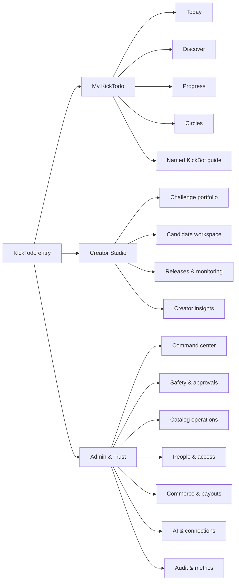
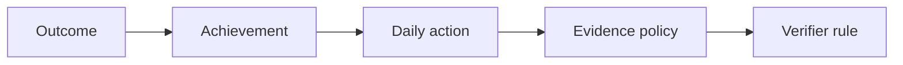

# KickTodo UX/UI recommendation

**Status:** Proposed product-design direction  
**Date:** 2026-07-19  
**Scope:** Participant experience, creator experience, administrator/operator experience, responsive React web/PWA, and the planned Expo/React Native participant app  
**Starting wireframe:** `/Users/david/Downloads/Project Kickbot by Kicktodo.pptx`  
**Architecture sources:** `docs/kicktodo-prd.md`, `docs/kicktodo-implementation-plan.md`, `DESIGN.md`, ADRs 0413–0415 and 0419–0433

---

## 1. Executive recommendation

KickTodo should feel like a **calm, intelligent achievement companion**: one clear next action, visible purpose, flexible pacing, evidence-backed progress, and accountability that grows only when the participant asks for it.

The original Project KickBot deck supplies the enduring experience spine:

1. choose a meaningful goal;
2. discover a relevant challenge;
3. choose the right depth;
4. fit it into a real schedule;
5. decide whether to go solo, with peers, or with a coach;
6. use KickBot as a personalized guide;
7. work from a unified daily view;
8. complete practical actions and reflections;
9. see progress;
10. snooze without guilt;
11. purchase premium help when it adds real value;
12. continue across devices.

That model remains strong. The new UX should preserve it while replacing the deck's linear setup wizard and isolated phone screens with three coordinated product workspaces:

- **My KickTodo** for participants: Today, Discover, Progress, Circles, and the user's named KickBot agent.
- **Creator Studio** for challenge authors: portfolio, research, plan, daily actions, media, simulations, gates, release, and monitoring.
- **Admin & Trust** for operators: readiness, approvals, safety, content health, access, commerce, AI operations, audit, and outcome metrics.

The most important experience decision is this:

> **Today is the participant home; the Challenge is the unit of transformation; KickBot is the continuous relationship; Creator Studio is a governed production pipeline; Admin is an exception-and-trust console.**

Do not expose OpenWOP's implementation vocabulary to ordinary participants. They should experience “Today,” “My plan,” “Ask Nova,” and “Share with my circle,” not runs, node packs, workflow definitions, interrupts, or agent dispatch provenance. Creators and administrators may progressively reveal those operational details when they need them.

---

## 2. What to retain—and what to evolve—from the source deck

| Deck concept | Recommendation | UX treatment |
|---|---|---|
| Welcome to DO | **Retain the mission, replace the product lecture** | A two-screen value introduction, then useful action. Explain outcomes, not technology. |
| Set your goals | **Retain; make outcome-first and revisable** | Guided goal statement plus constraints, readiness, motivation, and success evidence. Avoid a rigid category-only picker. |
| Select a challenge | **Retain as Discover** | Search, goal-fit recommendations, filters, editorial collections, trust signals, free/paid/coach variants. |
| Beginner / intermediate / advanced | **Retain as “pace and depth,” not ability ranking** | “Gentle,” “Steady,” and “Deep dive,” each showing time, evidence, and prerequisites. Let publishers define valid variants. |
| Choose your schedule | **Retain; elevate to plan approval** | Weekly preview with time windows, rest days, timezone, reminders, calendar conflicts, and a clear “You can change this later.” |
| Invite friends | **Retain; separate social modes** | Solo, accountability partner, private circle, coached cohort. Show exactly what each role can see before invitation. |
| Fit-to-need accountability | **Make this a signature pattern** | A graduated privacy ladder with immediate revocation and field-level preview. Never imply that joining a challenge makes activity public. |
| Enable your Smart Assistant | **Retain, but make KickBot the default named guide** | Name/avatar/tone setup; clear AI disclosure; visible memory controls; one persistent agent across challenges. |
| Calendar view | **Merge into Today + Plan; keep calendar as secondary** | Today answers “what now?” Plan answers “what is coming?” Calendar is useful for schedule management, not the primary home. |
| Start your challenge | **Retain as the daily action experience** | One primary action, supporting content, evidence capture, reflection, alternatives, and contextual discussion. |
| Calls to action | **Retain, simplify** | One primary action by default; up to two optional stretch/community actions. Avoid three mandatory actions every day. |
| Visual tracker / points | **Retain progress, make points optional** | Lead with meaningful outcomes, streak resilience, milestones, consistency, and evidence—not game currency. |
| Leaderboard | **Keep opt-in and privacy-safe** | Cohort/circle-only, minimum group size, aliases/display names, no public default, easy opt-out. |
| Snooze | **Retain as “Pause & adjust”** | Pause reminders and scheduled work, preserve continuity, preview consequences, offer recovery options without shame. |
| Monetization | **Retain, clarify value boundaries** | Free challenge, premium challenge, KickBot Plus, cohort/coach. Show refund/access terms and what AI or human support is included. |
| Omni-device future | **Retain the continuity promise, narrow the launch claim** | Web/PWA + React Native first. Watches, voice, car, and ambient devices become capability-driven extensions after the core loop is proven. |

### Source-deck critique

The deck works as a concept storyboard but should not become the final navigation model. It has four structural limitations:

- It treats onboarding as a one-way sequence rather than a revisable plan.
- It blends personal accountability, peer activity, coaching, and public sharing without enough privacy detail.
- It makes content consumption more prominent than evidence-backed action and recovery.
- It does not include the creator or administrator systems required to make “great challenges” and safe AI behavior credible.

The recommendation below closes those gaps while preserving the deck's core philosophy.

---

## 3. Experience principles

### 3.1 One meaningful decision per screen

Participant screens should answer one question:

- What should I do today?
- Is this challenge right for me?
- Does this plan fit my life?
- What evidence should I provide?
- Who can see my progress?
- What changed, and do I approve it?

Creator and admin screens may be denser, but their first viewport should still lead with the decision or exception requiring human attention.

### 3.2 Progress without pressure

- Never use shame, loss framing, or threatening streak language.
- A missed day creates choices: skip, substitute, reschedule, collapse into recovery, or ask KickBot.
- Celebrate evidence and insight, not mere taps.
- Show “You adjusted the plan” as successful self-management, not failure.
- Make competitive mechanics opt-in and reversible.

### 3.3 AI is visible, bounded, and interruptible

- Label AI-generated recommendations and summaries.
- Show what KickBot used: plan, stated constraints, approved memories, and relevant challenge material.
- Require explicit approval for meaningful plan changes.
- Expose “Why this?” and “Change this” beside recommendations.
- Use deterministic UI for permissions, evidence policy, money, safety status, completion, and publication gates.

### 3.4 Privacy is previewable

Before sharing, show a literal preview of what the recipient will see. Every circle, cohort, coach, organization, and creator surface must distinguish:

- private journal content;
- action completion;
- progress percentage;
- streak/consistency;
- evidence attachments;
- messages;
- goals and outcomes;
- identity/display name.

### 3.5 The interface follows the user's altitude

- Participants see human language and progressive disclosure.
- Creators see content-production language, evidence, and quality gates.
- Admins see policy, risk, audit, and operational state.
- OpenWOP execution details appear only in advanced drawers and audit views.

### 3.6 Every state is designed

Every major surface needs loading, empty, no-match, offline, partial-data, permission-denied, approval-waiting, provider-unavailable, retrying, superseded, retired, and success states. “Nothing happened” is never an acceptable state.

---

## 4. Product-wide information architecture



### 4.1 Workspace switcher

Use the existing app workspace model and navigation tiers. A person with multiple roles gets a simple switcher at the top of the web sidebar or account menu:

- **My KickTodo**
- **Creator Studio**
- **Admin & Trust** — only when authorized

Do not mix participant actions and operator queues in one navigation list. Context switching should be explicit, URL-addressable, and remembered per device.

### 4.2 Participant navigation

**React Native phone:** five destinations in the bottom tab bar:

1. Today
2. Discover
3. Progress
4. Circles
5. Guide — labeled with the user's chosen KickBot name when space permits; otherwise “Guide”

The tab bar is navigation only, never an action bar, consistent with Apple's guidance that tab bars represent top-level destinations rather than commands ([Apple HIG: Tab bars](https://developer.apple.com/design/human-interface-guidelines/tab-bars)).

**Web/PWA:** the same destinations in the KickTodo sidebar group. Large screens may show the next scheduled action and guide presence in the shell, but the information hierarchy must remain identical.

### 4.3 Creator navigation

- Overview
- Challenges
- Research library
- Media library
- Reviews & approvals
- Releases
- Insights
- Creator settings

Selecting a challenge opens its candidate workspace with inner tabs:

- Brief
- Research
- Plan
- Daily actions
- Media
- Simulation
- Gates
- Release
- Monitor
- Activity

### 4.4 Admin navigation

- Command center
- Safety & approvals
- Catalog
- Content health
- Users, creators & access
- Organizations & cohorts
- Commerce & payouts
- AI providers & connections
- Notifications & delivery
- Metrics & experiments
- Audit log
- Feature and distribution settings

---

## 5. Participant experience

### 5.1 Entry, authentication, and first-run

### Screen P0 — Welcome

**Purpose:** establish the promise in under 20 seconds.

Content:

- “Make meaningful progress, one doable action at a time.”
- Three short benefits: a plan that fits, a guide who remembers, accountability you control.
- Primary action: “Get started.”
- Secondary action: “I already have an account.”
- A small “How KickTodo uses AI” disclosure.

Avoid a carousel of feature marketing. The source deck's mission belongs here, but condensed.

### Screen P1 — Sign in / create account

- Support passkeys/social or system-browser identity where configured.
- Allow password managers and copy/paste; do not require memory puzzles or transcription-only authentication. WCAG 2.2 explicitly addresses accessible authentication ([W3C: Accessible Authentication](https://www.w3.org/WAI/WCAG22/Understanding/accessible-authentication-minimum.html)).
- Preserve the intended destination for invitation, challenge, cohort, purchase, or action deep links.

### Screen P2 — Choose your starting outcome

Use two paths:

- “I know what I want” — a sentence starter: “I want to…”
- “Help me choose” — browse life areas and examples.

Suggested life areas are filters, not a permanent taxonomy: wellbeing, relationships, learning, creativity, career, leadership, finance, home, community, and personal practices. Sensitive topics display appropriate safety context before recommendations.

### Screen P3 — Define success and constraints

Collect only what improves the plan:

- What would be different?
- How will you know you made progress?
- Time available on typical and difficult days.
- Preferred days/time windows.
- Accessibility needs and content formats.
- Constraints, injuries, sensitivities, or topics to avoid.
- Desired accountability level.

Show why each question is asked and allow “Skip for now.”

### Screen P4 — Challenge recommendations

Provide three to five high-confidence recommendations, not an infinite catalog wall. Each recommendation explains:

- “Why it fits”
- expected outcome;
- duration and daily time;
- depth/pace;
- content formats;
- evidence expectations;
- safety or prerequisite notes;
- solo/circle/cohort availability;
- price and refund/access summary;
- source/review freshness.

Allow “Browse all challenges” for exploration.

### Screen P5 — Plan preview and personalization

Present a one-week preview before asking for commitment:

- Day-by-day action titles and time estimates.
- One primary action per day.
- Optional stretch/community actions.
- Recovery/rest days.
- Substitution availability.
- Evidence method.
- Important external resources.

KickBot may propose modifications, but the user approves the final plan. Show a compact change ledger: “Moved two actions to weekdays,” “Reduced daily time from 25 to 15 minutes,” and “Replaced photo evidence with an equivalent private note” only when the publisher's policy permits it.

### Screen P6 — Schedule and reminders

Use a weekly timetable rather than isolated dropdowns:

- suggested time windows;
- existing calendar conflicts when connected;
- quiet hours;
- reminder channel;
- missed-action behavior;
- timezone confirmation;
- “Pause during…” planned breaks.

Default to a low-notification posture. Explain that Today remains correct even when notifications are off.

### Screen P7 — Accountability choice

Offer four cards:

- **Just me** — private by default.
- **Accountability partner** — one trusted person.
- **Private circle** — invited peers.
- **Coached cohort** — scheduled human support and limited seats.

Each card opens “What they can see” and “What they can do.” Invitation happens after plan approval so invited people receive a coherent commitment, not an unfinished draft.

### Screen P8 — Meet and name your guide

- Default: KickBot.
- User can rename the agent without creating a new identity.
- Choose communication style: concise, encouraging, reflective, direct.
- Preview example messages.
- Choose proactive behavior: only when asked, daily check-in, or approved follow-ups.
- Review memory controls: remember preferences, review memories, delete a memory, turn long-term memory off.

### Screen P9 — Ready

Summary:

- goal/outcome;
- challenge;
- first action;
- schedule;
- sharing;
- guide name;
- price/entitlement;
- “Start my plan.”

Every field links back to edit. Starting creates the durable enrollment only after the user confirms.

---

### 5.2 Today: the participant home

Today should answer “What is the smallest meaningful thing I can do now?” before showing dashboards.

```text
┌──────────────────────────────────────────────┐
│ Good morning, David              [Guide ✦]  │
│ You have 1 meaningful action today           │
├──────────────────────────────────────────────┤
│ FOCUS RESET · DAY 4 OF 14                    │
│ Protect one 20-minute focus block            │
│ 20 min · Note · Due this afternoon           │
│                                              │
│ Why this matters                             │
│ You are building a repeatable start ritual.  │
│                                              │
│ [Start action]   [Choose an alternative]     │
├──────────────────────────────────────────────┤
│ Coming up · Reflection at 7:00 PM            │
│ Circle · Maya sent encouragement             │
└──────────────────────────────────────────────┘
```

### Today hierarchy

1. Greeting and truthful workload summary.
2. One hero action—the most relevant next action.
3. Any other due actions as compact rows.
4. A “Coming up” strip.
5. Relevant circle/coach activity.
6. Recovery or provider/offline notices when needed.

Do not lead with streaks, points, or a chart. Do not make “Check progress” a manual button that users must understand; progress updates after evidence is accepted.

### Action card states

- Ready
- In progress
- Evidence needed
- Submitted / verifying
- Complete
- Needs clarification
- Alternative selected
- Rescheduled
- Missed—choice required
- Superseded by plan change
- Unavailable offline

Each state must have an explicit next action.

---

### 5.3 Daily action detail

The action detail is the highest-value participant screen.

### Structure

1. **Action title and outcome connection**
2. **Time and evidence expectations**
3. **Primary content** — video, audio, article, PDF excerpt, prompt, or guided exercise
4. **Do this now** — one concise instruction
5. **Why this matters**
6. **Accessibility and alternatives**
7. **Evidence capture**
8. **Optional reflection**
9. **Ask the guide about this action**
10. **Circle/cohort discussion** when explicitly enabled

### Evidence UI

Evidence controls derive from the challenge policy:

- Attestation: “I did this,” with optional note.
- Note: required text with clear minimum/maximum expectations.
- Photo: camera/library, privacy notice, upload progress, remove/replace, alt text where shared.
- Measurement: unit-aware numeric input, range validation, source label for wearable imports.
- File/resource: explicit accepted formats and scan state.

Never render a generic “Done” button when the challenge requires evidence. Show exactly what is required before the user starts.

### Completion moment

- Stamp the action complete with restrained motion and haptic feedback on native.
- Announce status changes through assistive technology.
- Show one meaningful reflection: “This moves you toward…”
- Offer “What’s next” without immediately pushing the user into more work.

---

### 5.4 Discover and challenge detail

### Discover home

- Continue/recommended strip for returning users.
- Goal-fit recommendations.
- Editorial collections: “Under 10 minutes,” “Build with a friend,” “Evidence-backed wellbeing,” “New this month.”
- Search and filter bar.
- Grid/list switch on web; native vertical cards.

Filters:

- outcome/life area;
- duration;
- daily time;
- pace/depth;
- format;
- free/paid/subscription/coached;
- solo/circle/cohort;
- accessibility support;
- content language;
- evidence type;
- creator;
- rating only after the privacy floor is met.

### Challenge card

Show only decision-critical information:

- cover/title;
- one-sentence promise;
- daily time and duration;
- format icons with text labels;
- pace/depth;
- trust/review state;
- price or “Included”;
- creator identity when approved;
- reason it was recommended.

### Challenge detail

Sections:

- Overview
- Outcomes
- What you will do
- Week preview
- Evidence and privacy
- Pace and alternatives
- Creator and sources
- Reviews
- Solo/circle/cohort options
- Price, entitlement, refund, and access duration
- Safety/prerequisite notice

Primary action is contextual: “Preview my plan,” “Join cohort,” “Buy and preview,” or “Continue.” Do not enroll directly from a catalog card without a plan/commitment preview.

---

### 5.5 Plan and calendar

### Plan screen

Views:

- **Week** — default, action cards arranged by day.
- **Calendar** — month/agenda for schedule management.
- **Challenge** — one challenge timeline.

Actions:

- move within allowed window;
- select publisher-approved alternative;
- change time window;
- pause challenge;
- request KickBot re-plan;
- compare current and proposed plan;
- approve/reject proposed revision.

Drag-and-drop must have a non-drag keyboard/touch alternative. WCAG 2.2 requires dragging functionality to be achievable without dragging when dragging is not essential ([WCAG 2.2](https://www.w3.org/TR/WCAG22/)).

### Calendar integration

- KickTodo remains source of truth.
- External calendar state is disclosed: connected, syncing, stale, error, permission revoked.
- Show what will be written before enabling write access.
- A sync failure never hides or deletes the action in KickTodo.

---

### 5.6 Progress

Progress should explain transformation, consistency, and evidence—not merely activity volume.

### Progress overview

- “Meaningful progress this week” narrative.
- Current challenge milestones.
- Outcome evidence summary.
- Consistency pattern with recovery distinguished from failure.
- Time invested versus planned.
- Recent achievements.
- Optional private reflection trend.
- Circle/cohort comparison only if opted in.

### Challenge progress detail

- Outcome → achievements → actions → evidence trace.
- Milestone timeline.
- Completed, substituted, skipped, recovered, and pending states.
- Verifier decisions with plain-language explanation.
- “What remains” and “Adjust plan.”
- Completion certificate or share card only after authoritative completion.

Avoid a single percentage that implies false precision. If a percentage is shown, explain its basis.

---

### 5.7 Pause, snooze, and recovery

Rename the source deck's feature to **Pause & adjust** at the navigation/action level; “Snooze” may remain as the short control label.

### Pause flow

1. Choose duration or return date.
2. Preview what pauses: reminders, scheduled actions, proactive KickBot messages, cohort expectations.
3. Clarify what does not pause: access, messages, already submitted evidence, financial terms.
4. Choose missed-action behavior on return.
5. Confirm.

### Return flow

KickBot offers three bounded choices:

- Continue from today.
- Complete one recovery action.
- Review and approve a lighter plan.

Copy should say “Welcome back” and “Let’s make the plan fit,” never “You broke your streak.”

---

### 5.8 KickBot / named guide

The Guide destination is the user's durable relationship, not a generic chatbot.

### Guide home

- Continue primary conversation.
- Today's context and next action.
- Pending plan proposal or approval.
- Recent milestone or recovery.
- Shortcuts: “Explain today's action,” “Adjust my week,” “Review my progress,” “What do you remember?”

### Agent profile

- chosen name and avatar;
- AI disclosure;
- communication style;
- autonomy/proactivity;
- schedules and workflows in human terms;
- approved knowledge sources;
- memories, with review/delete controls;
- connected services;
- activity/history;
- permissions and sharing;
- rename without losing continuity.

### Conversation behavior

- Keep plan/evidence/approval cards visually distinct from ordinary chat.
- A plan change is a structured proposal with diff and approval controls, not prose hidden in a message.
- Tool activity collapses to “Checked your plan and calendar,” with an expandable audit explanation.
- Safety escalation gives a clear boundary and next step.
- Offline/provider failure preserves Today and deterministic plan functions.

---

### 5.9 Circles, partners, cohorts, and coaching

### Circles home

- My accountability relationships.
- Invitations requiring action.
- Recent privacy-filtered encouragement.
- Upcoming cohort sessions.
- Clear “Who can see what” link.

### Circle detail

- members and roles;
- shared challenge/progress summary;
- conversation;
- encouragement/nudge controls;
- active grants;
- privacy preview;
- leave/revoke controls;
- activity history.

### Coach view for a participant

- coach identity and credentials/context;
- next session;
- what the coach can see;
- plan proposals awaiting participant approval;
- private message or group conversation;
- escalation/reporting and cancellation/refund terms.

No social screen should expose raw journal content by default.

---

### 5.10 Commerce

### Purchase flow

- Product type: challenge, KickBot Plus, or coached cohort.
- Included content/support.
- AI limits or premium features in understandable units.
- Price, tax, billing cadence, renewal, refund, and access duration.
- Cohort capacity/hold countdown only when backed by durable reservation state.
- External checkout handoff and safe return state.
- Fulfilment state: processing, active, needs attention, refunded, disputed.

The checkout return is not the entitlement confirmation. The UI should show “Confirming access…” until the verified fulfilment state arrives.

---

## 6. Creator experience

Creator Studio should feel like an evidence-aware production environment, not a form that generates content in one click.

### 6.1 Creator onboarding

1. Creator identity and public profile.
2. Organization/team.
3. Subject areas and qualifications.
4. Rights/AI-use attestation.
5. Payment onboarding only when selling.
6. Review and approval status.
7. Guided first challenge or import.

Creators can explore Studio before approval, but publication and sales remain gated.

### 6.2 Studio overview

First viewport:

- items needing the creator;
- blocked candidates;
- approvals returned with feedback;
- broken sources/media;
- upcoming releases;
- performance signals after privacy floors.

Below that:

- challenge portfolio with search, status filters, grid/list view;
- drafts, in review, approved, published, monitoring, retired;
- “Create challenge” primary action.

### 6.3 New challenge intake

Entry choices:

- Research a new topic.
- Start from my materials.
- Adapt an existing challenge version.
- Translate/localize a challenge.
- Import a structured plan.

### Intake brief

- target outcome;
- audience;
- starting knowledge/readiness;
- constraints and exclusions;
- duration/time budget;
- desired formats;
- evidence strategy;
- accessibility routes;
- risk/sensitivity declaration;
- monetization and coaching intent;
- creator materials upload/connect.

Immediately show deterministic risk classification and required review lanes.

### 6.4 Candidate workspace

```text
┌──────────────────────────────────────────────────────────────┐
│ Better Sleep Foundations       DRAFT · General risk         │
│ [Run research] [Preview as participant] [Submit for review] │
├───────────────┬──────────────────────────────────────────────┤
│ Brief         │ NEEDS YOU                                    │
│ Research      │ 2 unsupported claims                         │
│ Plan          │ 1 day exceeds time budget                    │
│ Daily actions │ 3 actions lack accessible alternatives       │
│ Media         │ 1 transcript pending                         │
│ Simulation    │ Skeptic persona flagged outcome wording      │
│ Gates         │ 6 passed · 4 blocked                         │
│ Release       │ Not eligible                                 │
│ Monitor       │ —                                            │
└───────────────┴──────────────────────────────────────────────┘
```

The candidate record remains authoritative for challenge production. Its linked OpenWOP Project supplies shared board, named coworkers, workflows, schedules, knowledge, memory, and group conversation. The UI should link the two without duplicating state.

### 6.5 Research workspace

Views:

- Research brief and question tree.
- Source inbox.
- Source viewer with metadata, rights disposition, freshness, and extract history.
- Evidence graph: claim → supporting/contradicting sources.
- Gaps and contradictions.
- Creator-provided materials.
- Research run history and budgets.

Key actions:

- run/refine research;
- add/upload/connect a source;
- exclude a source;
- resolve duplicate;
- mark primary/secondary;
- request deeper research on a gap;
- inspect AI provenance;
- freeze a source snapshot for a release.

Do not show a wall of URLs. Organize around the claims the challenge intends to make.

### 6.6 Challenge Plan editor

Use a structured document, not raw JSON.

Sections:

- Promise and audience.
- Measurable outcomes.
- Achievements and observable evidence.
- Duration and daily-time budget.
- Learning/behavior arc.
- Safety boundaries.
- Accessibility and alternatives.
- Recovery policy.
- Source/evidence summary.

An alignment map visualizes:



Unlinked elements are errors, not decorative warnings.

### 6.7 Daily-action designer

Each day/action editor includes:

- stable action id and day/window;
- title;
- one clear instruction;
- user-facing why;
- time estimate;
- content/resource blocks;
- evidence policy;
- publisher-approved alternatives;
- accessibility route;
- recovery behavior;
- optional community/stretch action;
- linked achievement/outcome;
- source citations and rights.

Provide week and timeline views plus a participant preview at phone width. The preview uses the real participant component contract, not a screenshot imitation.

### 6.8 Media production

Media jobs appear as a production queue:

- source/import/generated;
- script and factual alignment;
- rights state;
- transcript/captions;
- alt text/audio description;
- rendition status;
- mobile/offline suitability;
- cost and provider;
- safety scan;
- replace/regenerate/version.

Generated media must disclose model/provider/version and bind to the release candidate.

### 6.9 Simulation and evaluation

Simulation is a structured evaluation lab, not a chat transcript.

Default personas:

- newcomer;
- time-poor participant;
- evidence skeptic;
- screen-reader/low-vision route;
- missed-days/recovery route;
- low-bandwidth/offline route;
- sensitive-topic boundary route when applicable.

Results group defects by severity, gate, day, and owning artifact. A creator can regenerate or edit a targeted unit, then rerun only affected evaluations while preserving the audit trail.

### 6.10 Gate center and approval

Gate categories:

- evidence and citation;
- outcome/action/evidence alignment;
- safety;
- accessibility;
- privacy;
- rights;
- media integrity;
- behavioral quality;
- simulation;
- commerce/legal readiness;
- provider and pack provenance;
- source freshness.

Each gate displays:

- pass/block/escalate;
- deterministic or reviewer/model source;
- evidence;
- policy version;
- owner;
- remediation;
- rerun/review history.

“Submit for publication” is enabled only when deterministic eligibility passes. Human review happens in the shared approval system. The submitting creator cannot approve their own release.

### 6.11 Release and monitoring

### Release screen

- immutable version summary;
- source snapshot;
- evidence graph version;
- challenge plan and daily-unit hashes;
- media manifest;
- evaluation bundle;
- rights decisions;
- approval decisions;
- pack/workflow/model provenance;
- locale/translation lineage;
- release notes;
- publish/rollout scope.

### Monitoring

- broken or redirected resources;
- terms/rights policy freshness;
- factual incidents;
- participant reports;
- safety/privacy incidents;
- outcome and completion signals;
- time-estimate error;
- accessibility parity;
- refund/dispute anomalies;
- current and active-enrollment impact of retirement.

Retirement should clearly distinguish “no new enrollments” from treatment of active participants.

### 6.12 Creator insights and earnings

- catalog reach;
- activation and completion;
- outcome evidence after privacy floors;
- recovery rate;
- participant clarity/helpfulness;
- review aggregate;
- source health;
- revision cycles;
- gross sales, refunds, fees, net earnings, payout state;
- AI/media production cost where authorized.

Do not expose small-cell participant identity or unsupported causal claims.

---

## 7. Administrator and operator experience

Admin should be an exception-driven trust console. Its home is not a collection of vanity charts.

### 7.1 Command center

Priority bands:

1. **Needs action now** — safety escalations, money/entitlement failures, broken active content, provider outage, capacity inconsistency.
2. **Approvals waiting** — publication, creator profile, verifier sample, moderation, sensitive plan.
3. **Operational health** — workflow failures, schedules, notification delivery, calendar sync, model/provider readiness.
4. **Catalog and participant health** — activation, meaningful progress, abandonment/recovery, content incidents.
5. **Recent changes** — releases, retirements, policy/toggle changes, admin activity.

Every metric tile acts as a filter into its owning queue.

### 7.2 Safety & approvals

Unified queue with saved views:

- publication approvals;
- sensitive/regulated-adjacent content;
- safety escalations;
- creator profile approvals;
- review flags;
- verifier samples;
- rights/accessibility escalations.

Review drawer:

- proposal and requested decision;
- subject/resource scope;
- submitter and eligibility;
- independent reviewer requirement;
- evidence bundle;
- policy/rubric version;
- related incidents/history;
- approve/reject/request changes/escalate;
- required reason for consequential decisions.

The UI must never make “different user” look equivalent to “authorized independent reviewer.”

### 7.3 Catalog operations

- all challenge versions;
- lifecycle state;
- creator;
- risk tier;
- locale/lineage;
- entitlement type;
- source freshness;
- gate state;
- active enrollment count;
- incidents;
- release/retire controls.

Bulk actions are restricted to safe, reversible operations. Publication and retirement remain per-release decisions with confirmation and impact preview.

### 7.4 Content health and incident response

- active incidents with severity and SLA;
- source/media health;
- affected challenge versions and enrollments;
- kill-switch/retirement readiness;
- participant communication plan;
- replacement content;
- investigation timeline;
- resolution and postmortem.

### 7.5 People, creators, and access

- users and workspace membership;
- creators and approval state;
- coaches and organizations;
- roles/scopes;
- resource grants;
- suspensions/revocations;
- support-access mode with audit disclosure;
- account deletion/export status.

Use uniform not-found behavior in product APIs, but the authorized admin UI may show explicit access rationale and audit context.

### 7.6 Organizations and cohorts

- organization library;
- linked cohorts;
- capacity and holds;
- coach assignment;
- consent and participant boundaries;
- schedule/session health;
- k-anonymous reports;
- brand reference;
- seat products and reconciliation.

Before linking a cohort, show ownership/consent eligibility and the exact aggregate the organization will receive.

### 7.7 Commerce and payouts

- products and challenge/cohort links;
- orders and entitlement state;
- holds/capacity;
- refunds/disputes;
- reconciliation queue;
- creator accounts/payouts;
- fee policy;
- webhook health;
- money-truth audit timeline.

Any “paid but not fulfilled” state is a first-class incident with retry/reconciliation controls.

### 7.8 AI providers, connections, and budgets

- provider readiness by capability;
- model policy and routing;
- BYOK connection health;
- search/media/calendar/messaging connections;
- per-tenant and per-workflow budgets;
- spend and latency;
- fail-closed conditions;
- model/version provenance;
- rate limits and concurrency;
- signed pack/chain posture.

Hide secrets completely; show reference, owner, scope, health, and last verified time.

### 7.9 Notifications and delivery

- schedule fires;
- channel delivery health;
- suppression/quiet-hour reasons;
- consent;
- bounced/invalid destinations;
- template/version;
- replay-safe retry;
- native push registration and receipt status when mobile ships.

Avoid duplicate alerts across push, Live Activities, email, and in-app surfaces. Apple's Live Activity guidance cautions against over-alerting and duplicating the same update through push ([Apple HIG: Live Activities](https://developer.apple.com/design/human-interface-guidelines/live-activities)).

### 7.10 Metrics and experiments

Metrics pages must disclose:

- exact definition;
- unit of analysis—participant, enrollment, action, candidate, or order;
- date window;
- denominator;
- privacy floor/withholding;
- data freshness;
- filters;
- experiment variant;
- whether the metric is descriptive or causal.

Core views:

- activation funnel;
- meaningful weekly progress;
- D7/D30 retention;
- completion/abandonment/recovery;
- verifier quality;
- factory acceptance/revision/cost;
- content health/incidents;
- accountability uplift;
- commerce/refund/payout;
- AI cost and provider health.

### 7.11 Audit and configuration

- immutable activity timeline;
- actor/subject/resource;
- before/after for configuration;
- approval and dispatch provenance;
- workflow/run refs;
- export for investigation;
- feature variants and distribution posture;
- policy versions;
- retention/deletion state.

Configuration screens require change previews, validation, staged activation, and rollback guidance. Dangerous settings never share the visual weight of ordinary preferences.

---

## 8. Shared interaction and component system

### 8.1 Web component strategy

Reuse the existing OpenWOP cohesion layer:

- `PageHeader`
- `.surface-card`
- `.card-grid`
- `.list-row`
- `.chip` with localized status
- `.action-bar`
- `Notice`
- `StateCard`
- `Tabs` / URL-backed inner tabs
- `ViewToggle`
- `DataTable`
- shared confirmation dialog
- right-side quick-look drawer
- shared Kanban renderer for Factory Projects

Add KickTodo product components only when the behavior is genuinely reusable:

- `OutcomePicker`
- `ChallengeCard` / `ChallengeRow`
- `PlanWeek`
- `ActionCard`
- `EvidenceCapture`
- `ProgressTrace`
- `PrivacyPreview`
- `AccountabilityLevelCard`
- `AgentProposalCard`
- `GateStatus`
- `ReleaseManifest`
- `CapacityStatus`
- `MetricDefinitionPopover`

Each new component needs a `DESIGN.md` registry entry, loading/error/empty states, keyboard behavior, localization contract, and native-equivalent decision.

### 8.2 React Native strategy

Share contracts, view-models, semantic tokens, icon names, route intents, and content patterns—not DOM components. React Native explicitly supports `.native`, `.ios`, and `.android` implementations for platform-appropriate code ([React Native: Platform-specific code](https://reactnative.dev/docs/platform-specific-code.html)).

Use Expo Router so Today, challenge, enrollment, action, conversation, circle, invitation, approval, and checkout-return destinations are deep-linkable. Expo Router is built around native navigation and automatic universal-link routing ([Expo Router](https://docs.expo.dev/router/introduction/)).

Native primitives:

- bottom tabs;
- native stacks and sheets;
- `Pressable` controls;
- virtualized lists;
- platform pickers/date/time controls;
- camera/file/media adapters;
- haptics for restrained confirmation;
- safe-area and keyboard avoidance;
- screen-reader announcements and accessibility actions.

React Native's accessibility APIs support platform labels, hints, live regions, escape behavior, and custom accessibility actions; VoiceOver and TalkBack behavior must be tested separately ([React Native Accessibility](https://reactnative.dev/docs/accessibility)).

### 8.3 Responsive behavior

| Width/context | Participant | Creator | Admin |
|---|---|---|---|
| Phone | Bottom tabs, single column, full-screen action flow, sheets | Review/approval and lightweight edits only | Incident triage/approval only; dense configuration redirects to web when necessary |
| Tablet | Navigation rail, split Today/detail, week plan | Candidate rail + editor, participant preview drawer | Queue + review split view |
| Desktop web | Sidebar, centered content, optional guide/context rail | Full production workspace with resizable rail/editor/inspector | Dense tables, queues, drawers, dashboards |
| PWA offline | Cached Today and safe resources, outbox states | Read-only drafts only unless conflict-safe | Read-only health snapshot; no consequential offline mutations |

### 8.4 Status vocabulary

Use the same status semantics across web and native:

- Neutral: draft, scheduled, paused.
- Information: proposed, syncing, submitted.
- Success: verified, complete, published, active.
- Warning: needs review, expiring, degraded, withheld.
- Danger: blocked, failed, incident, disputed, retired for safety.

Status is always label + icon/dot + optional color; never color alone.

### 8.5 Motion

- Use motion for spatial continuity, completion acknowledgment, and revealing consequences.
- No confetti by default.
- Respect reduced-motion settings.
- Never animate progress in a way that obscures the real value.
- Do not use countdown pressure except for a real, server-backed seat hold or expiring approval.

---

## 9. Visual direction

### 9.1 Brand personality

The source deck's blue/green identity communicates clarity and completion but feels clinical and dated when used as large flat bands. Modernize it into a warmer consumer system:

- **KickTodo blue** — agency, links, primary brand actions.
- **Progress green** — verified completion only, not every primary button.
- **Warm paper neutrals** — calm, reflection, long-form content.
- **Amber** — attention and recovery, not punishment.
- **Muted red** — safety, destructive, payment/incident failures only.

Retain the check-mark brand idea but do not place a check on every card. Completion should feel earned and semantically meaningful.

### 9.2 Typography

- Friendly, highly legible sans serif for participant UI.
- Strong but compact hierarchy for creator/admin tools.
- Minimum comfortable mobile body size and dynamic type support.
- Monospace only for ids, versions, policy refs, and technical audit metadata.

### 9.3 Imagery

- Challenge covers use distinctive editorial illustration or photography with consistent art direction.
- Avoid generic “happy productivity person” stock art.
- Generated images require rights/provenance and accessibility metadata.
- Creator and admin tools prioritize evidence and state over decorative imagery.

### 9.4 Density

- Participant: generous, one primary decision, progressive disclosure.
- Creator: medium density, split views, inspector drawers, participant preview.
- Admin: high but structured density, decision queue first, tables below.

---

## 10. Accessibility, localization, and inclusive design

Target WCAG 2.2 AA on web and equivalent native behavior.

### Required accessibility behaviors

- 44×44 preferred touch targets for high-frequency mobile actions; never below WCAG's 24×24 CSS-pixel minimum without permitted spacing/equivalence ([W3C: Target Size](https://www.w3.org/WAI/WCAG22/Understanding/target-size-minimum)).
- Visible focus with a strong, theme-safe outline; focused items cannot be hidden by sticky bars or sheets ([W3C: Focus Appearance](https://www.w3.org/WAI/WCAG22/Understanding/focus-appearance.html), [Focus Not Obscured](https://www.w3.org/WAI/WCAG22/Understanding/focus-not-obscured-minimum)).
- Logical focus order and meaningful headings.
- Keyboard alternatives for drag, swipe, and long-press.
- Screen-reader labels, values, states, hints, and live announcements.
- Captions, transcripts, alt text, audio description as appropriate.
- Text resize/dynamic type without clipping.
- Reduced motion, contrast, dark/light themes.
- No chart without a table or narrative equivalent.
- Accessible evidence capture and media-upload recovery.
- Errors identify the field, explain the issue, and suggest a correction.

### Localization

- Separate UI locale from challenge content locale.
- Use BCP 47 locale identifiers internally; show language names to users.
- Localize statuses and system-generated evidence explanations.
- Support RTL through logical layout properties.
- Avoid text embedded in images.
- Preserve source/translation lineage and disclose fallback language.
- Timezone, week start, date, time, number, unit, and currency are locale-aware.

---

## 11. Notifications and re-engagement

Notification design follows a hierarchy:

1. **Actionable now:** approved reminder for a scheduled action.
2. **Needs decision:** plan proposal, invitation, approval, evidence clarification.
3. **Human activity:** coach/circle message or encouragement.
4. **Milestone:** meaningful achievement, delivered sparingly.
5. **Operational:** purchase/access, source retirement impact, security/privacy.

Controls:

- per-channel opt-in;
- quiet hours;
- digest versus immediate;
- challenge-level pause;
- circle/cohort controls;
- proactive KickBot controls;
- explicit consent for messaging channels.

Every notification deep-links to the exact screen and remains safe if the state changed before open.

---

## 12. Offline, latency, and failure UX

### Participant offline

- Cached Today with freshness timestamp.
- Downloaded, offline-safe challenge resources.
- Durable outbox for allowed check-ins/notes.
- Clear local/pending/synced/needs-attention status.
- No offline purchase, permission, publication, or consequential plan approval.
- Conflict resolution explains the server decision without losing the local draft.

### Provider failure

- Today, plan, schedule, evidence, and prior content continue without AI.
- KickBot explains temporary limitation and offers deterministic actions.
- Creator generation shows provider/budget readiness and preserves inputs.
- Admin sees the degraded capability and affected workflows.

### Partial failure

Every multi-step operation needs a resumable state:

- Starting your plan…
- Scheduling actions…
- Confirming access…
- Uploading evidence…
- Verifying progress…
- Publishing release…
- Syncing calendar…

Expose “Retry safely” and an incident/reference id only when useful.

---

## 13. Role and permission presentation

| Capability | Participant | Partner/circle | Coach | Creator/editor | Publisher/reviewer | Admin |
|---|---|---|---|---|---|---|
| View private journal | Yes | No by default | Only explicit grant | No | No | Exceptional audited support only |
| View shared progress | Own | Grant-filtered | Grant-filtered/cohort policy | Aggregate only | Aggregate only | Authorized aggregate/support scope |
| Change participant plan | Approves/requests | No | Proposes only | Publisher policy only | Reviews policy | Emergency/policy action only |
| Complete participant goal | Evidence + goal judge | No | No | No | No | No manual override without audited exception policy |
| Create challenge | Personal draft if enabled | No | Optional creator role | Yes | Yes | Yes |
| Publish challenge | No | No | No | Submit only | Eligible independent approval | Authorized release action |
| Retire challenge | No | No | No | Request | Authorized | Authorized with impact preview |
| Moderate review | No | No | No | No own moderation | Authorized moderator | Authorized |
| Link products/cohorts | No | No | Own cohort where authorized | Own challenge where authorized | Publisher scope | Authorized commerce scope |

The UI never derives permission from display role labels alone; it renders server-authoritative allowed actions and explains unavailable actions without leaking hidden resources.

---

## 14. Measurement plan for UX quality

### Participant

- Time to first approved plan.
- Time to first meaningful action.
- First-action clarity score.
- Plan change approval/rejection.
- Evidence completion/error rate.
- Recovery after missed action or pause.
- Notification opt-out and suppression.
- Guide helpfulness and escalation.
- Accessibility-route completion parity.
- Offline outbox success/conflict.

### Creator

- Time from brief to gate-ready plan.
- Research gaps and unsupported claims per candidate.
- Targeted versus full regeneration rate.
- Gate failure/revision cycles.
- Participant-preview defects.
- Accessibility/media defect age.
- Approval turnaround.
- Source-health incident rate.
- Cost per published challenge.

### Admin

- Queue age by severity.
- Mean time to acknowledge/resolve incident.
- Paid-but-unfulfilled age.
- Broken-source active exposure.
- Approval reversal/escalation rate.
- Unauthorized-action attempts.
- Reconciliation success.
- Metric-definition and privacy-floor audit failures.

Instrument screen intent, action, result, latency, and error category. Do not capture private journal/evidence bodies in analytics.

---

## 15. Recommended route map

### Participant

```text
/kicktodo/today
/kicktodo/discover
/kicktodo/challenges/:challengeId/versions/:version
/kicktodo/enrollments/:enrollmentId
/kicktodo/enrollments/:enrollmentId/plan
/kicktodo/enrollments/:enrollmentId/actions/:cardId
/kicktodo/progress
/kicktodo/progress/:enrollmentId
/kicktodo/circles
/kicktodo/circles/:circleId
/kicktodo/guide
/kicktodo/guide/profile
/kicktodo/settings/notifications
/kicktodo/settings/privacy
/kicktodo/purchases
```

### Creator

```text
/kicktodo/studio
/kicktodo/studio/challenges
/kicktodo/studio/candidates/:candidateId?tab=brief|research|plan|days|media|simulation|gates|release|monitor|activity
/kicktodo/studio/research
/kicktodo/studio/media
/kicktodo/studio/approvals
/kicktodo/studio/releases
/kicktodo/studio/insights
/kicktodo/studio/settings
```

### Admin

```text
/admin/kicktodo
/admin/kicktodo/approvals
/admin/kicktodo/safety
/admin/kicktodo/catalog
/admin/kicktodo/content-health
/admin/kicktodo/people
/admin/kicktodo/organizations
/admin/kicktodo/commerce
/admin/kicktodo/ai-operations
/admin/kicktodo/notifications
/admin/kicktodo/metrics
/admin/kicktodo/audit
/admin/kicktodo/settings
```

Every opened entity has a URL; inner tabs use query parameters; invitations, actions, conversations, approvals, and checkout returns have stable deep-link intents shared by web and native.

---

## 16. Phased delivery recommendation

### Phase UX-0 — Foundations and trust

- KickTodo semantic design tokens and brand assets.
- Three role shells and workspace switcher.
- Shared route-intent vocabulary.
- Permission/action contract.
- Evidence-capture contract.
- Status and error vocabulary.
- Accessibility test matrix.
- Threat model and privacy previews.
- Resolve implementation blockers around authorization, workflow dataflow, scheduling, evidence, commerce, and metrics before polishing the UI over unsafe behavior.

### Phase UX-1 — Complete participant web loop

- First-run onboarding.
- Challenge detail and plan preview.
- Today redesign.
- Daily action/evidence detail.
- Plan/week/calendar.
- Progress trace.
- Pause/recovery.
- Full named-guide profile and structured proposals.
- Purchases/entitlement states.

Exit evidence: a participant can discover, approve, schedule, complete with required evidence, recover, and finish a multi-week challenge without operator intervention.

### Phase UX-2 — Creator Studio

- Portfolio and candidate workspace.
- Material intake.
- Research/evidence graph.
- Plan and daily-action editors.
- Media queue.
- Simulation lab.
- Gate center.
- Release manifest and monitoring.
- Creator profile/earnings.

Exit evidence: a real-provider candidate travels from brief to independently approved immutable release with no direct API/manual data intervention.

### Phase UX-3 — Admin & Trust

- Command center.
- Unified approvals and safety.
- Catalog/content health.
- Creator/access administration.
- Commerce reconciliation.
- AI/connection readiness.
- Correct metric definitions and experiments.
- Audit/configuration.

Exit evidence: every participant-, content-, access-, and money-critical exception has an owner, queue, safe action, and audit trail.

### Phase UX-4 — React Native participant app

- Expo shell and token-first identity.
- Today, action/evidence, Discover, plan, progress, circles, guide.
- Universal links.
- Native push.
- Offline Today/outbox.
- Camera/media.
- Accessibility on VoiceOver/TalkBack, dynamic type, contrast, motion.
- Store release and migration.

Exit evidence: core flows pass on physical iOS and Android devices with intermittent connectivity and assistive technology.

### Phase UX-5 — Scale and native advantage

- Widgets/Live Activities for one active action only.
- Wearable evidence with explicit consent.
- Cohort/coach mobile tools.
- Creator mobile approvals.
- Advanced organization programs.
- Voice/ambient extensions only after privacy and continuity are proven.

---

## 17. Definition of UX complete

KickTodo should not call a surface complete until:

- every critical state and error has intentional UI;
- server authority and the rendered actions agree;
- participant, creator, and admin flows are end-to-end tested;
- keyboard, VoiceOver, TalkBack, text expansion, dark/light, reduced motion, and 320px web widths pass;
- UI locale and content locale behave independently;
- every consequential AI suggestion has provenance, explanation, and an approval boundary;
- sharing has a live privacy preview and immediate revocation;
- evidence requirements are visible before action and enforced at completion;
- payment returns distinguish checkout from verified entitlement;
- schedules, notifications, and external sync expose truthful state;
- offline and partial-failure recovery are proven;
- all entity/detail selections are deep-linkable;
- sensitive content, money, publication, and admin actions are audit-visible;
- participant Today meets the declared performance target;
- manual-test pages and automated render/interaction tests cover toggled-off features;
- the first catalog has been dogfooded on mobile and desktop.

---

## 18. Final design position

The original Project KickBot vision was right about the emotional and behavioral core: people need meaningful goals, daily actions, adaptable schedules, accountability that fits, an intelligent guide, visible progress, and permission to pause. The modern KickTodo experience should make those ideas feel simpler—not larger—even though the underlying OpenWOP orchestration is dramatically more capable.

For participants, the product should feel like **one relationship and one next step**.  
For creators, it should feel like **a rigorous, AI-assisted challenge production studio**.  
For administrators, it should feel like **a trustworthy exception, safety, and operations console**.

That is the UX system that turns the source deck from an inspiring mobile storyboard into a complete product.
